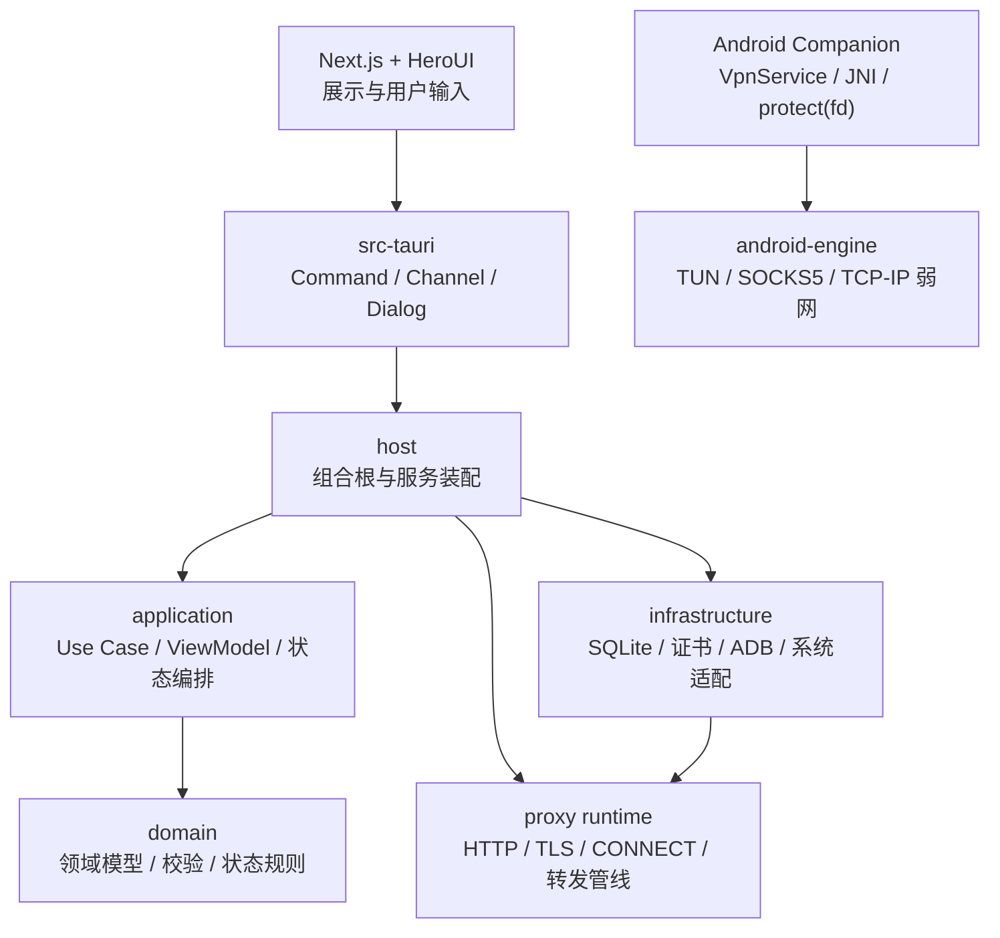

# Intercept Proxy 架构索引

状态：Active R01 baseline（2026-08-17）。本目录明确区分当前事实、已接受目标与开放决策；R01 只交付
能阻止错误实现的首批基线，不表示 `TODO-ARCH-001` 的十类完整设计已经完成。

`scripts/check-architecture-docs.mjs` 在不新增依赖的前提下确定性校验本批文档使用的 Mermaid
`flowchart`/`sequenceDiagram` 子集、配对结构和语句；它不是图片渲染器，文档不把该检查表述为 PNG/SVG 渲染证明。

## R01 阻塞基线

- [系统上下文与容器边界](system-context.md)：UI、host、application、domain、adapter、runtime、存储和外部系统。
- [HTTP、Socket 与协议包边界](protocol-boundaries.md)：严格 data-plane 语义、协议包当前边界与禁止依赖。
- [HTTP 与 Socket 数据平面](data-planes.md)：当前关键路径、失败前零输出和证据模型。
- [生命周期、持久化与信任边界](lifecycle-persistence-security.md)：task ownership、迁移、ZIP 所有权和敏感数据流。
- [架构可追溯矩阵](traceability.md)：场景到 domain/application/runtime/IPC/page/test 的可扩展骨架。

## 已接受决策

- [ADR-001：HTTP 与 Socket 只共享中立内核](decisions/ADR-001-http-socket-boundary.md)
- [ADR-002：HTTP 与 Socket 使用独立协议包，共享字段处理模型](decisions/ADR-002-protocol-packages-http.md)
- [ADR-003：统一 application ZIP 的所有权与版本](decisions/ADR-003-application-zip-ownership.md)
- [ADR-004：本机只读 MCP 信任边界](decisions/ADR-004-embedded-read-only-mcp.md)

## 既有专题文档

- [请求生命周期](request-lifecycle.md)
- [规则与状态](rules-and-state.md)
- [Workspace 与安全](workspace-and-security.md)
- [Android VPN 透明路由](android-vpn-transparent-routing.md)
- [开发指南](development-guide.md)

下文保留既有入门说明；若与上述 R01 边界冲突，以 R01 文档和 ADR 为准。

## 既有 HTTP 入门说明

本文档面向第一次接触项目的开发者。它回答四个问题：

1. Intercept Proxy 为什么要这样分层？
2. 一个请求从客户端进入后依次经过哪些模块？
3. 配置、证书、规则、VPN 和运行状态分别由谁负责？
4. 修改某类功能时应该改哪里，又不应该把逻辑放到哪里？

产品功能和验收条件仍以 [需求文档](../requirements.md) 为准；页面操作以
[用户使用说明](../user-operation-guide.md) 为准。本目录解释的是代码背后的设计与运行原理。

## 1. 系统目标

Intercept Proxy 是一个通用的 HTTP/HTTPS 测试代理，而不是某个业务应用的专用工具。
它同时提供三类能力：

- 桌面代理：正向代理、CONNECT 隧道、显式 MITM、固定上游反向代理、TLS/mTLS。
- HTTP 测试：抓包、会话、断点、规则、Mock、正文修改和故障注入。
- Android 网络接管：只接管选中的应用，通过 VPN/TUN 把指定目标透明转发到桌面代理，
  并可在 TCP/IP 层施加弱网。

系统刻意不包含业务地址、业务证书和业务返回码。测试人员通过 Workspace 自行组合监听、
证书、规则和设备网络方案。

## 2. 最重要的设计原则

### 2.1 Rust 是唯一业务实现

网络、证书、规则、校验、状态机、持久化、ADB 和弱网全部由 Rust 实现。Next.js 只做：

- 渲染 Rust 返回的 ViewModel；
- 把用户输入作为“操作意图”发给 Rust；
- 保存 Tab、弹窗、滚动位置、临时输入等纯视觉状态。

因此前端不能自行判断 Listener 是否能启动、规则是否匹配、证书是否可信，也不能在本地
持久化业务数据。这样未来接入 CLI/TUI 时可以复用同一套 application 和 runtime。

### 2.2 配置与运行时分离

Workspace 是“希望系统怎样运行”的持久化配置；Listener、VPN、断点等待任务和连接则是
“系统现在正在怎样运行”的临时状态。运行任务始终持有启动时的不可变配置快照：

- 编辑配置不会悄悄改变已建立连接；
- 需要变更网络行为时必须显式保存、停止、启动或应用；
- 停止失败、保存失败和运行状态不确定都必须被显式报告。

### 2.3 默认安全，显式放开

- Listener 的客户端 CIDR 留空表示允许任意地址；非空时按列表准入。非回环正向代理仍必须配置认证。
- CONNECT 默认透明隧道，只有显式 allowlist 才执行 MITM。
- 私钥/P12 字节和密码不进入前端 DTO。明确确认后，Rust 可把 Listener 证书材料和明文 P12 密码嵌入可移植导出，但本机 MITM Root CA 私钥绝不进入任何导出。
- Android VPN 只接管明确选择的应用，失败时关闭 TUN，让应用恢复系统网络。

### 2.4 失败必须可观察且可恢复

网络工具最危险的错误不是“操作失败”，而是“只完成一半”。因此跨资源操作采用补偿思路：

- Listener 先绑定端口，再保存 enabled 状态；保存失败就停止刚启动的 Listener。
- Android 先准备新的 ADB reverse，设备确认 Running 后才清理旧映射。
- 无法确认设备最终状态时保留可能正在使用的映射，不把应用留在断路状态。
- 停止时优先关闭真实端口/TUN，即使后续持久化状态失败也不能重新开放网络资源。

## 3. 分层与依赖方向



依赖只允许朝内层或能力层流动：

- `domain` 不知道 Tauri、SQLite、Android 或 UI。
- `application` 通过 trait 请求持久化、Listener、证书、ADB 等能力。
- `infrastructure` 实现这些 trait，并把领域配置转换为具体 runtime 配置。
- `proxy` 和 `android-engine` 只实现网络行为，不直接访问页面或数据库。
- `src-tauri` 不写业务规则，只做 IPC 参数和错误模型转换。

## 4. Rust crate 职责

| crate | 负责 | 不负责 |
| --- | --- | --- |
| `intercept-proxy-domain` | Workspace、Listener、规则、证书引用、设备方案、校验和状态迁移 | 数据库、Tauri、真实 socket |
| `intercept-proxy-application` | Use Case、乐观锁、运行编排、ViewModel、事件、分页 | 具体 SQLite/ADB/TLS 实现 |
| `intercept-proxy-runtime` | HTTP/1.1、CONNECT、MITM、Reverse、TLS、连接生命周期、报文管线 | 页面、数据库、业务模板 |
| `intercept-proxy-infrastructure` | SQLite、Keychain/DPAPI、证书材料、Listener runtime、ADB 控制 | UI 推断和领域规则复制 |
| `intercept-proxy-android-engine` | TUN 数据面、SOCKS5、包解析、弱网决策、统计 | VpnService 授权、桌面 UI |
| `intercept-proxy-product-api` | 稳定、可复用的产品级 API 数据契约 | Tauri 专用命令 |
| `intercept-proxy-host` | 创建并连接 application、infrastructure、runtime | 具体页面行为 |

## 5. 前端目录职责

- `src/app/`：Next.js 静态路由，只装配页面入口。
- `src/features/`：按工作区、入口、抓包、会话、断点、规则、故障、证书、设备网络拆分页面。
- `src/lib/ipc/`：调用 Tauri Command、订阅 Channel，隐藏传输细节。
- `src/generated/rust-types.ts`：Rust 自动生成的 DTO，禁止手工维护。

一个 feature 组件可以维护编辑草稿，但提交时必须把意图交给 Rust 校验。列表的筛选、分页、
业务错误原因和运行状态文案也应来自 Rust。

## 6. 组合根与启动

应用启动时 `host` 按顺序完成：

1. 打开全新命名空间下的 SQLite 和受保护秘密存储。
2. 创建领域仓储与基础设施适配器。
3. 创建 application facade 和事件中心。
4. 把规则、抓包、会话、断点端口注入代理 runtime。
5. 把 application 放进 Tauri `AppState`。
6. 注册 Command、Channel 和原生文件对话框。

业务调用的标准方向始终是：

```text
页面操作
  -> Tauri Command
  -> application Use Case
  -> domain 校验
  -> infrastructure/runtime trait
  -> ViewModel 或 AppErrorViewModel
  -> 页面渲染
```

## 7. 文档导航

- [请求生命周期](request-lifecycle.md)：HTTP、CONNECT、MITM、固定 Server、抓包和事件。
- [Workspace、配置与安全](workspace-and-security.md)：revision、导入导出、证书和秘密。
- [规则、断点与状态机](rules-and-state.md)：规则顺序、Body 编码、断点和恢复。
- [Android VPN 与透明代理](android-vpn-transparent-routing.md)：按应用接管、ADB reverse、TUN 和弱网。
- [开发与扩展指南](development-guide.md)：新增功能应该改哪里、注释和测试要求。

## 8. 一条简单判断规则

不知道代码应该放在哪里时，先问：

- 它是纯业务规则吗？放 `domain`。
- 它在编排多个动作或生成 UI 模型吗？放 `application`。
- 它需要操作系统、数据库、证书文件或 ADB 吗？放 `infrastructure`。
- 它处理 socket、HTTP、TLS 或字节流吗？放 `proxy`。
- 它处理 TUN 包和 TCP/IP 弱网吗？放 `android-engine`。
- 它只是把按钮点击转成命令吗？放前端或 `src-tauri` 薄适配层。

如果一个文件同时回答多个问题，应先拆分职责，而不是继续增加条件分支。
