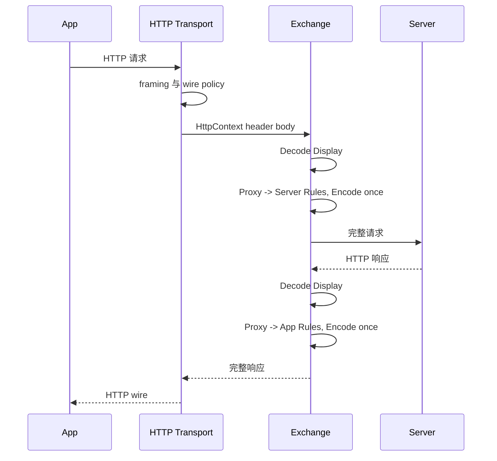
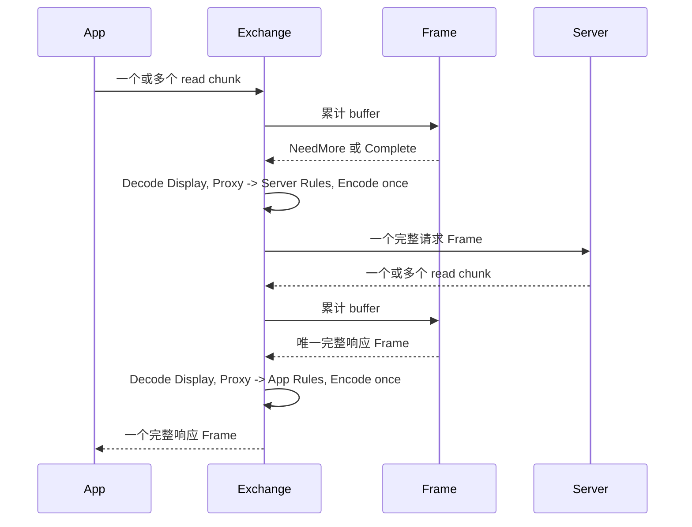
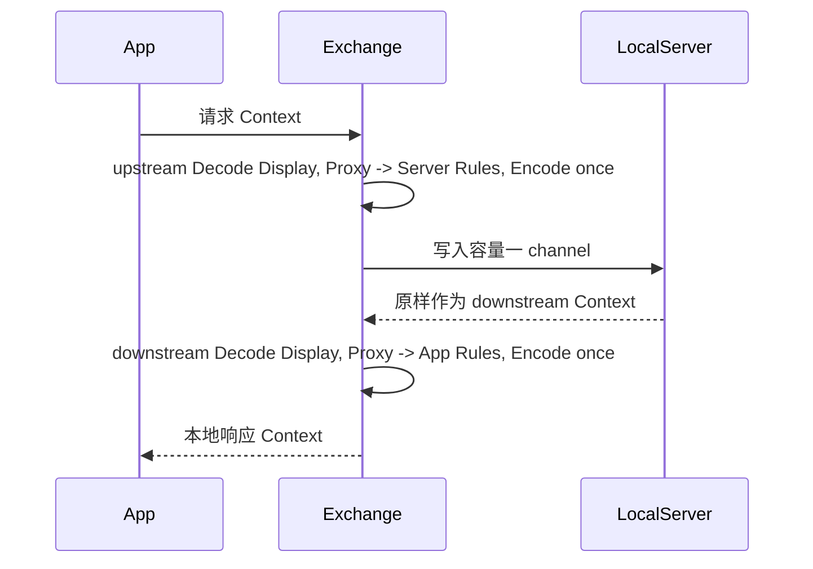
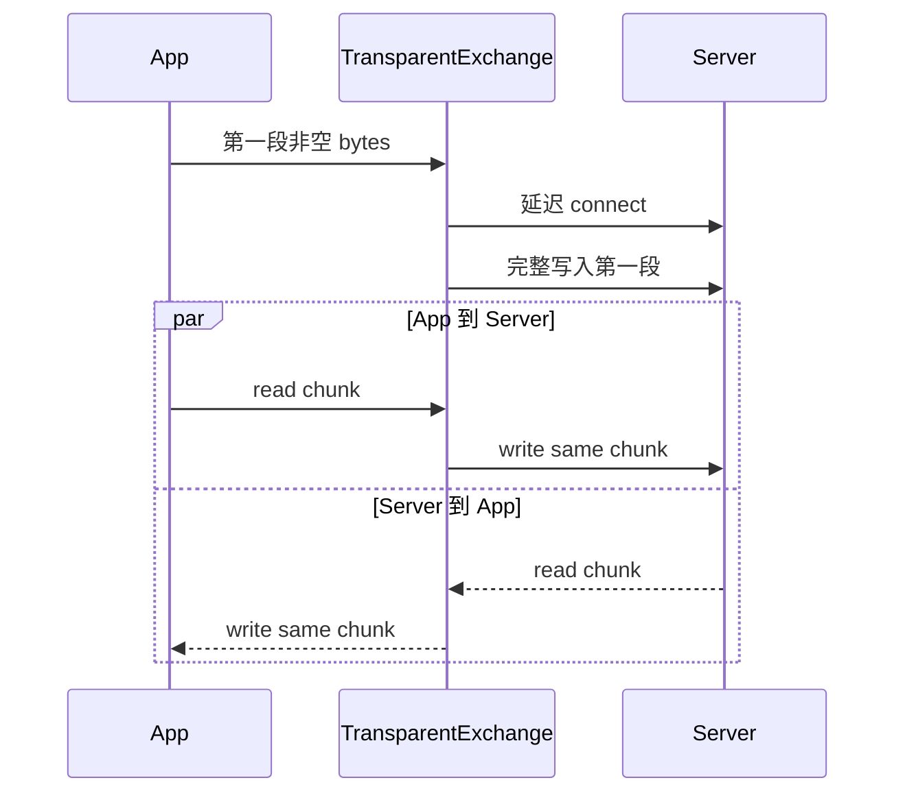
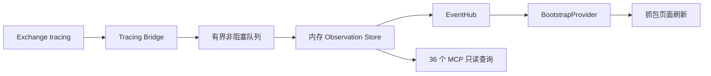

# 数据流、错误与验证

本文从真实连接角度说明 HTTP、Socket 协议模式、Socket 透明模式、观察链路和验证逻辑。

## 1. 统一方向

```text
------------------------------------ upstream ------------------------------------>

App -- read --> Decode --> Document --> Display --> Envelope
     -- write --> Proxy -> Server Rules --> Encode -----------> Server

Server -- read --> Decode --> Document --> Display --> Envelope
        -- write --> Proxy -> App Rules --> Encode -----------> App

<---------------------------------- downstream ------------------------------------
```

方向描述数据相对于 App 与 Server 的流向；Reader/Writer 描述 Proxy 当前执行的 I/O 动作。
因此 App Reader 是 Upstream，App Writer 是 Downstream；Server Writer 是 Upstream，Server
Reader 是 Downstream。

## 2. 一个连接的所有权

当 Listener accept 一个 App connection 时：

1. transport 创建 App Connection。
2. 当前 Listener 快照固定协议模式、安全配置、能力 factory 和 Server Endpoint。
3. 创建唯一 `Exchange<P>`，并把 App、ServerSlot、upstream Pipeline、downstream Pipeline 移入。
4. accept loop 只 poll `Exchange::exchange()`，不再自行推动协议阶段。
5. App EOF 正常结束；任一业务错误结束 Exchange 并关闭两端。
6. 同一 Socket connection 未断开时 Exchange 保留，可处理后续严格配对交易。
7. 同一 HTTP/1.1 connection 使用容量为 1 的 actor channel，多个请求依次进入同一个 Exchange。

`ExchangeId` 只用于 tracing/UI 并发关联，不进入协议报文、Document 或规则匹配。

## 3. HTTP 真实转发



HTTP 的边界分两层：

- Hyper/transport：HTTP/1 framing、原始 head 捕获、TLS、超时、连接管理和 wire policy。
- Exchange：协议 Decode/Display/Rules/Encode 与严格 request/response 配对。

Plain Body 模式仍会建立 `http-text` Document，但不加载协议包；Protocol Body 模式使用
Listener 启动时冻结的精确协议包版本。规则快照替换不会更换已冻结的协议脚本身份。

固定上游反向代理和普通 HTTP 正向代理都进入同一个 HTTP Exchange。当前连接绑定一个 Endpoint；
同一 Exchange 不支持在 keep-alive 期间切换目标。CONNECT、Upgrade 和 MITM tunnel fail-closed。

## 4. Socket 协议转发



严格顺序带来四个约束：

- App 请求未完整 Frame 前不连接/写入 RemoteServer。
- 请求未完整写入 Server 前不读取 Server 响应。
- 响应未读完、处理并写回 App 前不读取下一笔 App 请求。
- 同一次 Socket Pipeline read 不允许产出两个 Frame；出现尾部数据即协议错误。

RemoteServer 可以是 TCP、TCP→TLS、TLS→TCP 或 TLS→TLS；mTLS 身份和信任材料在 Listener
启动与握手阶段解析，Exchange 只看到已经建立的强类型 Connection。

## 5. LocalServer 数据流



LocalServer 与 RemoteServer 的差别只有 Endpoint 实现：

- 上下行 Pipeline、Envelope、规则、观察和错误传播完全相同。
- 容量 1 channel 保持一条在途 Context，不积累第二笔交易。
- Socket LocalResponder 的响应语义由 downstream 能力产生，而不是在 Exchange 外另建 responder。
- Direct LocalRawServer 同样属于透明 Exchange 的 Server 端口，每个 chunk 原样回环。

HTTP 标准规则的 `MockResponse` 是 request 阶段的终止动作，由 HTTP wire policy 和
BufferedHttpServer 形成响应；它不是另一套 HTTP LocalServer 生命周期。

## 6. Socket 透明转发



透明模式不承诺报文边界，只承诺字节与顺序：读到多少写多少，完整 write 成功后才记录 sent。
它允许两个方向同时传输，也正确传播 TCP half-close。TLS ClientHello 等任意二进制数据不会被解析。

## 7. 观察与 UI 刷新



业务事件按实际发生顺序追加：

1. `opened`
2. `received` 或 raw received
3. `sent` 或 raw sent
4. 可能出现 `failed`
5. `closed`，结果为 completed 或 failed

重要边界：

- `opened` 是唯一能创建连接记录的事件；缺失元数据时不能从后续事件猜测。
- Store 按连接保存 `Vec<ExchangeObservationEvent>`，第二笔数据追加，不能覆盖第一笔。
- 仓储只存在内存中并受 `CapacityLedger` 限制，不写 SQLite。
- tracing 回调只做有界 `try_send`；队列满、字段超限或 UI 变慢时丢观察并计数，不能阻塞交易。
- Store 更新后发布 `exchange_observation_changed`；前端 `useAppEventRefresh` 使列表和详情查询失效。
- UI 与 MCP 共享同一个 `Arc<ExchangeObservationStore>`，看到的是同一连接时间线。
- 五个环境配置工具不经过 Observation Store。它们由 MCP transport 类型化适配到 Application 的
  create/preview/token/apply 生命周期，并由 Application 持有候选、确认令牌、apply task、mutation
  gate 与清理所有权。

## 8. 错误传播

| 位置 | 结果 |
| --- | --- |
| App Reader EOF 且无半帧 | 连接正常完成 |
| Socket EOF 且存在半帧 | `TRUNCATED_FRAME` 类业务失败 |
| Server 在必要响应前 EOF | Exchange 失败 |
| Frame 边界无效或同次读取含尾部 | 协议失败，不保留到下一笔 |
| Decode、Rules、Encode 失败 | 当前 Exchange 失败，不发送兜底数据 |
| Reader、Writer、connect、TLS 或超时失败 | 保留稳定错误码并关闭连接 |
| Display 失败 | 使用 HTTP body 或 Socket hex，交易继续 |
| 观察队列或 UI 刷新失败 | 丢观察并计数，交易继续 |
| capability factory 返回错误或 panic | 同一 Exchange 记录 failed/closed，不创建兜底 Pipeline |
| 最终 shutdown 失败 | 追加 warning，不覆盖业务结果 |

Writer 必须循环处理底层 partial write；只有整个 Context/chunk 和 flush 成功才返回 sent。
失败后不得猜测已提交前缀、重发完整报文或切换 Local/Remote 模式。

## 9. 配置与规则验证

验证按层次执行，不把 UI 控件当作安全边界：

### 9.1 Domain

- serde `deny_unknown_fields` 拒绝不会生效的配置字段。
- Workspace 校验 HTTP Body 模式、协议包身份、Socket Topology、processing 和安全组合。
- Document Schema 校验 ID、版本、标题、字段数量、名称唯一性和值类型。
- 统一规则冻结 Listener、content type 和 Document package/Schema 绑定；stage 可以更新，但目标阶段
  必须重新校验完整 HTTP/Document 内容、条件、动作、资源上限和 revision。
- HTTP 内容按 `Proxy -> Server` 与 `Proxy -> App` 两个统一写出阶段校验匹配字段、动作、终止语义和
  流量方向；Document 与普通 HTTP gate 在同一 actor transaction 中保持各自能力所有权。

### 9.2 Application

- Use Case 执行乐观锁、确认操作、跨仓储引用和当前 Listener/协议包状态校验。
- `rule_editor_context` 按两个统一写出阶段返回合法匹配字段和动作，方向敏感动作带固定方向。
- 草稿命令只生成矩阵允许的字段/动作；保存时不依赖 Listener 运行状态，再次调用同一阶段能力
  判断和领域校验。
- Document capability 绑定 Listener、精确包版本和 Schema，并按目标阶段重新验证，HTTP/Socket
  不能串用。

### 9.3 Infrastructure 与 Runtime

- Listener 启动前冻结 Workspace、协议包和规则快照；校验证书用途、Endpoint 和资源限制。
- TLS/mTLS 在真实握手时验证 CA、hostname、client identity 和 downstream client authentication。
- Frame、Decode 和 Encode 受 buffer、输出、操作数、调用深度和 wall-time 限制。
- 外部软件包必须完成精确身份注册；超时、非法 JSON、错误结果类型和背压均有稳定失败路径。

### 9.4 Frontend

- `commands.ruleCapabilities()` 和协议 capability command 是可选项来源。
- 前端只渲染能力、请求 Rust 生成草稿并显示 `field_errors`。
- 能力查询失败或异步草稿仍未完成时禁止保存；前端不自行推导“应该允许什么”。

## 10. 验证锚点

| 契约 | 源码/测试锚点 |
| --- | --- |
| Exchange 严格配对和固定 Endpoint | `src-tauri/crates/exchange/src/tests/exchange.rs` |
| Envelope 不变与阶段顺序 | `src-tauri/crates/exchange/src/tests/pipeline.rs` |
| raw 延迟连接、双向 relay 和 half-close | `src-tauri/crates/exchange/src/tests/raw.rs` |
| HTTP 一个连接复用一个 Exchange | `src-tauri/crates/proxy/tests/raw_http_proxy/lifecycle.rs` |
| HTTP capability 执行顺序 | `src-tauri/crates/proxy/src/forward/tests/capability_sequence.rs` |
| HTTP wire 保真 | `src-tauri/crates/proxy/tests/raw_http_proxy/wire_fidelity.rs` |
| TLS 与 mTLS | `src-tauri/crates/proxy/tests/tls_mtls.rs`、`src-tauri/crates/proxy/tests/reverse_listener/` |
| HTTP 协议包完整 Pipeline | `src-tauri/crates/infrastructure/src/adapters/listener_runtime/tests/phase10_http_pipeline.rs` |
| Socket Remote/Local/透明 runtime | `src-tauri/crates/infrastructure/src/adapters/listener_runtime/tests/socket_runtime.rs`、`local_responder_runtime.rs` |
| Socket 双向规则、Encode 与事务 | `src-tauri/crates/infrastructure/src/adapters/listener_runtime/tests/external_package_runtime.rs` |
| HTTP 标准规则能力矩阵 | `src-tauri/crates/application/src/requirements_tests/settings_lifecycle.rs`、`src/features/rules/rules-view.test.tsx` |
| Observation 顺序、容量和 UI 刷新 | `src-tauri/src/runtime_logs/exchange_ui_layer/tests.rs`、`src/features/capture/exchange-observation-view.test.tsx` |
| 架构依赖和文件大小 | `scripts/check-architecture-boundaries.mjs`、`scripts/check-source-file-sizes.mjs` |

日常验证入口：

```text
pnpm scan:architecture
pnpm scan:source-size
pnpm lint
pnpm typecheck
pnpm test
cargo test --manifest-path src-tauri/Cargo.toml --workspace
pnpm check
```

`pnpm check` 是完整收口门禁：生成 IPC 类型、检查架构和文件大小、执行前端 lint/typecheck/tests/build、
检查 bundle 品牌、Rust fmt/clippy/Windows check，并运行整个 Cargo workspace 测试。
