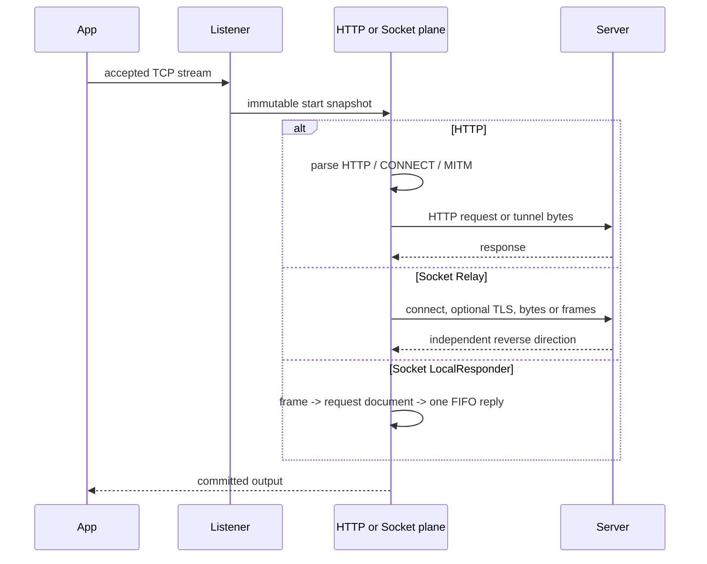

# HTTP 与 Socket 数据平面

## As-Is

| 路径 | 当前失败/输出边界 | 源码 | 测试证据 |
| --- | --- | --- | --- |
| accept -> immutable snapshot | 已运行连接不读取编辑中的 Workspace | `src-tauri/crates/infrastructure/src/adapters/listener_runtime.rs` | `src-tauri/crates/infrastructure/src/adapters/listener_runtime/tests/scripted_snapshot.rs` |
| HTTP forward/reverse | HTTP request/response、规则、断点和抓包使用 HTTP 专属模型 | `src-tauri/crates/proxy/src/http`, `src-tauri/crates/application/src/facade/traffic.rs` | `src-tauri/crates/proxy/src/http/tests.rs`, `src-tauri/crates/application/src/requirements_tests.rs` |
| CONNECT/MITM | 默认 tunnel；显式策略才终止 TLS 并解析 HTTP | `src-tauri/crates/proxy/src/forward/service/connect.rs`, `src-tauri/crates/proxy/src/tls` | `src-tauri/crates/proxy/tests/raw_http_proxy/lifecycle.rs`, `src-tauri/crates/proxy/src/forward/tests/listener_lifecycle.rs` |
| Socket transparent relay | 双向并发并保留 half-close；TLS 可保持不透明 | `src-tauri/crates/proxy/src/socket_relay.rs` | `src-tauri/crates/proxy/src/socket_relay/tests/direct.rs` |
| Socket scripted relay | Frame/Decode/Rule/Encode 任一 pre-write 失败不得输出该 frame | `src-tauri/crates/proxy/src/socket_relay/frame_pump.rs` | `src-tauri/crates/proxy/src/socket_relay/frame_pump/tests.rs` |
| LocalResponder | 无上游字段；请求逐个处理并在 flush 后处理下一请求 | `src-tauri/crates/proxy/src/socket_relay/frame_pump/local.rs` | `src-tauri/crates/proxy/src/socket_relay/frame_pump/scheduling_tests.rs` |
| capture commit | HTTP Exchange 与 Socket RelayFrame/LocalExchange 不共享 nullable mega-DTO | `src-tauri/crates/application/src/models/socket_capture.rs`, `src-tauri/crates/application/src/models/capture.rs` | `src-tauri/crates/infrastructure/src/adapters/socket_capture/tests.rs`, `src-tauri/crates/application/src/models/socket_capture_tests.rs` |

## To-Be

- 共享的 transport 只处理 accept/connect/read/write/TLS/cancellation；协议解析、错误和 capture 由各平面拥有。
- 稳定 port 传递协议专属 tagged union；禁止全局 service locator 和万能 Message DTO。
- 任何抽取都先以现有 HTTP 和 Socket 行为测试锁定，删除兼容层前必须有消费者为零的静态证据。

## Open Decision

- WebSocket Upgrade 的完整 lifecycle/capture 时序尚未纳入首批图。Owner: R07e。
- Socket rule/capture UI 的紧凑共享 shell 不改变两个平面的 DTO。Owner: R04。
- Android 经 VPN 进入不同 Listener 的路由与取消时序。Owner: R02、R10。
