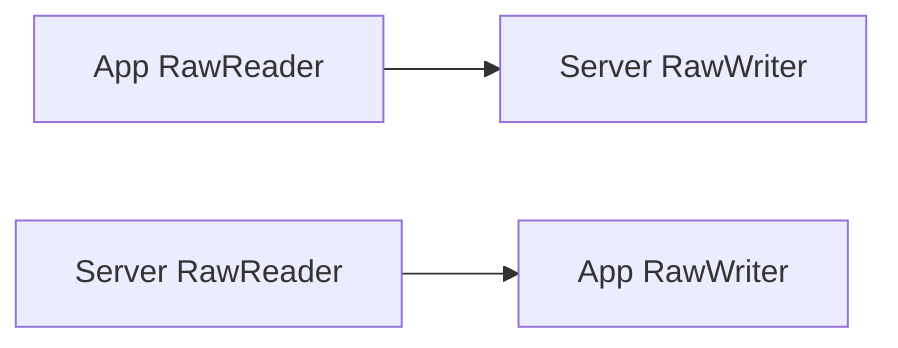

# Exchange 与 Pipeline

本章描述 `intercept-proxy-exchange` 的当前代码模型。代码块是对生产签名的结构化摘录，
省略字段和方法体，不能作为独立程序编译；真实定义位于 `src-tauri/crates/exchange/src/`。

## 1. 核心概念

| 概念 | 含义 |
| --- | --- |
| `Protocol` | 决定 Context 的静态类型；HTTP 是 header/body 文本，Socket 是字节数组 |
| `Direction` | `Upstream` 或 `Downstream`，作为泛型参数防止端点接反 |
| `Reader` | 从一个方向读取 transport Context；`None` 表示 EOF |
| `Writer` | 完整写入并 flush，成功后返回真实写出的 Context |
| `Connection` | 同时拥有 Reader、Writer 和完整 shutdown |
| `Server` | 创建时已经固定的 Local 或 Remote Endpoint |
| `Envelope` | Reader Pipeline 产生的不可变消息事实 |
| `Pipeline` | 同一协议、同一方向上的 Reader Pipeline 与 Writer Pipeline |
| `Exchange` | 一个 App connection 的连接级运行器和观察边界 |

## 2. 协议与方向强约束

```rust
pub trait Protocol {
    type Context: Clone + Debug + Send + Sync + 'static;
}

pub struct HttpContext {
    pub header: String,
    pub body: String,
}

pub struct SocketContext {
    pub data: Vec<u8>,
}

pub trait Direction {
    const KIND: DirectionKind;
}

pub struct Upstream;
pub struct Downstream;
```

`Reader<Http, Upstream>` 与 `Reader<Socket, Downstream>` 是不同类型。HTTP 不能误接 Socket
Context，App 侧 Reader 也不能误接 Server 侧 Reader。方向含义固定如下：

- Upstream：App → Proxy → Server。
- Downstream：Server → Proxy → App。

## 3. 端点模型

```rust
#[async_trait]
pub trait Reader<P: Protocol, D: Direction> {
    async fn read(&mut self) -> Result<Option<P::Context>, Error>;
}

#[async_trait]
pub trait Writer<P: Protocol, D: Direction> {
    async fn write(&mut self, context: P::Context) -> Result<P::Context, Error>;
}

#[async_trait]
pub trait Connection<P, RD, WD> {
    fn reader(&mut self) -> &mut dyn Reader<P, RD>;
    fn writer(&mut self) -> &mut dyn Writer<P, WD>;
    async fn shutdown(&mut self) -> Result<(), Error>;
}

pub type AppConnection<P> = dyn Connection<P, Upstream, Downstream>;
pub type ServerConnection<P> = dyn Connection<P, Downstream, Upstream>;

#[async_trait]
pub trait Server<P: Protocol> {
    async fn connect(&mut self, first: &P::Context)
        -> Result<Box<ServerConnection<P>>, Error>;
}
```

Connection 而不是 Reader/Writer 拥有 shutdown，因为关闭属于整条底层连接。`ServerSlot<P>`
延迟到第一条 upstream Context 写出前建立 Server connection；成功后始终复用同一 Endpoint。

## 4. 阶段能力

```rust
pub enum FrameResult {
    NeedMore,
    Complete { consumed: usize },
}

#[async_trait]
pub trait Frame<D: Direction> {
    async fn split(&mut self, buffer: &[u8]) -> Result<FrameResult, Error>;
}

#[async_trait]
pub trait Decode<P: Protocol, D: Direction> {
    async fn decode(&mut self, context: &P::Context) -> Result<Document, Error>;
}

#[async_trait]
pub trait Display {
    async fn display(&mut self, document: &Document) -> Result<String, Error>;
}

#[async_trait]
pub trait Rules {
    async fn apply(&mut self, document: Document) -> Result<Document, Error>;
}

#[async_trait]
pub trait Encode<P: Protocol, D: Direction> {
    async fn encode(
        &mut self,
        original: &P::Context,
        document: &Document,
    ) -> Result<P::Context, Error>;
}
```

这些 trait 是运行时替换点。实现可以来自 Rust 内建逻辑或统一软件包 RPC，
但 Exchange 只看见单阶段能力，不允许把整条组合处理器伪装成 Decode。

规则链按既定顺序逐条接收前一条输出的 Document。每条协议 Document 规则只有一个 condition 和
一个对应 action；需要多个独立行为时创建多条规则，由规则顺序决定 working Document 的可见次序。

- condition 对当前 working Document 求值。
- 命中后执行该规则的唯一 action。
- 字段和值严格遵循 Schema 类型，不做隐式字符串/数字转换。

## 5. Envelope 不变量

```rust
pub struct Envelope<P: Protocol, D: Direction> {
    context: P::Context,
    document: Document,
    display: String,
    direction: PhantomData<D>,
}
```

Envelope 在 Reader Pipeline 完成时固定三份事实：

- `context`：本次 read 得到的协议数据。
- `document`：Decode 结果。
- `display`：基于 read 时 Document 生成的 UI 展示。

Writer 只能读取 Envelope。Rules 获得 `document.clone()` 并产生独立写出 Document；Encode
可以根据原始 Context 与修改后的 Document 构造输出。Writer 修改不会回写 Envelope，也不会
重新渲染 read 时已经固定的 display，因此抓包能够同时解释“收到什么”和“最终发出什么”。

## 6. Pipeline 结构

```rust
pub struct Pipeline<P: Protocol, D: Direction> {
    reader: Box<dyn ReadPipeline<P, D>>,
    writer: Box<dyn WritePipeline<P, D>>,
}

pub struct HttpRead<D: Direction> {
    decode: Box<dyn Decode<Http, D>>,
    display: Box<dyn Display>,
}

pub struct SocketRead<D: Direction> {
    frame: Box<dyn Frame<D>>,
    decode: Box<dyn Decode<Socket, D>>,
    display: Box<dyn Display>,
}

pub struct Write<P: Protocol, D: Direction> {
    rules: Box<dyn Rules>,
    encode: Box<dyn Encode<P, D>>,
}
```

Exchange 持有两条方向一致、类型不同的 Pipeline：

```rust
pub struct ProtocolExchange<P: Protocol> {
    app: Box<AppConnection<P>>,
    server: ServerSlot<P>,
    upstream: Pipeline<P, Upstream>,
    downstream: Pipeline<P, Downstream>,
}
```

### 6.1 HTTP Pipeline


HTTP transport 已经完成 HTTP framing，Context 保存 header/body 文本，因此 Reader Pipeline
不需要 Frame。当前有两种明确能力工厂：

- Plain：Rust `TextDecode` 把 header/body 放入 `http-text` Document；Display 返回 body；
  空 RulesChain 后由 `TextEncode` 重建 Context。
- Protocol：绑定精确 HTTP 协议包版本；Decode/Display/Encode 调用传输无关的固定 Hook，
  RulesChain 顺序执行两个边界阶段的 Document 规则。

HTTP 标准 Header/JSON/故障规则不隐藏在协议 Decode 中。它们由 `PipelinePorts` 在已 framing
的 Message 上执行；协议包阶段仍只由 Exchange capability factory 创建。

### 6.2 Socket 协议 Pipeline


`SocketRead` 在一次 `read()` 调用内部循环读取非空 chunk，并把字节追加到本地 buffer：

1. Frame 返回 `NeedMore` 时继续读取。
2. Frame 返回 `Complete` 时，`consumed` 必须大于零且不能超过 buffer。
3. `consumed` 必须恰好等于 buffer 长度；同次读取中出现第二帧或尾部数据直接报协议错误。
4. 完整帧立即 Decode、Display 并返回一个 Envelope；不会等待下一帧。
5. EOF 时 buffer 非空代表截断帧，Exchange 失败。

这套限制刻意不支持 Socket pipelining，保证一问一答与当前 Server 回复模型一致。

## 7. Exchange 运行器

```rust
pub struct Exchange<P: Protocol> {
    id: ExchangeId,
    mode: ExchangeMode<P>,
}

enum ExchangeMode<P: Protocol> {
    Protocol(ProtocolExchange<P>),
    Transparent(TransparentExchange),
}

impl<P: ObservedProtocol> Exchange<P> {
    pub async fn exchange(self) -> Result<(), Error>;
}
```

协议模式唯一循环如下：

```text
upstream.read(App)
  -> upstream.write(Server)
  -> downstream.read(Server)
  -> downstream.write(App)
  -> 下一轮
```

任何时刻只 poll 当前步骤。等待 Server 回复时不读取 App；App 提前到达的下一笔数据留在
transport 缓冲区，下一轮才处理。App Reader EOF 正常结束；Server 在应答前 EOF 是业务失败。

## 8. LocalServer 与 RemoteServer

`Server<P>` 是统一 Endpoint 端口：

- Remote HTTP：`BufferedHttpServer` 的 Writer 调用真实 `UpstreamConnector`，Reader 返回响应。
- Remote Socket：`RemoteSocketServer` 延迟建立 TCP/TLS，并暴露 Socket Reader/Writer。
- Local protocol：`LocalServer<P>` 使用容量为 1 的 channel，把 upstream Context 原样交给
  downstream Reader；downstream Pipeline 仍会执行 Decode、Display、Rules、Encode。
- Local raw：`LocalRawServer` 对每个非空 chunk 做同字节回环。

因此 LocalServer 是可替换 Server，不是 LocalResponder 旁路。Socket LocalResponder 可以把
请求 Context 作为 downstream 输入，再由绑定能力生成/修改响应；观察、错误和关闭仍走同一个 Exchange。

## 9. Socket 透明模式

`SocketPayloadProcessing::Direct` 不创建 Frame、Document 或 Envelope，而是进入
`TransparentExchange`：



透明模式的固定规则：

- 先读取第一段非空 App bytes，再建立 Server connection；App 未发送数据就关闭时不连接 Server。
- 第一段必须完整写给 Server，之后两个方向才使用 `try_join` 并发 relay。
- 每次读到多少就完整写出多少，不切 Frame、不合并业务消息、不调用协议能力。
- 单向 EOF 只调用对应 Writer 的 `finish` 传播 half-close，另一方向继续到自身 EOF 或失败。
- 任一方向失败会取消共同 Exchange；失败后不会静默切换模式或重发业务字节。

透明模式只存在于 `Exchange<Socket>`。HTTP CONNECT、Upgrade 和 MITM 隧道当前明确不支持。

## 10. 展示失败与业务失败

- Frame、Decode、Rules、Encode、Reader、Writer、Server connect 失败属于业务 Pipeline 失败，
  必须结束当前 Exchange。
- Display 只影响观察。HTTP Display 失败时使用原始 body，Socket Display 失败时使用十六进制；
  交易仍继续。
- App/Server 最终 shutdown 失败只写 warning，不覆盖已经确定的业务结果。
- capability factory 错误或 panic 会被转换为同一 Exchange 的 failed/closed 时间线，不构造兜底 Pipeline。

详细事件流见 [数据流、错误与验证](data-flow.md)。
