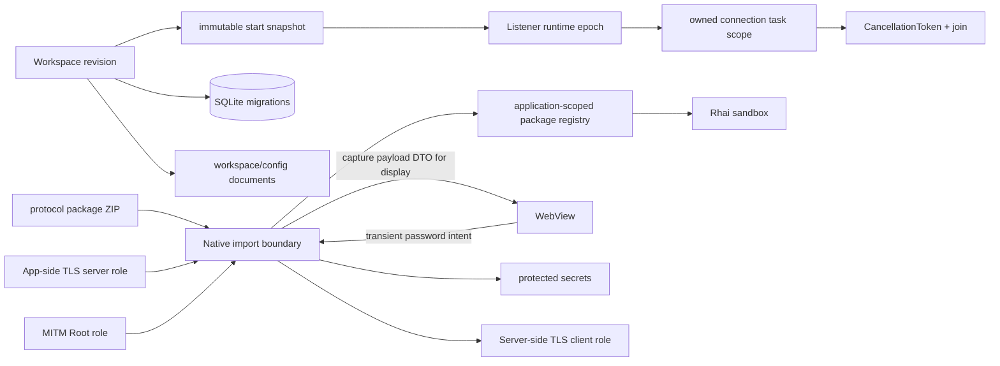

# 生命周期、持久化与信任边界

## As-Is

| 节点或路径 | 当前所有权/边界 | 源码 | 测试证据 |
| --- | --- | --- | --- |
| Workspace revision -> snapshot | optimistic revision 后启动不可变配置 | `src-tauri/crates/domain/src/workspace.rs`, `src-tauri/crates/infrastructure/src/adapters/listener_runtime.rs` | `src-tauri/crates/infrastructure/src/adapters/workspaces/tests.rs`, `src-tauri/crates/infrastructure/src/adapters/listener_runtime/tests/scripted_snapshot.rs` |
| epoch -> owned scope -> cancel/join | supervisor 拥有 Listener/connection task，关闭先关 spawn barrier 再 drain | `src-tauri/crates/proxy/src/supervisor`, `src-tauri/crates/proxy/src/listener/task_scope.rs` | `src-tauri/crates/proxy/src/supervisor/tests/shutdown.rs`, `src-tauri/crates/proxy/src/listener/task_scope/tests.rs` |
| Workspace -> SQLite migrations | `schema_migrations` 是唯一 schema 版本账本，当前版本由 infrastructure 常量定义 | `src-tauri/crates/infrastructure/src/sqlite.rs` | `src-tauri/crates/infrastructure/src/sqlite/tests/workspace_and_settings.rs` |
| Workspace/config documents | application 定义严格版本 wire；adapter 负责原生文件 I/O | `src-tauri/crates/application/src/workspace_documents.rs`, `src-tauri/crates/application/src/configuration.rs` | `src-tauri/crates/application/src/workspace_documents/tests/socket_compatibility.rs`, `src-tauri/crates/infrastructure/src/adapters/workspaces/tests.rs` |
| protocol package ZIP -> registry | 原生读取受限 ZIP、严格编译；安装记录 application scoped | `src-tauri/crates/protocol-scripting/src/archive`, `src-tauri/crates/infrastructure/src/adapters/protocol_packages.rs` | `src-tauri/crates/protocol-scripting/src/tests/archive/safety.rs`, `src-tauri/crates/infrastructure/src/adapters/protocol_packages/tests.rs` |
| WebView -> native file boundary | WebView 不接收协议包路径/ZIP/source；一次性 preview token 提交 | `src-tauri/src/commands/protocol_packages.rs`, `src-tauri/crates/infrastructure/src/adapters/protocol_package_import.rs` | `src-tauri/src/commands/protocol_packages/tests.rs`, `src-tauri/crates/infrastructure/src/adapters/protocol_package_import/tests.rs` |
| WebView -> native credential intent | 用户输入的密码可瞬时通过 IPC 提交给 Rust parser/store；前端不把它作为业务状态持久化，成功后清空输入 | `src/features/listeners/use-listener-certificates.ts`, `src-tauri/src/commands/listener.rs` | `src/features/listeners/socket-security-cards.test.tsx`, `src-tauri/crates/application/src/requirements_tests/settings_lifecycle.rs` |
| native -> WebView capture detail | HTTP/Socket 抓包 payload 是有意返回并展示的证据 DTO；Debug、diagnostic 和 error 不复制 payload/secret 值 | `src-tauri/src/commands/capture.rs`, `src-tauri/crates/application/src/models/socket_capture.rs`, `src-tauri/crates/application/src/models/diagnostics.rs` | `src-tauri/src/commands/capture/tests.rs`, `src-tauri/crates/application/src/models/socket_capture_tests.rs`, `src-tauri/crates/application/src/requirements_tests/diagnostics.rs` |
| native -> protected secrets | 持久化私钥、secret bytes 和密码只进入受保护存储；普通 ViewModel 不回显原值 | `src-tauri/crates/infrastructure/src/adapters/protected_secrets.rs`, `src-tauri/crates/application/src/portable_certificates.rs` | `src-tauri/crates/infrastructure/src/certificates_tests.rs`, `src-tauri/crates/application/src/workspaces_tests.rs` |
| App TLS / Server TLS / MITM Root | App 侧 server identity、Server 侧 client identity 与 MITM Root 是不同 role，配置不可互换 | `src-tauri/crates/domain/src/workspace/listener_model.rs`, `src-tauri/crates/proxy/src/tls` | `src-tauri/crates/proxy/src/socket_relay/tests/tls.rs`, `src-tauri/crates/domain/src/workspace/tests.rs` |
| package registry -> Rhai sandbox | 脚本不能获得文件、网络、进程或 UI 能力，资源错误保持结构化 | `src-tauri/crates/protocol-scripting/src/compiler/engine.rs`, `src-tauri/crates/protocol-scripting/src/runtime` | `src-tauri/crates/protocol-scripting/src/tests/compiler/sandbox.rs`, `src-tauri/crates/protocol-scripting/src/runtime/executor/tests.rs` |

## To-Be

- [ADR-003](decisions/ADR-003-application-zip-ownership.md) 规定统一 application archive：application 拥有 manifest、版本和迁移；infrastructure 拥有 ZIP 限额、临时文件、fsync/rename 与补偿。
- 导入采用 prepare/preview token/commit；commit 在 revision、运行状态和资源检查后原子替换，任何失败不产生半状态。
- App 侧 TLS identity、Server 侧 client identity、MITM Root 三类信任材料保持不同 role。密码允许作为瞬时入站 IPC
  intent，抓包 payload 允许作为有意展示的出站 DTO；持久化私钥/secret bytes/password 不回显，日志/error 不含
  敏感值，协议脚本正文不进入 WebView。

## Open Decision

- application ZIP v1 wire、限制、迁移与原子替换尚未实现。Owner: R07a、R07b、R07c、R07d、R07e。
- P12/PFX/加密 PEM 仅作为下游 serverAuth 的导入细节尚待实现。Owner: R09。
- clear/reset generation barrier 与 capture publisher 的完整并发图。Owner: R07e。
- Android runtime owner/epoch 和 host shutdown 补偿。Owner: R02、R10。
