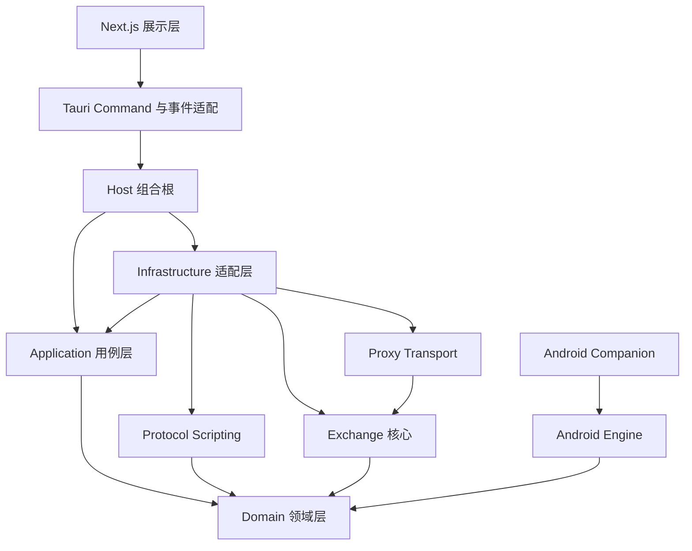
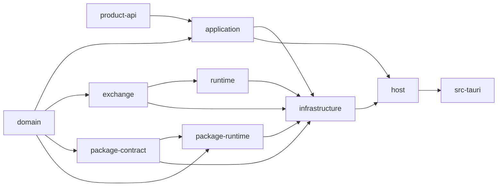
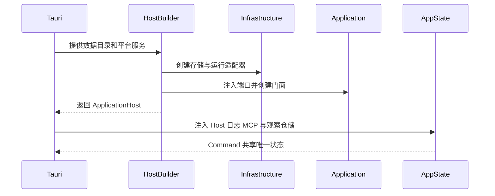

# 模块与代码组织

本文描述当前源码的静态分层、Cargo crate 依赖、Tauri 组合根和前端 feature 组织。

## 1. 全局分层

依赖图表达编译期依赖，不表达运行时调用的先后顺序。关键限制如下：

- `domain` 与 `product-api` 位于最内层，不依赖 Tauri、数据库或真实网络。
- `exchange` 只依赖 `domain`，因此交易顺序可以脱离 transport 做确定性测试。
- `application` 只依赖领域和产品契约，通过 trait 请求外部能力。
- `proxy` 依赖 `exchange`，提供 HTTP、Socket、TLS 和连接生命周期适配。
- `infrastructure` 是外层适配器集合，可以同时理解 application 端口、SQLite、proxy、
  exchange、package-contract、package-runtime 和外部 Sidecar 注册表，并负责把它们接起来。
- `host` 是与 UI 无关的最终 Rust 组合根；`src-tauri` 只再添加桌面运行时能力。

## 2. Cargo crate 依赖

下表来自各 crate 的 `Cargo.toml` 路径依赖。

| crate | 项目内依赖 | 核心职责 |
| --- | --- | --- |
| `intercept-proxy-domain` | 无 | Workspace、Listener、Document、规则、证书引用、设置和纯校验 |
| `intercept-proxy-product-api` | 无 | 产品名称、存储命名空间、分类器、Body codec 等稳定策略契约 |
| `intercept-proxy-android-engine` | `domain` | TUN 数据面、路由、SOCKS5、弱网决策和统计 |
| `intercept-proxy-application` | `domain`、`exchange`、`product-api` | Use Case、ViewModel、端口、事件、容量和乐观锁 |
| `intercept-proxy-exchange` | `domain` | `Exchange
`、Pipeline、Envelope、端点和透明转发 |
| `intercept-proxy-package-contract` | `domain` | API 1 Manifest、固定 RPC、FrameResult 与错误 wire |
| `intercept-proxy-package-runtime` | `domain`、`package-contract` | 严格 ZIP、Boa 模块与独立 Sidecar 程序 |
| `intercept-proxy-runtime` | `exchange` | Tokio/Hyper/rustls transport、HTTP、Socket、TLS 和 supervisor |
| `intercept-proxy-infrastructure` | `application`、`domain`、`exchange`、`package-contract`、`package-runtime`、`product-api`、`runtime` | SQLite、密钥保护、证书、ADB、Listener、协议包和运行适配 |
| `intercept-proxy-host` | `application`、`infrastructure`、`product-api`、`runtime` | 无 UI 的完整应用装配与后台任务所有权 |
| 根 crate `intercept-proxy` | `application`、`domain`、`host`、`infrastructure`、`product-api`、`runtime` | Tauri Command、AppState、日志、MCP 和桌面生命周期 |

箭头表示“被右侧依赖”。例如 `exchange --> runtime` 表示 runtime 依赖 exchange。

## 3. Rust 模块所有权

### 3.1 Domain

`src-tauri/crates/domain/src/` 是领域真相：

- `workspace/`：Listener 数据平面、HTTP Body 模式、Socket 拓扑、安全设置和校验。
- `document/`：协议无关的递归 Schema 与 JSON Document；值类型覆盖 Null、Boolean、Number、String、
  Object 和 Array，路径使用 JSON Pointer。
- `protocol_document_rule/`：统一规则内部复用的 Schema 驱动 Document 条件、动作与执行原语；
  不形成独立规则集合或 CRUD。
- `unified_rule.rs`：统一 `RuleDefinition`、固定阶段坐标、HTTP/Socket 带标签内容和顶层不变量。
- `rule/`：统一 HTTP 内容复用的匹配、动作、终止语义与运行时命中提交原语。
- `certificate`、`settings`、`session`、`android_network`：各自纯领域模型。

领域构造器和反序列化都会执行不变量校验。未知字段、错误类型、越界资源和不兼容组合
必须 fail-closed，不能依赖页面控件隐藏来保证合法性。

### 3.2 Application

`src-tauri/crates/application/src/` 负责：

- `facade/`：Workspace、Listener、规则、协议包、证书、设备和备份 Use Case。
- `models/`：前端、MCP 和其他展示适配器共享的 ViewModel。
- `ports/`：存储、Listener runtime、证书和 Android 等端口。
- `events/`：有界回放与实时 `EventHub`。
- `capacity`、`breakpoints`、`sessions`：进程级业务协调与资源合同。

HTTP 标准规则的 `facade/rule_capabilities.rs` 是编辑能力矩阵的唯一 Rust 真相源：

- TLS 握手阶段只暴露证书指纹匹配和拒绝握手动作。
- Request/Response 各自暴露合法匹配字段、普通动作和终止动作。
- Throttle/Intermittent 的方向由阶段固定为 Upstream 或 Downstream。
- 前端通过 `rule_capabilities`、草稿命令和生成 DTO 渲染选项。
- `rule_save` 仍调用领域与 application 校验，防止旧客户端或损坏输入绕过矩阵。

### 3.3 Exchange

`src-tauri/crates/exchange/src/` 只拥有协议交换抽象：

- `protocol.rs`：`Protocol`、HTTP/Socket Context、Upstream/Downstream 类型方向。
- `capability.rs`：Frame、Decode、Display、Rules、Encode。
- `endpoint.rs`：Reader、Writer、Connection、Server 和延迟连接的 `ServerSlot`。
- `pipeline.rs`：HTTP/Socket Reader Pipeline 与公共 Writer Pipeline。
- `exchange.rs`：连接级严格配对循环和统一观察 span。
- `local_server.rs`：与远端 Server 使用同一端口的协议/raw 本地回环。
- `transparent.rs`：Socket raw 双向转发和 half-close。

详细模型见 [Exchange 与 Pipeline](exchange-pipeline.md)。

### 3.4 Runtime 与 Infrastructure

`intercept-proxy-runtime` 负责真实网络行为：

- `http/`、`forward/`、`reverse/`：HTTP/1、正向/固定上游、连接级 Exchange 适配。
- `socket_relay/`：Socket 准入、TCP/TLS、协议模式和透明模式。
- `tls/`、`transport/`、`listener/`：安全握手、I/O 与任务生命周期。
- `supervisor/`：Listener 状态和并发任务所有权。

`intercept-proxy-infrastructure` 负责外层能力实现：

- `sqlite/`：Workspace、规则、协议包、证书引用和设置持久化。
- `adapters/listener_runtime/`：领域 Listener 到真实 runtime 的装配与校验。
- `adapters/pipeline/`：HTTP 标准规则、抓包、会话、断点和故障动作桥接。
- `sqlite/external_packages.rs`：外部包注册、本地 ZIP、生命周期状态和精确版本持久化。
- `adapters/external_packages/`：外部 WebSocket/RPC 协议能力。
- `adapters/exchange_observation.rs`：有界内存中的连接事件记录，不写 SQLite。
- `certificates/`、`dpapi`、`keychain`、Android ADB adapter：平台边界。

## 4. Tauri 与 Host 组合根

`src-tauri/crates/host/src/lib.rs` 先构造不依赖 UI 的 `ApplicationHost`：

1. 校验 `ProductProfile`，再创建数据目录。
2. 打开 SQLite；Phase17 后仅保留 Schema 100 preserve/fail-closed 路径。`<100`、未来、缺失、重复或
   损坏 Schema 均在不改写数据库 bytes 或数据的前提下拒绝启动；发布 checker 禁止 reset policy、
   marker 或 recreate 分支重新进入生产组合根。
3. 根据产品存储命名空间选择 Keychain 或 DPAPI secret protector。
4. 创建 Infrastructure service bundle、容量账本、断点协调器和 EventHub。
5. 构造 `RuntimePipelineAdapter` 并注入 Listener runtime。
6. 创建 Android ADB adapter、协议包服务和外部软件包 WebSocket 服务。
7. 创建 `Application` facade，并由 Host 持有后台任务和唯一关闭门闩。

`src-tauri/src/lib.rs` 再构造桌面外壳：

1. 解析 Tauri app-data 与安装资源路径。
2. 注入内置 ISO8583 协议包和原生文件对话框。
3. 创建 runtime log store、Exchange observation store 和 tracing bridge。
4. 启动 MCP：`0.0.0.0:17653` 的 IPv4 全接口绑定是桌面启动门禁，失败会终止启动；IPv4 成功后，
   IPv6 独立绑定、双栈覆盖、不支持或降级状态按 capability 如实公开。
5. 把 Host、Application、日志和观察仓储放入唯一 `AppState`。
6. 注册 specta Command、对话框和日志插件。
7. 退出时只允许一个任务执行优雅关闭；重复退出请求等待同一结果。

## 5. 前端 feature 组织

`src/app/` 只保留 Next.js 路由入口；桌面应用实际使用持久化外壳，页面切换不重载 HTML。

- `features/shell`：I18n、Toast、Bootstrap、内存导航、全局状态和 WorkspaceContent。
- `features/workspaces`、`listeners`、`protocol-packages`：配置和运行入口。
- `features/capture`：HTTP 抓包与 Socket Exchange 连接时间线。
- `features/rules`、`faults`、`breakpoints`：规则草稿、故障预设和断点交互。
- `features/certificates`、`android-network`、`settings`：平台配置页面。
- `features/diagnostics`：有界结构化诊断事件与复现报告导出；完整进程 RuntimeLog 由 MCP/报告读取。
- `features/shared`：真正跨 feature 的无业务所有权组件。
- `lib/ipc`：统一调用 Tauri Command 和处理 typed error。
- `generated/rust-types.ts`：Rust/specta 生成，禁止手工编辑。

`BootstrapProvider` 统一订阅 Rust 事件；feature 使用 `useAppEventRefresh` 失效查询。页面可以
保存未提交草稿、选择项和滚动位置，但不能自行决定规则是否合法、Listener 能否启动或证书是否可信。

## 6. 放置新代码的判断

| 问题 | 应放位置 |
| --- | --- |
| 纯数据不变量或状态转换 | `domain` |
| 多端口用例编排或 ViewModel | `application` |
| 协议交换顺序与方向约束 | `exchange` |
| HTTP/Socket/TLS 字节 I/O | `proxy` |
| SQLite、密钥库、ADB、文件或 RPC | `infrastructure` |
| 应用级依赖装配和后台任务所有权 | `host` |
| Tauri Command、Channel、Dialog | `src-tauri` 根 crate |
| 页面布局、交互草稿和视觉状态 | 对应 `src/features/*` |

一个模块如果同时拥有业务不变量、具体 I/O 和页面状态，说明边界已经破坏，应先拆分再扩展。
