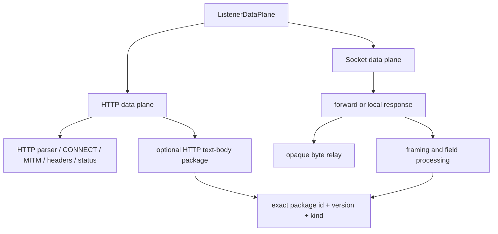

# HTTP、Socket 与协议包边界

## As-Is

| 节点或路径 | 不变量 | 源码 | 测试证据 |
| --- | --- | --- | --- |
| ListenerDataPlane -> HTTP/Socket | tagged union 阻止用 nullable 字段伪造统一配置 | `src-tauri/crates/domain/src/workspace/listener_model.rs` | `src-tauri/crates/domain/src/workspace/tests/listener_topology.rs` |
| HTTP -> HTTP parser/CONNECT/MITM | HTTP 独占 Hyper DTO、Header、Status、CONNECT 与 MITM | `src-tauri/crates/proxy/src/http`, `src-tauri/crates/proxy/src/forward` | `src-tauri/crates/proxy/src/http/tests.rs`, `src-tauri/crates/proxy/tests/raw_http_proxy.rs` |
| Socket -> forward/local response | 拓扑明确决定是否存在上游服务 | `src-tauri/crates/domain/src/workspace/listener_model.rs`, `src-tauri/crates/proxy/src/socket_relay/config.rs` | `src-tauri/crates/domain/src/workspace/tests/listener_topology.rs`, `src-tauri/crates/proxy/src/socket_relay/frame_pump/tests.rs` |
| Direct -> opaque bytes | 未绑定协议包时保持原始字节，不进入协议脚本 | `src-tauri/crates/proxy/src/socket_relay.rs` | `src-tauri/crates/proxy/src/socket_relay/tests/direct.rs` |
| Package identity and kind | 每个入口引用精确不可变 `id + version`；HTTP 与 Socket 包不可交叉绑定 | `src-tauri/crates/domain/src/protocol_package/identity.rs`, `src-tauri/crates/protocol-scripting/src/manifest.rs` | `src-tauri/crates/protocol-scripting/src/tests/manifest.rs`, `src-tauri/crates/application/src/requirements_tests/protocol_package_lifecycle/protocol_rules.rs` |
| Directional schemas | upstream 用于应用到上游，downstream 用于上游到应用；四个规则阶段各自固定到对应方向 | `src-tauri/crates/infrastructure/src/adapters/listener_runtime/http_protocol_pipeline.rs`, `src-tauri/crates/infrastructure/src/adapters/listener_runtime/scripted_relay.rs` | `src-tauri/crates/infrastructure/src/adapters/listener_runtime/tests/http_protocol_pipeline.rs`, `src-tauri/crates/infrastructure/src/adapters/listener_runtime/tests/scripted_relay_runtime/captures.rs` |
| HTTP text Body | 仅处理非空 UTF-8 Body；普通 HTTP 规则先执行，随后协议 Body 解析和字段规则；未变化时保留原始 Body 字节并保持 Content-Length 语义一致，变化时重算 Content-Length；不承诺 Header 空白/序列化字节不变 | `src-tauri/crates/infrastructure/src/adapters/listener_runtime/http_protocol_pipeline.rs` | `src-tauri/crates/infrastructure/src/adapters/listener_runtime/tests/http_protocol_pipeline.rs` |

禁止依赖由 `scripts/check-architecture-boundaries.mjs` 和已有 Socket/runtime scanners 执行：HTTP 不得引入
Socket runtime/contracts，Socket 不得引入 HTTP/Hyper DTO，中立层不得向 application/UI 反向依赖。

## To-Be

- 统一产品外壳、包注册表、字段模型、四阶段规则、展示安全边界和证据结构；包的 `kind` 是不可变身份的一部分。
- HTTP 与 Socket 使用独立协议包。HTTP 包没有报文分帧入口，只处理 UTF-8 文本 Body；Socket 包必须声明双方向分帧入口。
- 两类包都声明 `document.upstream/downstream` 与 `hooks.upstream/downstream`，不使用 request/response 后缀，也不声明 `content_types`。
- 请求链固定为普通 HTTP 规则 -> HTTP Body 协议处理；响应链采用相同顺序。协议处理内部固定为解析 -> 第一边界规则 -> 第二边界规则 -> 仅在字段变化时重建 Body -> 安全展示。
- HTTP 普通规则与协议 Body 规则继续作为两个显式层级，不做隐式合并；当前顺序由运行时测试锁定。
- Socket 转发链固定为应用到代理、代理到上游、上游到代理、代理到应用四阶段；本机应答只使用应用到代理和代理到应用两个阶段，并分别使用 upstream/downstream 字段结构。
- 必须隔离：HTTP parser/CONNECT/MITM/Header/Status 与 Socket 字节分帧/half-close/本机应答。共享字段规则不允许把 HTTP Header、Status 或 Socket 原始分帧对象泄漏进中立领域层。

## Open Decision

- HTTP 二进制 Body、按 Content-Type 自动选择协议包、单入口绑定多包均不在当前范围；需要独立设计后才能加入。Owner: R12。
