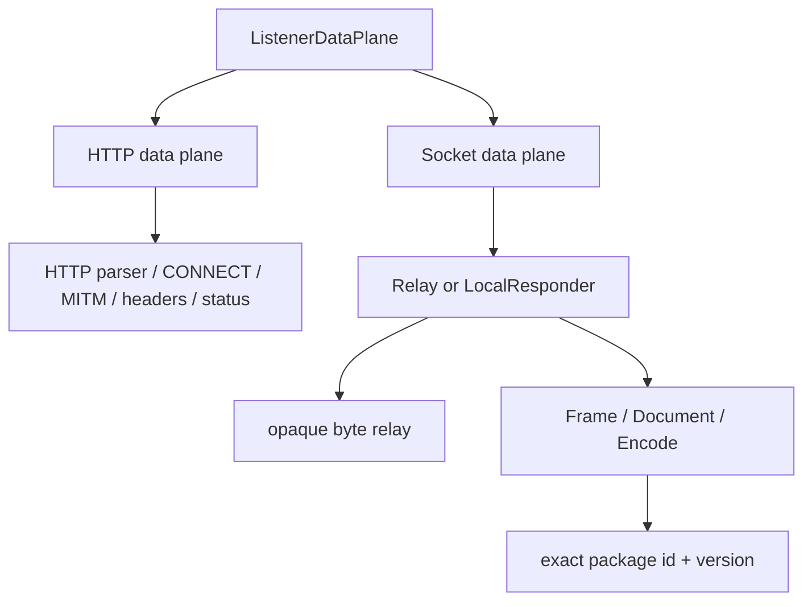

# HTTP、Socket 与协议包边界

## As-Is

| 节点或路径 | 不变量 | 源码 | 测试证据 |
| --- | --- | --- | --- |
| ListenerDataPlane -> HTTP/Socket | tagged union 阻止用 nullable 字段伪造统一配置 | `src-tauri/crates/domain/src/workspace/listener_model.rs` | `src-tauri/crates/domain/src/workspace/tests/listener_topology.rs` |
| HTTP -> HTTP parser/CONNECT/MITM | HTTP 独占 Hyper DTO、Header、Status、CONNECT 与 MITM | `src-tauri/crates/proxy/src/http`, `src-tauri/crates/proxy/src/forward` | `src-tauri/crates/proxy/src/http/tests.rs`, `src-tauri/crates/proxy/tests/raw_http_proxy.rs` |
| Socket -> Relay/LocalResponder | topology 明确决定是否存在上游 Server | `src-tauri/crates/domain/src/workspace/socket_topology.rs`, `src-tauri/crates/proxy/src/socket_relay/config.rs` | `src-tauri/crates/domain/src/workspace/tests/listener_topology.rs`, `src-tauri/crates/proxy/src/socket_relay/frame_pump/tests.rs` |
| Direct -> opaque bytes | Direct 不产生 Frame/Document，不依赖脚本 | `src-tauri/crates/proxy/src/socket_relay.rs` | `src-tauri/crates/proxy/src/socket_relay/tests/direct.rs` |
| Scripted -> package identity | 每个 Listener 引用精确不可变 `id + version` | `src-tauri/crates/domain/src/protocol_package/identity.rs`, `src-tauri/crates/domain/src/workspace/listener_model.rs` | `src-tauri/crates/domain/src/protocol_package/tests/identity.rs`, `src-tauri/crates/infrastructure/src/adapters/listener_runtime/tests/scripted_snapshot.rs` |
| Package -> Frame/Document/Encode | 当前 ABI 只面向 Socket 字节和每连接执行上下文 | `src-tauri/crates/protocol-scripting/src/runtime`, `src-tauri/crates/protocol-scripting/src/framing` | `src-tauri/crates/protocol-scripting/src/runtime/executor/tests.rs`, `src-tauri/crates/protocol-scripting/src/framing/tests.rs` |

禁止依赖由 `scripts/check-architecture-boundaries.mjs` 和已有 Socket/runtime scanners 执行：HTTP 不得引入
Socket runtime/contracts，Socket 不得引入 HTTP/Hyper DTO，中立层不得向 application/UI 反向依赖。

## To-Be

- 采用 [ADR-001](decisions/ADR-001-http-socket-boundary.md)：统一产品外壳和中立设施，保持协议语义与证据模型分离。
- 采用 [ADR-002](decisions/ADR-002-protocol-packages-http.md)：协议包 ABI 继续以 Socket 为唯一当前目标；HTTP 不借用 Document 伪装 Body。
- 可共享：Listener lifecycle、transport/TLS 原语、package registry、Schema/Document 值对象、分页、事件和 UI shell。
- 必须隔离：HTTP parser/CONNECT/MITM/Header/Status 与 Socket Frame/half-close/LocalResponder。

## Open Decision

- HTTP 专用协议包 ABI 若有真实用户场景，必须另立 ADR、独立 ABI 和行为保持测试，不能扩展当前 Socket ABI。Owner: R01 follow-up。
- Frame、Document Rule、Capture 三种证据模型的完整聚合图待紧凑协议切换与 ZIP 回填。Owner: R04、R07e。
