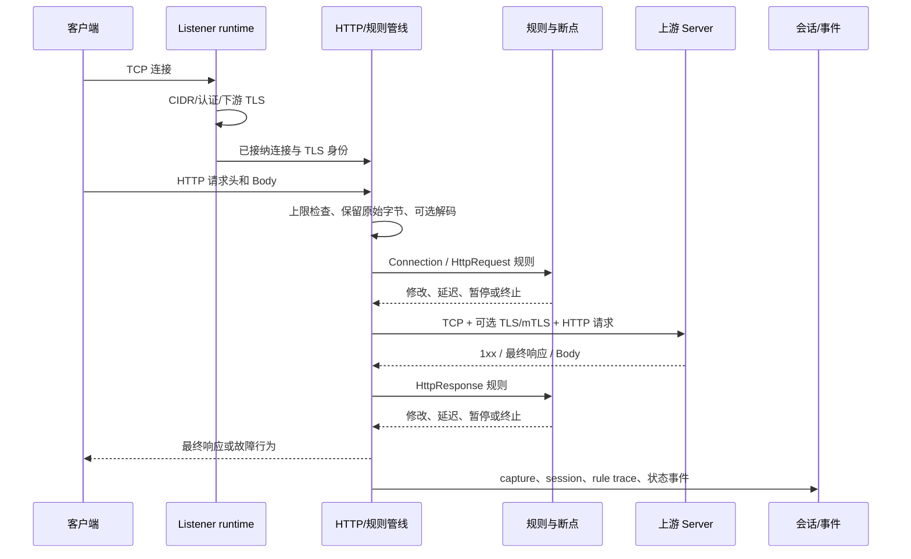

# 请求生命周期

本文说明一个客户端请求进入 Intercept Proxy 后的完整路径。理解这条链路后，抓包、规则、
断点、证书和错误状态就不再是互相独立的功能，而是同一条处理管线的不同阶段。

## 1. 两类代理入口

一个 Listener 负责“在本机哪个地址和端口接收连接”。收到连接后有两种请求去向：

### 1.1 按客户端请求目标转发

这就是标准正向代理：

- 普通 HTTP 使用 absolute-form，例如 `GET http://example.com/a HTTP/1.1`。
- HTTPS 使用 `CONNECT example.com:443` 建立隧道。
- CONNECT authority 未命中 MITM allowlist 时，代理只复制字节，不解密 TLS。
- 命中 allowlist 且协议可解析时，代理动态签发叶子证书并处理内层 HTTP/1.1。

### 1.2 转发到固定 Server

这就是反向代理/固定上游入口：

- 客户端只需要连接本机 Listener。
- 代理忽略请求中的目标地址，统一连接 Listener 配置的 Server URL。
- 每个 Listener 可以使用不同上游地址、Server CA、主机名策略和 mTLS 客户端身份。
- 可以在下游启用 TLS，并按需要验证客户端证书。

## 2. 端到端处理顺序

每一步的关键原则如下。

## 3. 接收连接

1. Listener 先接受 TCP 连接。
2. 全局连接容量在 TLS 握手前占用，防止沉默客户端无限占据握手任务。
3. 检查客户端 IP 是否在允许的 CIDR 中。
4. 正向代理根据配置验证 Proxy Basic Authentication。
5. 如果下游启用 TLS，使用该 Listener 的服务端身份完成握手。
6. 仅当配置要求时验证客户端证书；普通 TLS 不要求客户端证书。

连接成功后创建 `ConnectionContext`，其中包含 runtime epoch、连接 ID、Listener/Channel、
客户端地址、接收时间和可选 TLS peer 信息。后续事件都携带这些稳定标识。

## 4. 解析请求且保留原始字节

代理使用 HTTP/1.1 解析消息，但不会把解析后的结构当作唯一事实：

- 原始请求行、Headers 和 Body 会保留，用于详情展示和未修改透传。
- Body 未被规则修改时继续使用原始字节，避免编码和 Content-Length 被无意改变。
- Body 被修改时才按 Listener 配置的 Raw、UTF-8 或 Shift-JIS 策略重新编码。
- 编码失败、Body 超限、头部无效会在 Rust 中产生稳定错误码。

这也是为什么“格式化 JSON”只是详情页显示方式，不能覆盖真实 Payload。

## 5. 请求规则阶段

请求进入上游前依次执行：

1. 连接阶段规则：针对连接建立、TLS、连接延迟或拒绝。
2. HTTP 请求匹配：Listener、方法、路径、Header、正文、JSONPath、长度等。
3. 非终止动作：修改 Header/Body、延迟、抖动、暂停断点等。
4. 终止动作：Mock、拒绝、断开、丢弃、截断等；命中后不再连接上游。
5. 保存规则评估轨迹，供页面解释“为什么命中”。

断点由 Rust 协调器持有等待任务。客户端断开、Listener 停止或 Proxy 停止时，等待任务会
进入终态，前端不能再对过期断点执行放行。

## 6. 建立上游连接

### 6.1 正向代理

- HTTP absolute-form 被转换为 origin-form 后发送给目标 Server。
- 删除 Proxy-Authorization 和 hop-by-hop Headers。
- CONNECT 默认建立双向 TCP tunnel，保留背压、half-close、空闲超时和取消语义。
- MITM 只针对 allowlist 中的 authority；无法安全解析的协议回退为透明 tunnel。

### 6.2 固定 Server

- 启动 Listener 时提前解析固定 Server URL。
- 建立 TCP 后按配置执行 Server CA、主机名和可选 mTLS 身份验证。
- Host Header 改写为固定 Server authority，避免客户端仍携带本地代理地址。
- “测试上游 TLS/mTLS”复用相同连接配置，但不发送 HTTP 业务请求。

## 7. HTTP/1.1 写阶段与读阶段

上游交互不是一个笼统的“请求超时”：

1. 请求尚未 flush 前使用写超时。
2. 上游可能在 Body 写完前提前返回，代理必须接受这个合法响应。
3. 请求 flush 后才切换为读超时。
4. 等待最终响应时持续转发 `100 Continue` 等 1xx 信息响应。
5. 最终响应头和 Body 分别受大小、读取超时和取消控制。

这种分段状态机使 UI 能准确区分“上游写超时”和“上游读超时”。

## 8. 响应规则与返回客户端

收到最终响应后执行响应阶段规则。处理原则与请求相同：

- 未修改 Body 使用真实上游原始字节。
- 修改后重新编码并计算 Content-Length。
- 可以修改状态码、Header、JSON、文本，或模拟截断、丢弃和延迟。
- WebSocket 只解析握手；升级成功后帧流透明转发。

响应完成或失败后，session 会进入明确终态，不会只依赖前端猜测。

## 9. 抓包、会话和事件

抓包行是轻量摘要，完整 Payload 只在用户打开详情时按 ID 获取。这样可以避免 WebView
长期持有大报文。Rust 会记录：

- 请求与响应原始信息；
- HTTP 状态、Headers、Body 大小和耗时；
- Listener、连接、会话和消息 ID；
- 命中规则与动作轨迹；
- 终止、Mock、超时、断开等结果。

实时事件先写入有容量限制的 replay 历史，再向每个订阅者发送。订阅队列满时不会静默丢失
事件，而是终止该订阅并要求页面重新获取快照。

## 10. 取消与清理

Listener、连接和子任务使用分层 `CancellationToken`：

- 停止 Listener 会取消其所有连接。
- 连接退出会释放容量许可。
- 断点等待、Body 调度、TLS、读写超时都观察取消信号。
- Listener 任务必须 join 完成后，端口和 runtime epoch 才算真正清理。

因此页面上的“已停止”表示 Rust 已确认资源释放，不只是按钮状态变化。
