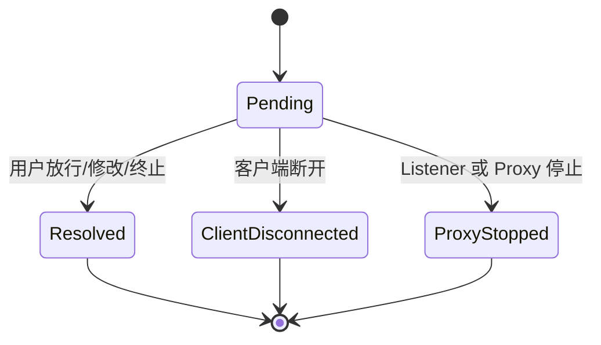

# 规则、断点、故障与状态机

## 1. 为什么规则只在 Rust 执行

规则会改变真实网络流量，因此匹配、顺序、命中计数、Body 编码和终止语义必须只有一套实现。
前端只编辑配置和展示评估轨迹，不参与运行时判断。

## 2. 三个规则阶段

| 阶段 | 发生时机 | 典型动作 |
| --- | --- | --- |
| `Connection` | TCP/TLS 建立期间 | 延迟、拒绝、断开、连接级限速 |
| `HttpRequest` | 请求发往上游前 | Header/Body 修改、Mock、断点、上行故障 |
| `HttpResponse` | 响应返回客户端前 | 状态码/Body 修改、截断、丢弃、下行故障 |

阶段是规则契约的一部分。请求阶段规则不能读取尚未存在的响应状态码。

## 3. 匹配和执行顺序

1. 只评估已启用且 Listener/阶段匹配的规则。
2. 按优先级排序，同优先级保持稳定创建顺序。
3. 计算条件结果并保存评估轨迹。
4. 命中后按配置顺序执行动作。
5. 非终止动作可以组合。
6. 终止动作立即停止当前规则剩余动作和后续规则。
7. 更新命中次数、最后命中时间和一次性规则状态。

第 N 次命中和“仅命中一次”属于运行态计数，使用 runtime epoch 隔离。多个 Listener 可以共享
同一 Workspace epoch，从而保证请求切换端口时计数不被意外重置。

## 4. Body 编码

Body 的真实存储始终是字节。Listener 仅指定在需要理解或修改正文时使用的解释方式：

- Raw：不做文本假设。
- UTF-8：按 UTF-8 解码和重新编码。
- Shift-JIS：使用 Rust 编码库转换。

处理顺序：

1. 保留原始 Body。
2. 按规则需要尝试解码。
3. JSON 条件或 JSONPath 动作只对合法 JSON 生效。
4. 非法 JSON 仍可按 Raw/文本条件展示和匹配，不会导致报文消失。
5. 未修改就原字节透传。
6. 修改后重新编码；存在不可表示字符时禁止发送。
7. Rust 重新计算 Content-Length，除非故障动作明确要求错误长度。

## 5. 动作分类

### 5.1 可组合动作

- 延迟和抖动；
- Header 增删改；
- 文本替换；
- JSONPath 修改；
- 暂停断点；
- 带宽和分段调度。

### 5.2 终止动作

- Mock 响应；
- 拒绝或断开；
- 丢弃请求/响应；
- 传输指定字节后关闭；
- 返回自定义错误状态。

终止动作之后继续修改 Body 没有定义，因此领域校验会拒绝不兼容组合。

## 6. 断点状态机

只有 Pending 可以处理。断点等待任务由 Rust 按 ID 管理，页面关闭不会自动放行。客户端断开
或运行时停止时，协调器完成终态转换并唤醒等待任务。

## 7. 会话结果

会话必须以明确结果结束，例如：

- 成功；
- 上游连接/写入/读取超时；
- 客户端断开；
- Mock；
- 截断或规则终止；
- 资源耗尽；
- 内部错误。

抓包列表可以是轻量流式视图，但会话结果、规则轨迹和完整详情都来自 Rust 的最终快照。

## 8. Listener 状态

典型状态为 Stopped、Starting、Running、Stopping、Faulted。合法操作由 Rust 返回的
`can_start`、`can_stop` 决定。页面不得根据按钮点击自行切换状态。

启动和停止的资源原则：

- Starting 期间已进入 mutation gate，不能并发删除引用配置。
- Running 持有不可变 Workspace 快照。
- Stopping 必须取消并 join 子任务。
- Faulted 必须保留原因，不能伪装成 Stopped。
- 停止通知未可靠提交时保存 `pending_cleanup`，阻止新一轮启动覆盖旧资源所有权。

## 9. Android 网络状态

Android 状态包含 Unknown、StartRequested、Running、StopRequested、Stopped、Faulted。
每次启动分配 generation：

- 旧 generation 的迟到回调不能覆盖新状态；
- Running 必须同时匹配 profile fingerprint、route fingerprint 和 route count；
- 状态未知不等于停止，桌面端应保留可能被设备使用的代理映射；
- 故障执行 fail-open，释放 TUN，让目标应用回到系统网络。

## 10. 实时事件与快照

Channel 用于有序事件，Command 用于获取权威快照。订阅过程必须：

1. 根据 cursor 同步发送 replay。
2. replay 完成后再启动 live 消费，避免新旧事件乱序。
3. 为每个订阅队列计算逻辑字节容量。
4. 队列溢出时终止订阅并发送 `SnapshotRequired`。
5. 页面重新 bootstrap/query 后使用新 cursor 订阅。

这比静默丢事件更安全，因为 UI 不会展示一个看似正常但实际缺失更新的状态。

## 11. 证据边界

- 单元测试证明纯领域、规则、编码和状态迁移。
- 集成测试证明 Rust 模块间、TLS、HTTP 和持久化契约。
- 前端测试证明正确渲染 ViewModel 和发送操作意图。
- Android JVM/模拟器测试证明协议和有限平台行为。
- 真机测试才证明特定设备、系统 VPN、厂商网络栈和真实业务兼容性。

构建成功、HTTP 200、TLS 成功都不能替代真实业务结果验收。
