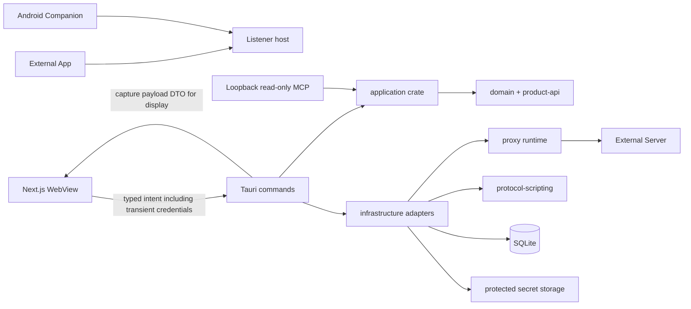

# 系统上下文与容器边界

本页是 R01 的最小阻塞基线。事实分为 As-Is、To-Be 和 Open Decision；完整十图交付仍属于
`TODO-ARCH-001` 后续切片。

## As-Is

责任和证据如下；图中每个当前节点和路径都必须保持可定位。

| 节点或路径 | 当前责任 | 源码 | 测试证据 |
| --- | --- | --- | --- |
| Next.js WebView -> Tauri | 展示 Rust ViewModel、提交意图，不持久化业务状态 | `src/lib/ipc/client.ts`, `src-tauri/src/commands/mod.rs` | `src/lib/ipc/use-ipc-query.test.tsx`, `src-tauri/src/commands/e2e_tests/mod.rs` |
| Tauri -> application/domain | 命令装配 use case；领域持有 Workspace、Listener 和协议专属 tagged union | `src-tauri/src/commands/listener.rs`, `src-tauri/crates/domain/src/workspace/listener_model.rs` | `src-tauri/crates/application/src/facade/listeners_tests.rs`, `src-tauri/crates/domain/src/workspace/tests/listener_topology.rs` |
| infrastructure -> proxy runtime | 将保存的快照编译成 HTTP 或 Socket 运行配置 | `src-tauri/crates/infrastructure/src/adapters/listener_runtime.rs`, `src-tauri/crates/proxy/src/lib.rs` | `src-tauri/crates/infrastructure/src/adapters/listener_runtime/tests.rs`, `src-tauri/crates/proxy/src/listener/supervisor/tests.rs` |
| infrastructure -> protocol-scripting | 导入、编译并为 Scripted Socket 提供隔离执行器 | `src-tauri/crates/infrastructure/src/adapters/protocol_packages.rs`, `src-tauri/crates/protocol-scripting/src/lib.rs` | `src-tauri/crates/infrastructure/src/adapters/protocol_packages/tests.rs`, `src-tauri/crates/protocol-scripting/src/framing/tests.rs` |
| infrastructure -> SQLite | Workspace、设置、协议包和抓包持久化 | `src-tauri/crates/infrastructure/src/sqlite.rs` | `src-tauri/crates/infrastructure/src/sqlite/tests/workspace_and_settings.rs` |
| WebView <-> Rust sensitive flow | WebView 可把 credential 作为瞬时 intent 提交给 Rust IPC；持久化 secret/private key/password 不回显；capture payload 是有意返回展示的 DTO。详见[生命周期与信任边界](lifecycle-persistence-security.md) | `src/features/listeners/use-listener-certificates.ts`, `src-tauri/src/commands/listener.rs`, `src-tauri/src/commands/capture.rs`, `src-tauri/crates/infrastructure/src/adapters/protected_secrets.rs` | `src/features/listeners/socket-security-cards.test.tsx`, `src-tauri/src/commands/capture/tests.rs`, `src-tauri/crates/application/src/requirements_tests/diagnostics.rs` |
| Listener host -> external App/Server | App 侧 accept；Relay 才建立 Server 侧连接 | `src-tauri/crates/proxy/src/listener/supervisor.rs`, `src-tauri/crates/proxy/src/socket_relay/handler.rs` | `src-tauri/crates/proxy/src/listener/supervisor/tests.rs`, `src-tauri/crates/proxy/src/socket_relay/tests.rs` |
| Android Companion -> host | 选定应用流量经 VPN/转发进入桌面 Listener | `android-companion/app/src/main`, `src-tauri/crates/android-engine/src/lib.rs` | `android-companion/app/src/test`, `src-tauri/crates/android-engine/src/routing_tests.rs` |
| loopback MCP -> application | 官方 `rmcp` Streamable HTTP 只调用只读 application facade；不提供写入、启停、导入导出或任意文件访问 | `src-tauri/src/mcp`, `src-tauri/src/lib.rs` | `src-tauri/src/mcp/tests.rs` |

## To-Be

- 依赖只向领域和稳定 port 下沉：UI -> host -> application -> domain；adapter 实现 port，runtime 不反向依赖 UI。
- HTTP 与 Socket 只共享中立 transport/TLS、Listener 生命周期、分页/事件和 UI shell；数据平面语义隔离。
- 应用级可移植归档由 application 定义 wire/version，由 infrastructure 实现文件选择、ZIP 与原子替换。

## Open Decision

- Android owner/epoch 和端点漂移的完整容器关系尚未建模。Owner: R02（owner correctness）与 R10（endpoint drift）。
- 完整 HTTP/Socket 规则、抓包与 Session 聚合图在相应功能切片回填。Owner: R04、R07e。
