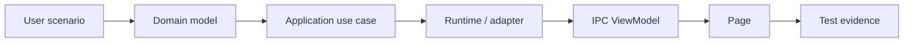

# 架构可追溯矩阵

本页是活的骨架，但不是运行状态账本；不记录 commit hash 或切片动态状态。

## As-Is

| 场景 | Domain | Application | Runtime/Adapter | IPC/Page | 测试证据 |
| --- | --- | --- | --- | --- | --- |
| 启停 HTTP Listener | `src-tauri/crates/domain/src/workspace/listener_model.rs` | `src-tauri/crates/application/src/facade/listeners.rs` | `src-tauri/crates/infrastructure/src/adapters/listener_runtime.rs` | `src-tauri/src/commands/listener.rs`, `src/features/listeners/listeners-view.tsx` | `src-tauri/crates/application/src/facade/listeners_tests.rs`, `src/features/listeners/listeners-view.test.tsx` |
| Socket Direct relay | `src-tauri/crates/domain/src/workspace/listener_model.rs` | `src-tauri/crates/application/src/facade/listeners.rs` | `src-tauri/crates/proxy/src/socket_relay.rs` | `src/features/listeners/socket-listener-settings.tsx` | `src-tauri/crates/proxy/src/socket_relay/tests/direct.rs`, `src/features/listeners/listeners-view.socket-contracts.test.tsx` |
| Socket Scripted Relay | `src-tauri/crates/domain/src/workspace/listener_model.rs` | `src-tauri/crates/application/src/facade/listeners.rs` 的 `listener_start` | `src-tauri/crates/infrastructure/src/adapters/listener_runtime/scripted_relay.rs` | `src-tauri/src/commands/listener.rs`, `src/features/listeners/socket-processing-card.tsx` | `src-tauri/crates/infrastructure/src/adapters/listener_runtime/tests/scripted_relay_runtime.rs`, `src/features/listeners/socket-processing-card.test.tsx` |
| Socket LocalResponder | `src-tauri/crates/domain/src/workspace/socket_topology.rs` | `src-tauri/crates/application/src/facade/listeners.rs` 的 `listener_start` | `src-tauri/crates/infrastructure/src/adapters/listener_runtime/local_responder.rs` | `src-tauri/src/commands/listener.rs`, `src/features/listeners/socket-processing-card.tsx` | `src-tauri/src/commands/e2e_tests/mod.rs`, `src-tauri/crates/infrastructure/src/adapters/listener_runtime/tests/local_responder_runtime.rs` |
| Socket 失败/取消/停止 | `src-tauri/crates/domain/src/error.rs` | `src-tauri/crates/application/src/facade/listeners.rs` 的 `listener_stop` | `src-tauri/crates/proxy/src/socket_relay/frame_pump.rs`, `src-tauri/crates/infrastructure/src/adapters/listener_runtime/socket_diagnostics.rs` | `src-tauri/src/commands/listener.rs`, `src/features/listeners/listener-runtime-card.tsx` | `src-tauri/crates/infrastructure/src/adapters/listener_runtime/tests/scripted_relay_runtime/failures.rs`, `src/features/listeners/listeners-view.socket-contracts.test.tsx` |
| 导入协议包 ZIP | `src-tauri/crates/domain/src/protocol_package` | `src-tauri/crates/application/src/facade/protocol_packages.rs` | `src-tauri/crates/infrastructure/src/adapters/protocol_package_import.rs` | `src-tauri/src/commands/protocol_packages.rs`, `src/features/protocol-packages/protocol-package-import-dialog.tsx` | `src-tauri/src/commands/protocol_packages/tests.rs`, `src/features/protocol-packages/protocol-package-import-dialog.test.tsx` |
| 查看 Socket capture | `src-tauri/crates/application/src/models/socket_capture.rs` | `src-tauri/crates/application/src/facade/traffic.rs` | `src-tauri/crates/infrastructure/src/adapters/socket_capture.rs` | `src-tauri/src/commands/capture.rs`, `src/features/capture/socket-capture-view.tsx` | `src-tauri/src/commands/capture/tests.rs`, `src/features/capture/socket-capture-view.test.tsx` |
| HTTP 文本 Body 协议处理 | `src-tauri/crates/domain/src/workspace/listener_model.rs`, `src-tauri/crates/domain/src/protocol_document_rule.rs` | `src-tauri/crates/application/src/facade/protocol_rules.rs` | `src-tauri/crates/infrastructure/src/adapters/listener_runtime/http_protocol_pipeline.rs` | `src/features/listeners/http-protocol-processing-card.tsx`, `src/features/rules/protocol-rules-view.tsx`, `src/features/capture/capture-detail-panel.tsx` | `src-tauri/crates/infrastructure/src/adapters/listener_runtime/tests/http_protocol_pipeline.rs`, `src/features/shared/http-protocol-body.test.tsx` |
| 本机只读 MCP 诊断与协议包参考 | application 只读 ViewModel | `src-tauri/src/mcp/backend.rs` 仅调用 application facade | `src-tauri/src/mcp/server.rs`, `src-tauri/src/mcp/protocol.rs` | MCP 2026-07-28 Streamable HTTP tools/resources | `src-tauri/src/mcp/tests.rs` |
| 应用数据 ZIP 导入导出 | `src-tauri/crates/domain/src/workspace.rs` | `src-tauri/crates/application/src/facade/application_backup.rs`, `src-tauri/crates/application/src/facade/application_backup_import.rs` | `src-tauri/crates/infrastructure/src/application_backup_export.rs`, `src-tauri/crates/infrastructure/src/application_backup_import.rs` | `src-tauri/src/commands/application_backup.rs`, `src/features/workspaces/workspaces-view.tsx` | `src-tauri/crates/application/src/requirements_tests/workspace_configuration/application_backup_import.rs`, `src/features/workspaces/workspaces-view.test.tsx` |

## To-Be

- 每个 Rxx 在实现前把用户场景、domain、use case、adapter、IPC/page 和至少一条跨边界证据回填到本表。
- 没有 runtime/adapter 消费者的 UI、没有测试的路径、只有 DTO 没有 domain owner 的功能都视为未完成。
- 文档 scanner 检查路径存在；行为正确性仍由相应 Rust/TypeScript/平台测试证明。

## Open Decision

- Android owner correctness 和 endpoint drift 行分别由对应交付添加。Owner: R02、R10。
