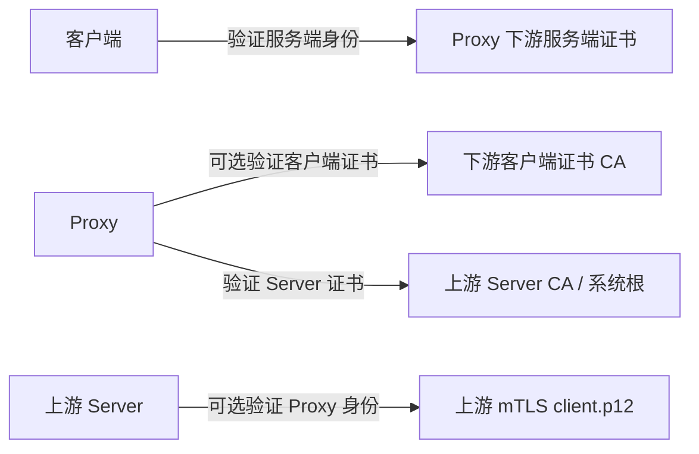

# Workspace、配置、证书与安全边界

## 1. Workspace 是什么

Workspace 是一组可切换的代理实验配置。它聚合：

- Listener；
- Body 编码策略；
- 元数据提取与响应断言；
- 规则和故障预设；
- 证书安全引用；
- Android 设备网络方案。

Workspace 运行时对象保存声明式配置和托管安全引用，不保存运行中的 socket、任务、Payload、TUN 文件描述符、
P12 密码或私钥字节。可移植导出文档属于另一条边界：Rust 可以嵌入 Listener 所引用的证书材料，实现测试环境的一文件迁移。

## 2. ID、revision 与乐观锁

所有实体 ID 由 Rust 生成。Workspace 和可编辑实体包含 revision：

1. 页面读取 revision 为 N 的快照。
2. 用户提交时同时提交“我基于 revision N 编辑”。
3. Rust 比较数据库当前 revision。
4. 一致才保存并递增；不一致返回冲突，要求页面重新加载。

这样可以避免多个页面、事件刷新或后台状态更新相互覆盖。前端不能自行递增 revision。

## 3. 配置与运行资源

保存配置不等于启动网络资源：

- `enabled` 是期望状态和重启恢复依据。
- Listener runtime 状态是实际端口任务返回的 Running/Stopped/Faulted。
- UI overview 由 Rust 合并配置与真实运行状态。
- 运行 Listener 持有启动时 Workspace 快照，后续编辑不会热修改已有连接。

Listener 启动是一个带补偿的两步操作：

1. 使用当前快照真实绑定端口并启动任务。
2. 把 `enabled=true` 持久化。
3. 如果第 2 步失败，停止第 1 步创建的 Listener。
4. 两步成功后才发布运行事件。

停止时顺序相反：先关闭真实资源，再保存 `enabled=false`。即使保存失败，也不能为了匹配
旧配置而重新开放已经关闭的端口。

## 4. Workspace 切换

切换 Workspace 只改变当前编辑上下文，不隐式停止其他 Workspace 的运行资源，也不隐式
停止 Android 设备上已经运行的 VPN。运行状态必须按实体 ID 和所属 Workspace 查询。

删除 Workspace 前必须确认：

- 没有属于它的 Listener 正在运行；
- 没有活动 Android 方案引用它；
- 没有无法清理的证书草稿租约。

## 5. 导入导出

### 5.1 `.intercept-workspace`

包含单个 Workspace 的可携带配置及其引用的 Listener 证书材料，适合用一个文件迁移完整测试配置。

### 5.2 `.intercept-config`

包含应用级可携带配置及全部 Workspace 引用的 Listener 证书材料，适合用一个文件备份或迁移多个 Workspace。

文档的 `certificate_materials` 由 Rust 组装，可包含：

- 导入的下游 Listener 服务端证书链和私钥；
- 下游客户端 CA 与上游 Server CA；
- 上游 mTLS PKCS12/PFX 原文和明文密码。

两种导出都必须先显示危险确认。前端不读取、解码或组装这些字节。

导入流程：

1. 原生文件对话框只返回用户选择的路径。
2. Rust 限制文件大小并读取内容。
3. 在反序列化前扫描禁止字段和运行时字段。
4. 反序列化为专用文档模型，并校验 schema、哈希、大小、格式与证书用途。
5. 在隔离事务中把内嵌材料恢复到目标用户的受保护存储，并重写托管引用。
6. 先在内存构建完整替换结果。
7. 所有检查通过后才原子写入持久化层；失败时配置与已恢复材料一起回滚。

敏感字段扫描会统一 snake_case、kebab-case 和 camelCase，避免 `privateKey` 之类未知字段
被 Serde 忽略后误判为安全文档。

## 6. 不能导出的内容

可携带文档不得包含：

- 本机 MITM Root CA 私钥或其受保护存储 envelope；
- HTTP Basic 明文密码；
- DPAPI/Keychain 密文 envelope；
- 当前运行 PID、端口所有权、ADB reverse 临时端口；
- 会话 Payload、断点等待任务和订阅游标。

Listener 证书/私钥材料与 P12 密码是此测试工具可移植格式的明确例外。它们以 base64/明文字段存在于导出文件，而不是系统加密 envelope；该文件必须按敏感测试材料管理。导入后立即恢复到受保护存储，运行时模型不保留可移植原文字节。

## 7. 证书关系

四类材料不能混用：

1. 下游服务端身份：Proxy 向客户端出示的证书和私钥。
2. 下游客户端 CA：仅在 Proxy 要求客户端证书时，用于验证客户端。
3. 上游 Server CA：Proxy 用于验证上游 Server 证书链。
4. 上游 mTLS 客户端身份：仅在 Server 要求双向 TLS 时由 Proxy 出示。

普通 TLS 不需要客户端证书。客户端即使主动出示证书，在“不验证客户端证书”策略下也不
作为访问控制依据。

## 8. Root CA 与 MITM

Intercept Proxy 为受控测试环境内置一套跨 Windows/macOS 固定的 Root CA 签发材料。
这样测试客户端只需内置信任一次，桌面端仍把运行时私钥副本交给当前系统用户的安全存储保护：

- macOS 使用 Keychain；
- Windows 使用当前用户 DPAPI；
- 前端永远拿不到私钥；
- 导出按钮只能导出公开 Root CA。

该私钥随测试工具分发，不具备生产密钥的保密边界，禁止用于生产、预生产或真实商户信任体系。

MITM 叶子证书按 authority/SNI 动态签发并使用有界缓存。只有显式 allowlist 中的目标才
允许 MITM，其他 CONNECT 保持透明隧道。

## 9. 托管证书生命周期

导入 CA 或 P12 时：

1. Rust 读取并限制文件大小。
2. 解析证书链、用途、主题、SAN、有效期和 SHA-256。
3. P12 密码只在提交期间存在，随后清零。
4. 私钥/P12 存入受保护存储，数据库只保存托管引用和公开元数据。
5. Listener 保存前验证引用确实存在且用途匹配。
6. Listener 启动时 infrastructure 把引用解析为 rustls 所需材料。

删除未保存 Listener 草稿时，页面会释放本次草稿创建的证书租约，避免孤立敏感材料。

## 10. 错误返回原则

所有错误由 Rust 返回：

- 稳定错误码；
- 中文说明；
- 字段错误；
- 是否可重试；
- 建议操作；
- 可选实体 ID 和 runtime epoch。

前端不能根据字符串内容猜测错误原因，也不能把证书解析失败统一显示成“保存失败”。
