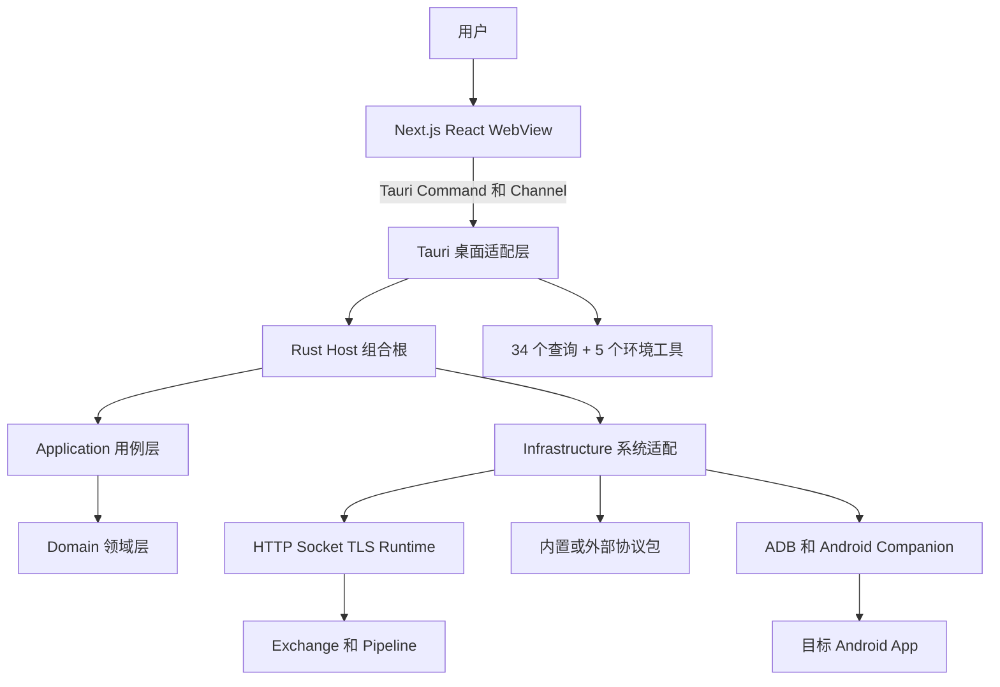

# Intercept Proxy 新人接手与项目全景指南

本文面向第一次接触 Rust、Tauri、网络代理或本仓库的开发者。目标不是让你一次记住所有模块，而是让你按
“能运行 → 能观察 → 能定位 → 能修改 → 能验证 → 能发布”的顺序，逐步建立可靠的项目心智模型。

如果时间很少，先完成第 1、2、6、7 节；准备改代码前，再阅读第 8～16 节。

## 1. 先记住四句话

1. Intercept Proxy 是一个桌面网络测试代理，不是普通网站；完整功能必须运行 Tauri App。
2. Rust 是业务、网络、安全、持久化和合法性判断的唯一真相源；前端只展示状态和提交用户意图。
3. HTTP 与 Socket 可以共享 Exchange、Pipeline、规则列表和抓包界面，但不能混淆各自的协议语义。
4. “代码编译通过”“端口正在监听”“外部包在线”和“真实交易成功”是不同层级的结论，必须分别验证。

项目当前支持 HTTP/HTTPS、Socket TCP/TLS/mTLS、协议包、规则、故障注入、Android 按应用透明
路由、运行观测、MCP 查询/环境配置和应用级导入导出。当前不支持 HTTP CONNECT、HTTP Upgrade/WebSocket
tunnel 和 CONNECT MITM；`/packages` 是协议包控制面，不是被代理的 WebSocket tunnel。完整边界以
[需求与验收基线](requirements.md)为准。

## 2. 用 15 分钟看懂系统

### 2.1 系统由哪些部分组成



可以把它理解成五个同心层：

- 最外面是用户界面和 Tauri 桌面能力；
- 中间是 Application 用例与 Infrastructure 适配器；
- 最里面是 Domain 不变量和 Exchange 交换模型；
- 真实网络由 Runtime 控制，协议解析由协议包提供；
- Android Companion、外部协议包和 MCP 都通过明确接口接入，不直接拥有核心业务状态。

### 2.2 为什么前端不能直接做业务判断

WebView 是展示层，也是较低信任边界。它可以被旧页面、损坏输入或异步竞态影响，因此“按钮被隐藏”不能证明
操作合法。前端调用生成的 Tauri Command，Rust 再执行类型、revision、状态机和领域校验。成功后 Rust
返回 ViewModel；运行状态变化通过有序 Channel 通知前端刷新。

因此：

- 不要在 TypeScript 复制 Rust DTO、规则能力或分页逻辑；
- 不要绕过 `src/lib/ipc/client.ts` 直接组织另一套 IPC；
- 不要手改 `src/generated/rust-types.ts`；运行 `pnpm bindings` 重新生成；
- 不要让页面直接访问文件、证书、ADB、Socket、数据库或密钥。

### 2.3 一笔流量如何通过系统

协议模式遵守严格的一问一答：

```text
App read
  -> Upstream Reader: Frame(Socket) -> Decode -> Display
  -> Proxy -> Server: evaluate/update current working Document in order -> Encode once
  -> Server write
  -> Server read
  -> Downstream Reader: Frame(Socket) -> Decode -> Display
  -> Proxy -> App: evaluate/update current working Document in order -> Encode once
  -> App write
```

每个已接受的 App connection 对应一个 `Exchange<P>`。Socket 透明模式不创建 Document，只把实际读取的
字节转发到另一端，并保留 half-close。观测链路失败要 fail-open，不能破坏成功交易；Frame、Decode、Rules、
Encode 或 transport 失败要 fail-closed，结束当前 Exchange。

## 3. 最常用的项目术语

| 术语 | 初学者理解 | 权威位置 |
| --- | --- | --- |
| Workspace | 一组可导入导出的代理配置 | `domain/workspace` |
| Listener / 代理入口 | Proxy 在本机接受 App 连接的地址、端口和转发配置 | Workspace + runtime |
| App | 连接 Proxy 的客户端，不等于 Tauri 桌面 UI | Exchange Context |
| Proxy | 本项目运行的中间代理 | `proxy` runtime |
| Server | Proxy 连接的远端服务或 LocalResponder | Exchange Server 端口 |
| Exchange | 一条 App connection 内按顺序发生的全部请求、响应和失败 | `crates/exchange` |
| Pipeline | Frame、Decode、Display、Rules、Encode 的可组合处理链 | `crates/exchange` |
| Envelope | 原始字节、Document 和协议上下文的单次处理载体 | `crates/exchange` |
| Document | 协议包解析出的递归 JSON tree | `domain/document` |
| HTTP 标准规则 | Header、Body、状态、延迟、断开等 HTTP 阶段动作 | `domain/rule` |
| 统一规则 | `RuleDefinition` 的非空扁平 `conditions`（固定 AND）与有序 `UnifiedAction` | `domain/unified_rule` |
| 协议包 | 提供 Frame、Decode、Encode、Display 能力的精确版本包 | package API 1 / external Sidecar |
| LocalResponder | 使用同一 Server 接口的本地响应端，不是旁路流程 | `exchange/local_server` |
| Observation | 面向抓包 UI 的有界内存 Exchange 事件 | Infrastructure store |
| runtime epoch | 一次 Listener 启动周期的身份 | runtime/application |
| revision | 防止旧配置覆盖新配置的乐观锁版本 | domain/application |
| generation | 外部包连接或运行资源重连后的代次 | infrastructure |
| MCP | 全接口明文、无认证的查询与 Workspace 环境配置接口 | `src-tauri/src/mcp` |

遇到文档中的 Upstream/Downstream 时，以数据方向理解：App 到 Server 是 Upstream，Server 到 App 是
Downstream。TLS 也有两段：App ↔ Proxy 和 Proxy ↔ Server，证书角色不能混用。

## 4. 代码和团队责任如何组织

### 4.1 仓库目录地图

| 目录 | 它拥有什么 | 新人常见任务 |
| --- | --- | --- |
| `src/app` | Next.js 路由入口 | 增加页面入口，通常很薄 |
| `src/features` | 页面、组件、交互草稿、视觉状态 | UI 修改和前端合约测试 |
| `src/lib/ipc` | 前端访问 Rust 的低层桥 | 统一错误解包和事件订阅 |
| `src/generated` | Rust 自动生成的 TypeScript 类型 | 只生成，不手改 |
| `src-tauri/src` | Tauri Command、AppState、MCP、日志、桌面生命周期 | 新增桌面适配和 IPC |
| `src-tauri/crates/domain` | 纯领域模型、不变量、状态转换 | 新业务规则和稳定错误 |
| `src-tauri/crates/application` | Use Case、Port、ViewModel、事件 | 编排用户操作 |
| `src-tauri/crates/exchange` | 协议无关的交换顺序与方向类型 | Pipeline/Exchange 抽象 |
| `src-tauri/crates/proxy` | HTTP、Socket、TCP/TLS、Listener runtime | 真实网络和资源生命周期 |
| `src-tauri/crates/package-contract` | API 1 Manifest、固定 RPC 与错误 wire | 协议包公共合同 |
| `src-tauri/crates/package-runtime` | 严格 ZIP 与独立 Boa Sidecar | 本地协议包进程 |
| `src-tauri/crates/infrastructure` | SQLite、证书、ADB、协议包、系统密钥和适配器 | 外部系统实现 |
| `src-tauri/crates/host` | 无 UI 的 Rust 组合根和后台任务所有权 | 依赖装配与关闭 |
| `src-tauri/crates/product-api` | 产品身份和稳定策略契约 | 通常很少修改 |
| `src-tauri/crates/android-engine` | 纯 Rust TUN/路由/弱网数据面 | Android 网络算法 |
| `android-companion` | VpnService、JNI、Android 平台边界 | 设备侧控制与打包 |
| `templates/socket-protocol` | 严格 JavaScript ZIP 模板和作者 API | 新建 Sidecar 协议包 |
| `scripts` | 架构门禁、构建和真实 App E2E | 验证与发布自动化 |
| `test-support` | 独立 runtime/平台测试工程 | 跨层验证 |
| `.github/workflows` | CI、Windows/macOS 构建与发布 | 远程门禁和产物 |

更精确的 crate 依赖和模块所有权见[模块与代码组织](architecture/modules.md)。

### 4.2 依赖方向

依赖应从外层指向内层：

```text
UI -> Tauri -> Host -> Application -> Domain
                     -> Infrastructure -> Runtime -> Exchange -> Domain
                                       -> Package Contract/Runtime -> Domain
```

`domain` 不知道 Tauri、SQLite 或真实网络；`exchange` 不知道数据库、Sidecar 和 UI；`application` 通过 Port
请求外部能力；`infrastructure` 实现 Port 并连接真实系统。新增反向依赖通常说明代码放错了位置。

### 4.3 建议的协作责任

仓库没有按人员写死 CODEOWNERS。接手团队可以按下面的责任面评审，而不是按页面平均分工：

| 责任面 | 主要关注 | 修改时至少邀请谁评审 |
| --- | --- | --- |
| 产品与协议 | 用户流程、协议 Profile、支持边界 | 业务/协议负责人 |
| Domain/Application | 不变量、错误码、ViewModel、并发写 | Rust 领域负责人 |
| Exchange/Runtime | 字节保持、超时、取消、TLS、资源释放 | 网络运行时负责人 |
| Frontend | Rust ViewModel 展示、交互和无障碍 | 前端负责人 |
| Security/Persistence | 密钥、证书、SQLite、导入导出 | 安全或平台负责人 |
| Android | VpnService、TUN、ADB、签名与 ABI | Android 负责人 |
| Release | CI、签名、安装包和发布回滚 | 发布负责人 |

一个人可以承担多个责任，但高风险改动仍应按责任面复核。尤其是支付协议、证书、密钥、真实交易数据和发布签名，
不能只做同层代码评审。

## 5. 关键运行流程

### 5.1 桌面应用启动

1. `src-tauri/src/main.rs` 调用根 crate 的 `run()`。
2. `src-tauri/src/lib.rs` 解析 Tauri app-data 和安装资源路径。
3. `ApplicationHostBuilder` 打开 SQLite、系统密钥保护、EventHub 和各类 Infrastructure service。
4. Host 构造唯一 Application facade、Listener runtime、Android ADB adapter 和外部包服务。
5. Tauri 创建 runtime log、ExchangeObservationStore 和 tracing bridge。
6. App 必须成功绑定 `0.0.0.0:17653` 才能完成启动；IPv4 成功后的 IPv6 独立绑定、双栈覆盖、
   不支持或降级状态通过 MCP capability 如实公开。
7. Tauri 注册 Specta Command、文件对话框和日志插件，把唯一 `AppState` 交给所有 Command。
8. 退出时由一个关闭门闩停止 Listener、后台任务、MCP 和观测消费者，再显式退出进程。

### 5.2 页面到 Rust 的调用链

以 `workspace_list` 为例：

```text
src/features/workspaces/workspaces-view.tsx
  -> commands.workspaceList()
  -> src/generated/rust-types.ts
  -> src-tauri/src/commands/workspace.rs
  -> application facade/workspaces.rs
  -> application Port
  -> infrastructure SQLite adapter
  -> Rust ViewModel 返回页面
```

启动时 `app_bootstrap` 返回首个完整快照和事件游标；`BootstrapProvider` 从该游标订阅 Rust Channel。后续事件
只使对应查询失效并重新读取权威状态，不在前端拼装另一套运行状态。

### 5.3 HTTP

HTTP Listener 接受 TCP/TLS 后，由 Hyper 处理 HTTP/1.1 framing，再进入 HTTP Exchange。请求可以按
absolute-form 目标动态转发，也可以固定到一个 HTTP/HTTPS origin。请求和响应分别经过 Decode、Display，
再在对应 `Proxy -> Server` / `Proxy -> App` 写出阶段执行统一规则并 Encode 一次。CONNECT 和 Upgrade
在创建 Server connection 与 Exchange 前返回 501。

修改 HTTP 时先区分：Listener/TLS、HTTP framing、请求策略、Pipeline、上游连接、响应策略还是 UI 观测。
不要用透明 Socket 逻辑兜底 HTTP 不支持功能。

### 5.4 Socket

Socket 有三种关键形态：

- Direct/Transparent：真实字节双向转发，保留任意分段、二进制和 half-close；
- Scripted：Frame 完成一帧，再 Decode、Display，并在写出阶段执行统一规则和 Encode；
- LocalResponder：不连接远端，但仍实现同一个 Server 接口并沿同一 Exchange 流程返回。

Scripted 模式一次只处理一帧；`NeedMore` 表示继续累积，完整 Frame 后立即发送。排障时按
`accept/tls/read/frame/decode/rules/encode/write/close` 定位，不要把所有失败归为“协议包错误”。

### 5.5 内置与外部协议包

官方起始包与用户导入包都是严格 ZIP：根目录固定为 `manifest.json`、`protocol.js`、`display.js`，
由独立 Boa Sidecar 执行；模板入口见 [Socket 协议模板](../templates/socket-protocol/README.md)。软件包
主动通过 `/packages` WebSocket JSON-RPC 注册精确 `package id@version`，再提供上下行 hook。在线、启用、绑定、
Listener 运行和 Exchange 成功是五个独立状态。

包作者先阅读 [package API 1](../templates/socket-protocol/API.md) 与
[Socket package authoring](../templates/socket-protocol/AUTHORING.md)。运行与生命周期排障见
[外部包接入与 MCP 排障](mcp/external-package-integration-guide.md)。

协议包断线会停止依赖它的 Listener；重连只恢复包在线状态，不自动重启 Listener。

### 5.6 Android Companion

桌面端通过 ADB 控制 Android Companion。Companion 的 `VpnService` 只接管 Profile 明确选择的应用，流量
经 TUN、纯 Rust Android Engine、tun2proxy 和进程内 SOCKS5 路由；命中代理路由时通过 LAN 或
`adb reverse` 进入桌面 Listener，未命中时经 `protect(fd)` 访问原目标。

需要分别确认设备控制、VPN/TUN、路由端点、桌面 Listener 和真实业务响应。详情见
[Android Companion](../android-companion/README.md)和
[Android VPN 透明路由](architecture/android-vpn-transparent-routing.md)。

### 5.7 MCP、日志和抓包

MCP 以明文 Streamable HTTP 监听 `0.0.0.0:17653`，并在平台支持时监听 `[::]:17653`。服务不检查
Host、Origin、Authorization、API key、Cookie、来源 IP 或 CIDR；任何网络可达方都能调用工具，
传输中的私钥、密码和 confirmation token 也可能被网络观察者读取。

现有 34 个工具继续只读调用 Application 查询 facade；ExchangeObservation 查询通过 Application 的
`ExchangeObservationQueries` port facade，只有 composition root 会把 Infrastructure `ExchangeObservationStore`
注入该 port。运行日志继续使用其专用只读边界。五个环境配置工具提供 capabilities、create、status、
cancel、apply：create 完成分层验证并返回完整预览和一次性 token，
apply 返回 `apply_queued` 后由 Application owned task 持有执行与清理。create 返回前断开会取消候选；
apply ack 后断开不会取消任务。MCP 不自动启停 Listener、不重放交易、不修改应用级 Settings、其他
Workspace 或任意本机文件。

抓包/ExchangeObservation 是有界内存证据，不写 SQLite；普通诊断日志使用独立滚动 JSONL。协议处理
事件包含 received Document、typed operation summary、final working Document、Encode/result 与 stable
error；`changes_truncated` 只表示逐规则摘要达到观测预算。观测丢失不能让业务交易失败。工具清单和
返回合同见 [MCP 工具参考](mcp/tool-reference.md)。

### 5.8 持久化和安全材料

Workspace、设置、规则、协议包元数据和安全引用保存在 SQLite。私钥、P12 密码和其他秘密由当前 OS 用户的
Keychain/DPAPI 保护。应用备份可以在用户明确确认后携带选定 Listener 的可移植 TLS 材料，但不能包含安装级
Root CA 私钥、HTTP Basic 明文、运行态抓包或 Android 设备运行状态。

完整边界见[安全、TLS 与持久化](architecture/security-and-persistence.md)。

## 6. 第一次准备开发环境

### 6.1 基础工具

桌面开发的仓库基线是：

- Git；
- Node.js 22；
- pnpm 11.13.1，版本固定在 `package.json`；
- Rust 1.97.1、rustfmt、clippy，版本固定在 `rust-toolchain.toml`；
- macOS 使用 Xcode Command Line Tools；Windows 使用 Visual Studio C++ Build Tools 和 WebView2；
- 需要 Android Companion 时，再安装 JDK 21、Android SDK 36、Build Tools 36.0.0 和 NDK
  29.0.14206865；

先验证版本：

```bash
node --version
pnpm --version
rustc --version
cargo --version
```

不要用升级全部依赖来解决首次安装问题。仓库锁定了 `pnpm-lock.yaml`、Rust toolchain 和关键 crate 版本，先
复现当前基线，再单独评估升级。

### 6.2 安装和首次校验

从仓库根目录执行：

```bash
pnpm install --frozen-lockfile
pnpm bindings
pnpm typecheck
cargo test --manifest-path src-tauri/Cargo.toml -p intercept-proxy-domain
```

`pnpm bindings` 从 Rust/Specta 重新生成 TypeScript IPC 类型。首次生成后 `git status --short` 应保持干净；
如果出现差异，先查 Rust DTO、生成器版本或未提交绑定，不要直接编辑生成文件消除差异。

### 6.3 启动完整开发 App

```bash
pnpm tauri:dev
```

该命令启动 Next.js 开发服务和 Tauri WebView。只运行 `pnpm dev` 只能看到 Web 前端，Tauri Command、原生
对话框、MCP、真实 Listener、SQLite、证书和 Android 控制都不可用，不能把浏览器页面当作完整功能验证。

### 6.4 构建 release App

只构建当前 macOS App：

```bash
pnpm tauri build --bundles app
```

完整桌面发布构建：

```bash
pnpm tauri:build
```

`pnpm tauri:build` 会先构建并验证 Android Companion，再构建桌面包，因此需要完整 Android 工具链。构建成功
只证明产物生成，不证明代理转发和真实业务结果。

## 7. 第一次打开 App 应该做什么

建议按[用户操作说明](user-operation-guide.md)完成一次最小闭环：

1. 查看默认 Workspace 和停止的 `127.0.0.1:8080` 入口草稿；
2. 新建一个隔离测试 Workspace，不使用生产地址、证书或密钥；
3. 配置一个 loopback HTTP Fixed Server Listener；
4. 保存、启动并确认顶部状态来自 Rust 运行概览；
5. 发送一笔合成请求，在抓包页查看同一 Exchange 的请求、响应和关闭事件；
6. 增加一条简单规则，确认真实线路结果发生预期变化；
7. 停止 Listener，确认端口释放；
8. 查看诊断日志、复现报告和 MCP 设置，但不要把它们等同于业务成功。

随后再运行发布矩阵中的 Socket Direct、Socket Scripted 和外部包场景。固定端口、脚本和判定标准见
[发布级验证矩阵](testing/release-validation-matrix.md)。

## 8. 如何从页面追到真正实现

当你不知道一个按钮做了什么时，按下面顺序查：

1. 在 `src/features/<feature>` 找页面文案或组件名；
2. 找 `commands.<camelCaseName>` 调用；
3. 在 `src/generated/rust-types.ts` 确认对应的 Rust `snake_case` command；
4. 在 `src-tauri/src/commands` 找薄适配；
5. 跟到 `application/src/facade` 的用例；
6. 看用例调用哪个 Port、领域构造器或能力矩阵；
7. 在 `infrastructure` 找 Port 实现，或在 `proxy` 找真实网络；
8. 最后查看同目录测试，先理解已经锁定的成功和失败语义。

常用搜索：

```bash
rg "commands\\.listenerStart|listener_start" src src-tauri
rg "struct .*ViewModel|enum .*ViewModel" src-tauri/crates/application/src
rg "impl .*Port" src-tauri/crates/infrastructure/src
rg "ERROR_CODE|error_code" src-tauri/crates
```

不要先从 `src-tauri/src/lib.rs` 顺序读完整仓库；先选一个用户动作，沿调用链纵向走通，再扩展横向模块地图。

## 9. 新代码应该放在哪里

| 你要改变什么 | 首选位置 | 需要同步考虑 |
| --- | --- | --- |
| 新字段、不变量、状态转换 | `domain` | serde 严格性、错误码、迁移/导入 |
| 多步骤用户操作 | `application` facade | Port、ViewModel、事件、revision |
| 数据库、文件、证书、ADB、外部 RPC | `infrastructure` | 原子性、超时、秘密和清理 |
| HTTP/Socket/TLS 真实字节行为 | `proxy` | EOF、half-close、取消、容量和观测 |
| Exchange/Pipeline 通用顺序 | `exchange` | HTTP/Socket 类型方向和确定性测试 |
| JavaScript Frame/Decode/Encode/Display | `package-contract`、`package-runtime` | 包版本、Schema、资源限制、Sidecar 生命周期 |
| Tauri Command/Dialog/Channel | `src-tauri/src` | 薄适配、生成绑定、权限边界 |
| 页面与交互草稿 | `src/features` | Rust ViewModel、pending/error、无障碍 |
| Android 包调度算法 | `android-engine` | seed、包方向、JNI 边界 |
| VpnService/Manifest/Gradle | `android-companion` | 权限、签名、ABI、真机恢复 |

如果一个新模块同时判断业务合法性、访问真实 I/O 并维护页面状态，先拆分所有权，不要继续堆代码。

## 10. 不同改动的标准工作流

### 10.1 UI 改动

1. 找到 Rust ViewModel 和现有 feature；
2. 先增加组件/交互回归测试；
3. 修改页面，只处理展示、输入草稿和视觉状态；
4. 验证 pending、失败恢复、焦点、键盘和 overlay 关闭；
5. 运行定向 Vitest、`pnpm test:ui-contracts`、lint 和 typecheck；
6. 用真实 Tauri App 检查系统 WebView 行为。

UI 设计原则和已关闭决策见[设计说明](../DESIGN.md)。

### 10.2 业务规则或 ViewModel 改动

1. 先在 Domain/Application 测试中写出用户动作、成功状态和稳定错误；
2. 在领域层实现唯一规则；
3. Application 组合 Port 并返回中文 ViewModel；
4. Tauri Command 只转发和映射结构化错误；
5. 运行 `pnpm bindings`，再更新前端；
6. 验证旧客户端或损坏 JSON 不能绕过 Rust 校验。

### 10.3 网络、Exchange 或 TLS 改动

先明确协议、方向、阶段、连接所有者、取消源和资源上限。测试必须覆盖短读写、EOF、超时、half-close、并发、
panic、停止和端口释放，不能只有 happy path。修改共享抽象时分别证明 HTTP、Socket Scripted、Socket Direct
和 LocalResponder 没有语义串线。

### 10.4 IPC 类型改动

Rust DTO 是唯一来源：

```bash
pnpm bindings
git diff -- src/generated/rust-types.ts
pnpm typecheck
```

Command 参数名、nullable/union、错误结构和事件 payload 都要有 Rust IPC 测试；不要在 TypeScript 写兼容镜像。

### 10.5 协议包改动

固定 package id/version、Schema、Frame 长度含义、字符集、字段类型和上下行 hook。先用合成或公开向量做
`decode -> encode` 字节保持，再验证半包、粘包、未知字段、超限和断线。涉及加密/MAC 时，必须明确密钥所有权、
算法来源和尚未验证的边界，不自行发明支付密码原语。

### 10.6 Android 改动

分别测试纯 Rust engine、JNI、Gradle APK、ADB 控制、VpnService/TUN 和真实目标 App。非目标应用、系统流量和
停止恢复也是验收内容。发布前必须使用项目脚本检查固定 signer、四 ABI 和 16 KiB page alignment。

### 10.7 文档或架构改动

当前行为写入详细架构文档；昂贵且长期的设计选择写 ADR；测试范围写验证矩阵。源码、详细文档和 ADR 有冲突时，
先确认当前代码，再明确文档是“当前实现”“历史决策”还是“待讨论”，不能混写。

## 11. 测试套件如何理解

测试是分层合同，不是一个总分：

| 层级 | 证明什么 | 不能证明什么 |
| --- | --- | --- |
| Domain 单元测试 | 不变量、类型、排序、状态转换 | 真实 I/O 和 UI |
| Application/Adapter 测试 | 用例、Port、事务、错误投影 | 最终系统 WebView 和外部网络 |
| Runtime/Exchange 测试 | 字节、EOF、TLS、取消、资源生命周期 | App 页面操作 |
| 前端测试 | ViewModel 展示、意图、异步与无障碍 | Rust 真实网络行为 |
| 架构门禁 | 依赖方向、文件边界、文档和平台编译面 | 真实业务响应 |
| release App loopback | 打包后的 UI、Listener、规则和网络闭环 | 厂商生产系统 |
| 真机/真实 Server | 设备、证书、线路和业务结果 | 未执行的其他场景 |

### 11.1 修改时先跑最小测试

示例：

```bash
pnpm vitest run src/features/listeners/listeners-view.test.tsx
cargo test --manifest-path src-tauri/Cargo.toml -p intercept-proxy-domain
cargo test --manifest-path src-tauri/Cargo.toml -p intercept-proxy-runtime socket_relay
cargo test --manifest-path src-tauri/Cargo.toml mcp:: --lib
```

然后运行相关架构门禁，最后执行完整检查：

```bash
pnpm check
```

`pnpm check` 会生成 IPC bindings，执行架构/源码大小门禁、lint、typecheck、UI 合约、全量前端测试、Next
production build、品牌检查、Rust fmt/clippy、Windows Rust 检查和 Cargo workspace tests。

### 11.2 App 测试

真实 App 回归至少覆盖：App 启动、MCP 34 个查询与五个环境工具合同、HTTP Fixed Server、
Socket Direct、Socket Scripted、不完整 Frame、成功/失败抓包、本地 Boa Sidecar、远端 package API 1，
以及外部包断线重连不自动恢复 Listener。未执行的人机、真实设备或外部网络项必须记录为 `NOT_RUN`，
不能用模块测试代替。
当前用例与当次结果见[最新 App 测试结果](testing/release-validation-results-20260825.md)，可重复步骤见
[发布级验证矩阵](testing/release-validation-matrix.md)。

## 12. Git、CI 和发布流程

### 12.1 本地提交前

```bash
git status --short
git diff --check
pnpm check
```

检查生成文件、测试缓存、数据库、日志、证书、密钥、完整业务报文和本地路径没有误入提交。提交应围绕一个清晰
行为或边界，避免把无关格式化、依赖升级和功能修改混在一起。

### 12.2 Code verification

`.github/workflows/ci.yml` 在 PR、main push 和手动触发时运行：

- 构建并验证 Android Companion；
- 执行覆盖率门禁；
- PR 在 Windows 验证，main 同时验证 Windows 和 macOS；
- 检查生成绑定确定性、前端、架构、Rust、独立 runtime gates 和平台编译面。

开发分支普通 push 不自动运行这套 CI，需要创建 PR或手动触发。

### 12.3 Desktop release

`.github/workflows/windows-release.yml` 支持：

- `verify-and-build`：先完整验证，再构建测试安装包；
- `build-only`：跳过 verify，快速生成分支测试产物；它不能替代本地/CI 完整门禁；
- `platform=windows`：只构建 Windows；
- `platform=all`：构建 Windows 和 macOS；
- `v*` tag：正式发布，必须完整验证并使用 GitHub Secrets 中的 Authenticode 材料签名 Windows 产物。

Windows 产物包括 MSI、NSIS 和 portable ZIP。分支构建明确是 unsigned；正式 tag 对主程序、MSI、NSIS 的
签名、签发者和时间戳执行 fail-closed 检查。发布凭据只存在于 GitHub runner，不能放进仓库、编辑器任务或文档。

## 13. 安全红线

- 测试和诊断允许按任务需要保存完整 HTTP/Socket payload、Document 与支付 trace；仍不得把真实生产私钥、P12
  密码、BDK 或其他生产凭据提交到仓库；
- 不把 Listener TLS、Server TLS、mTLS 客户端身份和 Root CA 当成同一种证书；
- 不让前端、MCP 或普通 Debug 输出获得密钥材料；
- 不把 HTTP Basic、证书密码或业务密钥放进 Workspace 明文字段；
- 不在未明确授权时对生产 App、生产 Server 或客户设备执行流量修改；
- 不因日志/Display/抓包失败而阻断交易，也不因业务阶段失败而静默透明转发；
- 不把外部包注册信息当成身份认证；Proxy 信任所有能到达服务且遵守 wire 合同的外部包，不要求 WSS、
  token、Origin、mTLS、CIDR、来源或注册授权门禁；
- 不声称 AU EFTEX MAC 已验证；当前没有可复现的厂商 MAC 合同。

## 14. 常见排障入口

### 14.1 App 启不来

先看终端/Tauri 日志，再查 app-data、SQLite、资源路径和平台依赖。MCP 端口占用只会让 MCP 不可用，不应让主
代理退出。若生成绑定失败，先运行 `pnpm bindings` 和 `cargo check`。

### 14.2 页面显示旧状态

确认 Rust 操作是否成功、EventHub 是否发布事件、`BootstrapProvider` 是否保持订阅、feature 查询是否在事件后
失效。不要先在前端追加本地“猜测状态”。

### 14.3 Listener 启动失败

按配置校验、bind、下游 TLS、协议包精确版本、上游解析/连接/TLS 的顺序检查。端口 listening 只证明
bind；还需要真实 App 请求和 Server 响应。

### 14.4 Socket 报文失败

先分类为 read、frame、decode、rules、encode 或 write；对照方向、package id/version、runtime epoch、
Exchange ID 和外部 RPC request ID。半包返回 `NeedMore`，不能当作头错误。

### 14.5 外部包在线但入口不可用

确认服务地址、注册、启用、精确版本绑定、connection generation 和 Listener 状态。断线重连后必须由用户重新
启动依赖 Listener。

### 14.6 Android 没有流量

分别查设备选择、VPN 授权、目标包 allowlist/shared UID、TUN、SOCKS5、路由匹配、ADB reverse/LAN 端点、
桌面 Listener 和电脑到 Server 的网络。设备无外网不等于电脑也可以无外网。

更系统的定位顺序见[开发、定位与验证指南](architecture/development-guide.md)和
[MCP 诊断架构](mcp/diagnostic-architecture.md)。

## 15. 新人最容易踩的坑

- 只运行 `pnpm dev`，却认为 Tauri 功能坏了；
- 手改生成的 `rust-types.ts`，下次 bindings 又被覆盖；
- 在 React 中复制规则能力、排序、分页或错误分类；
- 把 HTTP Header/Status 语义塞进 Socket Document；
- 把 LocalResponder 实现成第二套交易状态机；
- 保存运行时可变引用，而不是 Listener 启动时不可变 snapshot；
- 混淆 revision、runtime epoch 和 external generation；
- 锁跨网络 `await`、关闭不传播 CancellationToken、停止后端口未释放；
- 只测 DTO happy path，不测 EOF、超时、背压、panic 和回滚；
- 看到 WebSocket 在线就声称协议处理成功；
- 看到构建成功就声称安装包、真实设备或业务交易成功；
- 为通过 500 行门禁压缩代码，而不是拆分职责；
- 修改架构后只改聊天或代码，没有同步当前文档、ADR 和测试矩阵。

## 16. 第一周和第一个月怎么学

### 第一天：运行和观察

- 阅读本文、[README](../README.md)和[用户操作说明](user-operation-guide.md)；
- 启动 `pnpm tauri:dev`；
- 完成一个 HTTP loopback Exchange；
- 在抓包、诊断和 MCP 中找到同一操作的不同证据；
- 运行一个前端定向测试和一个 Rust crate 测试。

### 第 2～3 天：纵向走通一条调用链

- 选择 `workspace_list`、`listener_start` 或 `settings_get`；
- 从 feature 追到生成 Command、Tauri adapter、Application facade、Port 和 Infrastructure；
- 阅读同目录测试，画出成功/失败/事件路径；
- 做一个只改文案或小 ViewModel 展示的低风险 PR，熟悉门禁。

### 第 4～5 天：理解网络核心

- 阅读[架构总览](architecture/README.md)、[Exchange 与 Pipeline](architecture/exchange-pipeline.md)和
  [真实数据流](architecture/data-flow.md)；
- 运行 Socket Direct 与 Scripted loopback；
- 人为发送不完整 Frame，观察失败阶段和资源清理；
- 比较 HTTP 标准规则与 Document 规则。

### 第 2 周：承担一个边界明确的功能

- 先写行为合同和失败测试；
- 只修改一个主要责任面；
- 同步 bindings、文档和测试矩阵；
- 完成 `pnpm check` 和相关 release App 场景；
- 请相邻责任面的维护者评审边界。

### 第一个月：可以独立维护

你应能解释并演示：

- 为什么 Rust 是唯一业务真相源；
- 一个页面操作如何到达真实网络或持久化；
- HTTP 与 Socket 共享什么、绝不共享什么；
- Exchange、Pipeline、Document、revision、epoch、generation 的区别；
- 何时 fail-open，何时 fail-closed；
- 如何选择最小测试、完整门禁和真实 App 验证；
- CI、build-only、正式 tag 签名发布之间的差别；
- 哪些数据永远不能进入代码、日志、文档和提交。

## 17. 一次改动的完成定义

提交或交接前逐项确认：

- [ ] 用户操作、期望结果和不支持边界写清楚；
- [ ] 代码位于正确责任层，没有复制权威规则；
- [ ] 稳定错误、失败路径、取消和资源释放已覆盖；
- [ ] Rust DTO 变化已重新生成 bindings，生成结果确定；
- [ ] 定向测试先通过，再通过相关架构门禁；
- [ ] `pnpm check` 通过，或明确记录当前环境无法执行的层级；
- [ ] 受影响的 release App 用例已执行并记录用例与结果；
- [ ] 架构、MCP、操作或验证范围变化已同步文档；
- [ ] 没有秘密、本地数据库、日志、缓存和业务报文进入提交；
- [ ] CI/构建 Job 与当前提交 SHA 对齐；
- [ ] 构建、安装、设备、线路和业务结论没有越级表述。

## 18. 后续阅读地图

建议按问题选择文档，不必从头读完全部资料：

| 你想了解 | 阅读 |
| --- | --- |
| 产品支持什么 | [需求与验收基线](requirements.md) |
| App 怎么操作 | [用户操作说明](user-operation-guide.md) |
| 模块和依赖 | [模块与代码组织](architecture/modules.md) |
| Exchange/Pipeline | [Exchange 与 Pipeline](architecture/exchange-pipeline.md) |
| HTTP/Socket 真实流程 | [真实数据流](architecture/data-flow.md) |
| 规则和协议包 | [规则、Document 与协议包](architecture/rules-and-protocol-packages.md) |
| 抓包、日志和 MCP | [运行时观测与诊断](architecture/runtime-observability.md) |
| TLS、证书、SQLite、备份 | [安全、TLS 与持久化](architecture/security-and-persistence.md) |
| Android 透明路由 | [Android VPN 透明路由](architecture/android-vpn-transparent-routing.md) |
| 怎么改和怎么测 | [开发、定位与验证指南](architecture/development-guide.md) |
| 为什么这样设计 | [架构决策目录](README.md#架构决策) |
| MCP 工具和接入 | [MCP 工具参考](mcp/tool-reference.md)与[App 接入指南](mcp/app-integration-guide.md) |
| 发布验收 | [发布级验证矩阵](testing/release-validation-matrix.md) |

遇到文档与源码不一致时，以当前源码和可执行测试为事实，随后修正文档；不要长期保留“大家都知道”的口头例外。
