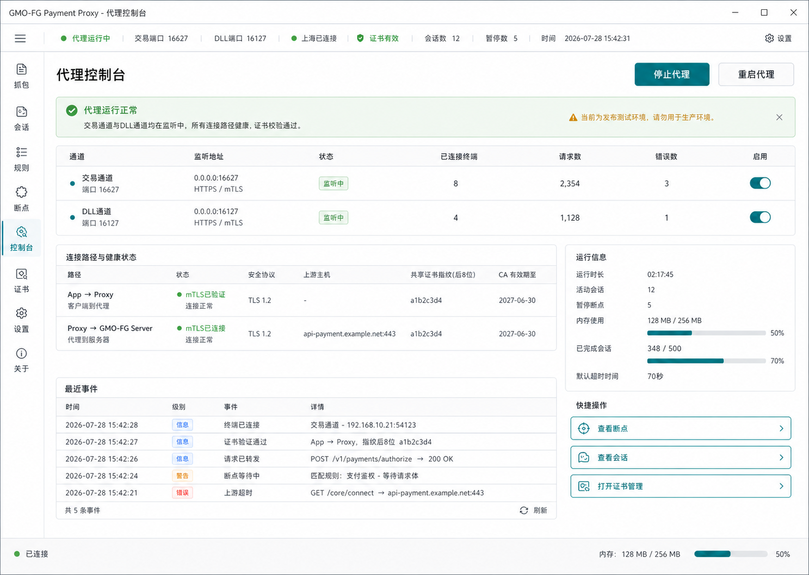
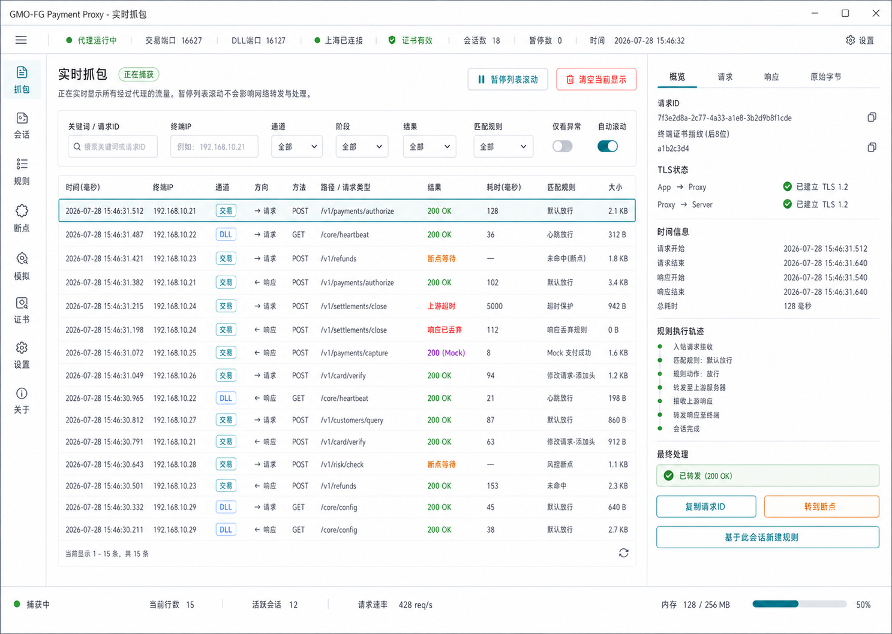
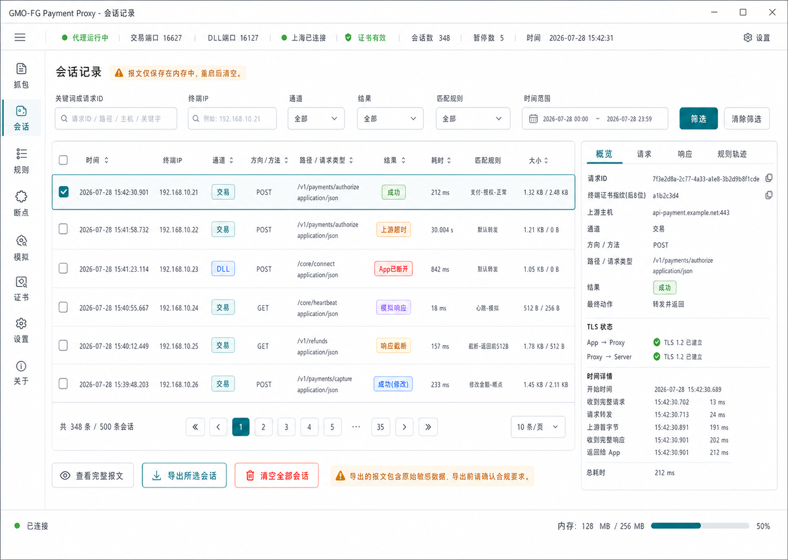
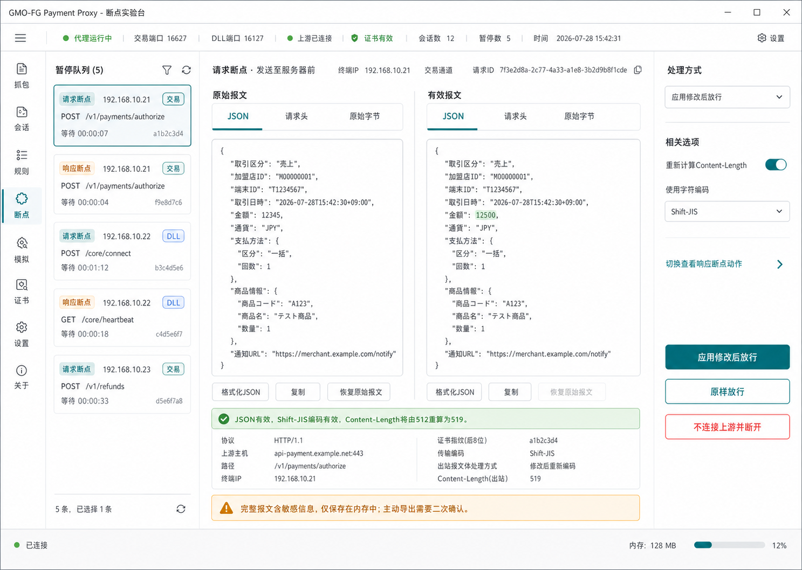
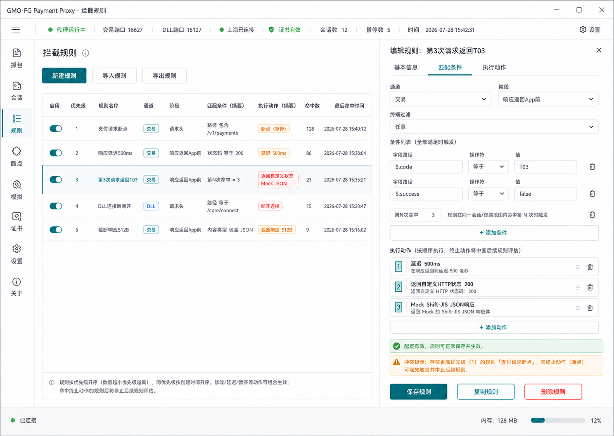
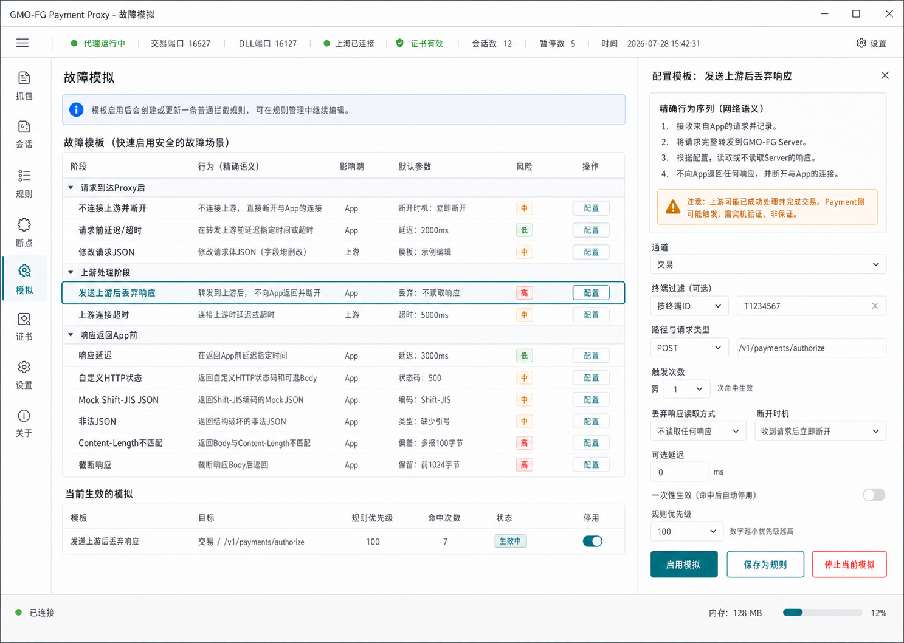
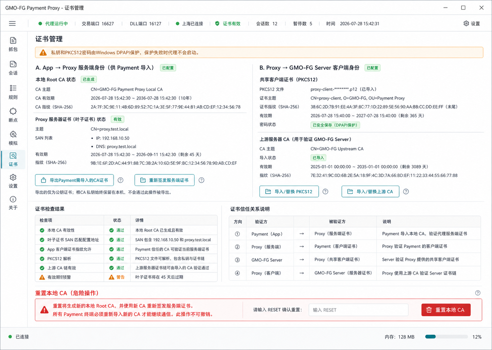
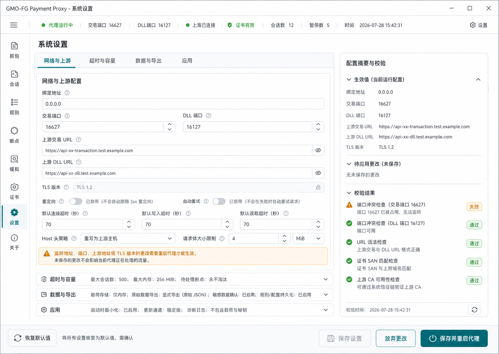

# GMO-FG Payment Proxy 需求规格与代码设计

## 0. 文档说明

| 项目 | 内容 |
| --- | --- |
| 产品名称 | GMO-FG Payment Proxy |
| 文档类型 | 产品需求规格、UI 行为规范与代码设计 |
| 文档版本 | v1.1.1 |
| 文档状态 | 实施基线 |
| 目标平台 | Windows 10/11 x64、macOS Apple Silicon |
| UI 语言 | 中文 |
| 主要用户 | 支付联机测试人员、协议测试人员、开发与问题调查人员 |
| 实现状态 | 核心功能已实现；继续以本文档执行跨平台、真机和回归验证 |

本文档是 GMO-FG Payment Proxy 的唯一实施基线，统一描述：

- 产品范围和外部边界。
- 八个 UI 页面的功能、状态和操作结果。
- HTTPS/mTLS 代理、报文拦截、规则和故障注入行为。
- Rust 代码分层、运行状态、IPC、数据和安全设计。
- 需求、UI、Rust 模块、IPC 与测试之间的追踪关系。

后续实现不得只依据 UI 图片猜测行为。UI 图片是视觉基准，本文档是行为基准。若功能、文案、状态或接口需要变化，应先修改本文档和追踪矩阵，再修改代码。

### 0.1 给第一次接触本项目的读者

如果你不了解代理、TLS、Rust 或 Tauri，请先记住一句话：**本工具在 Payment App 与
GMO-FG Server 中间接收一份请求，按测试规则决定“原样转发、修改、暂停或故意制造
故障”，再把结果交给另一端。**

阅读本文档时按下面顺序进行，不需要先读源码：

1. 阅读第 0.2 节术语，分清“通道、连接、会话、报文、断点和规则”。
2. 阅读第 2.3 节首次使用旅程，理解一台新电脑从零到取得 `D48` 的完整路径。
3. 阅读第 4 章，确认八个页面上应该出现什么、什么时候可点、失败时显示什么。
4. 阅读第 6～9 章，理解网络、规则、弱网、数据和安全的精确语义。
5. 阅读第 10～14 章，按依赖方向建立 Rust 与前端代码，不允许把业务逻辑搬到 UI。
6. 阅读第 16、17 章，逐项建立自动化测试、真机证据和需求追踪。
7. 最后按第 18 章的顺序实现；任何未在本文档定义的行为都先作为需求缺口处理。

本文档刻意同时包含“产品要做什么”和“代码怎样分层”。其他 AI 或开发者只读取本
文档，也必须能够重建同样的页面、Rust 边界、网络行为、默认值、错误状态、测试和
验收口径。第 3.5 节提供不依赖图片的页面区域骨架；仓库图片只用于最终视觉对照，不得
以“图片里看起来像这样”替代正文中的明确规则。

### 0.2 新手术语表

| 术语 | 小白解释 | 本项目中的准确含义 |
| --- | --- | --- |
| Proxy（代理） | 夹在两端中间转交数据的程序。 | 本桌面工具；同时扮演 Payment 的 TLS Server 和 GMO-FG 的 TLS Client。 |
| 上游 | Proxy 下一步要访问的真实服务。 | `https.gmo-fg.net` 的交易或 DLL 测试端口。 |
| 下游 | 主动连接 Proxy 的被测程序。 | Android Payment App。 |
| 通道 | 同一产品中的一类独立入口。 | Payment Profile 默认提供“交易”和“DLL”；通用核心不能写死这两个名字。 |
| Listener | 等待别人连接的网络端口。 | 交易默认 `16627`，DLL 默认 `16127`；仅对启用通道监听。 |
| 连接 | 一次 TCP/TLS 连接。 | 使用 `ConnectionId` 标识；包含终端 IP、客户端证书指纹和运行 Epoch。 |
| 会话 | 一次完整请求及其响应的业务记录。 | 使用 `SessionId` 标识；即使以故障终止也必须形成稳定终态。 |
| 报文 | HTTP 请求或 HTTP 响应。 | 使用 `MessageId` 标识；包含原始版本和经过规则/人工修改后的有效版本。 |
| mTLS | 双方都用证书证明身份的 TLS。 | Payment→Proxy 和 Proxy→Server 两段分别握手、分别验证，前一段成功不代表后一段成功。 |
| Root CA | 用来签发或信任其他证书的根证书。 | 隔离测试环境使用统一测试 Root CA 签发 Proxy 叶子；只允许导出公开证书。 |
| PKCS12/P12 | 把客户端证书链和私钥装在一起的文件。 | Proxy 连接 GMO-FG 时使用的共享客户端身份；原始字节和密码必须安全存储。 |
| SAN | 证书允许使用的 IP 或 DNS 名。 | Payment 实际连接 Proxy 使用的 LAN IP/DNS 必须包含在 Proxy 服务端叶子证书 SAN 中。 |
| Shift-JIS | 日文系统常用文字编码。 | Payment 产品 Body 的文本编码；未修改时不重编码，修改后必须严格无损编码。 |
| 规则 | 满足条件时执行一组动作。 | Rust 领域对象；包含优先级、条件、有序动作、命中计数、revision 和启用状态。 |
| 断点 | 在网络继续前人工暂停。 | 请求发往上游前或响应返回 App 前进入 `Pending`，必须由 Rust 原子解决。 |
| 故障模板 | 快速创建常见异常的表单。 | 最终仍生成普通规则，不允许出现第二套执行引擎。 |
| Epoch | 一次 Proxy 运行实例的编号。 | 每次成功启动生成新的 `runtime_epoch`，旧 Epoch 的实体不能在新运行实例中继续操作。 |
| revision | 数据版本号。 | 所有写操作用它做乐观锁；版本过期返回 `REVISION_CONFLICT`。 |
| ViewModel | 专门给界面展示的数据。 | 由 Rust 产生，包含中文文案、可执行动作、禁用原因、字段错误和 UI tone。 |
| Command | 前端主动请求 Rust 做事。 | Tauri IPC 请求/响应；所有业务操作的唯一入口。 |
| Channel 事件 | Rust 主动推送给前端的消息。 | 有序、带游标和 Epoch 的实时事件；慢 UI 不得阻塞网络。 |
| D48 | GMO-FG 返回的业务错误码。 | `マスタファイル未登録`，业务上不是成功；在当前真机基线中，它证明请求确实到达真实上游并收到可解析响应。 |

### 0.3 证据边界（避免把“看起来成功”误判为完成）

必须分开记录以下六层结果：

1. **界面层**：按钮可用、表单可保存、状态能显示。
2. **Rust 用例层**：Command 返回正确 ViewModel、字段错误或稳定错误码。
3. **传输层**：TCP、两段 mTLS、HTTP/1.1、Header、Body 字节和连接终止符合定义。
4. **规则层**：指定规则 ID 实际命中，并产生正确轨迹、计数和终止结果。
5. **Android 层**：真实 Payment 出现的错误、超时、自动取消或成功表现。
6. **上游业务层**：GMO-FG 返回的 HTTP 状态和业务码，例如 `D48`。

HTTP 200 不能单独证明业务成功；打开桌面窗口不能证明 Proxy 已监听；规则保存成功不能
证明规则命中；一次 `D48` 不能证明全部规则都通过。验收报告必须明确自己证明了哪一层。

## 1. 项目背景与目标

### 1.1 背景

当前 Payment App 直接与 GMO-FG Server 建立 HTTPS 通信：

```text
GMO-FG Server <-> Payment App
```

测试工具引入后，通信链路调整为：

```text
GMO-FG Server <-> GMO-FG Payment Proxy <-> Payment App
```

Proxy 作为测试环境中的双向 mTLS 中间代理，接收 Payment App 请求、按规则处理或暂停报文、向真实 Server 转发，并将 Server 响应返回 Payment App。

### 1.2 产品目标

| 编号 | 目标 |
| --- | --- |
| GLOBAL-001 | 在不修改 Payment 业务代码的前提下查看其全部 GMO-FG HTTPS 请求与响应。 |
| GLOBAL-002 | 支持在请求发送到 Server 前和响应返回 App 前设置人工断点。 |
| GLOBAL-003 | 支持修改报文、延迟、Mock、断开、丢弃、非法报文和截断等测试行为。 |
| GLOBAL-004 | 支持多个终端并发连接，并能明确区分终端、连接、会话和报文。 |
| GLOBAL-005 | 支持生成 Payment 需要导入的 Proxy CA，并管理 Proxy 访问 Server 使用的共享 PKCS12。 |
| GLOBAL-006 | 完整报文默认只驻留内存，避免测试敏感数据被自动写入磁盘。 |
| GLOBAL-007 | 规则、设置和证书配置可以持久化，重启工具后继续使用。 |
| GLOBAL-008 | 所有业务功能由 Rust 实现，Next.js 仅负责显示和收集用户操作。 |

### 1.3 不在范围内

| 编号 | 内容 |
| --- | --- |
| GLOBAL-009 | 不修改 `jp_gmofg_payment` 的联机业务实现。 |
| GLOBAL-010 | 不负责向 Payment 下发代理地址或证书；测试人员通过既有外部参数配置。 |
| GLOBAL-011 | 不绕过真实 GMO-FG Server 的业务认证、授权或协议校验。 |
| GLOBAL-012 | 不保证某个故障必然触发 Payment 的 T02、T03、T04 或自动取消；必须通过实机验证。 |
| GLOBAL-013 | 不作为生产流量网关或生产长期运行服务。 |
| GLOBAL-014 | 不自动采集、保存或上传支付卡号、密码、私钥等敏感内容。 |

## 2. 用户、外部系统与通信拓扑

### 2.1 用户与外部对象

| 对象 | 说明 | 主要交互 |
| --- | --- | --- |
| 测试人员 | 使用 Windows 或 macOS 工具执行协议和异常场景测试。 | 启停代理、查看流量、处理断点、配置规则和证书。 |
| Payment App | 被测 Android 支付应用。 | 连接 Proxy、发送请求、接收响应。 |
| GMO-FG Server | 真实测试环境服务端。 | 接收 Proxy 转发请求并返回响应。 |
| 外部参数系统 | Payment 地址和证书的既有配置来源。 | 将 Proxy 地址及公开 CA 配置给 Payment。 |

### 2.2 mTLS 关系

| 编号 | 方向 | 验证关系 |
| --- | --- | --- |
| CERT-001 | Payment App -> Proxy | Proxy 提供由安装包内置统一测试 Root CA 签发的本机服务端叶子证书；测试版 Payment 信任该公开 Root CA。 |
| CERT-002 | Proxy -> Payment App | Proxy 校验 Payment 提供的客户端证书，并与允许的共享客户端证书指纹匹配。 |
| CERT-003 | Proxy -> GMO-FG Server | Proxy 使用测试人员导入的共享 PKCS12 客户端身份。 |
| CERT-004 | GMO-FG Server -> Proxy | Proxy 默认使用安装包内置的 Payment 原始 `server.crt` 信任锚验证 Server 证书链和主机名；用户替换后使用替换值。 |

### 2.3 第一次使用的端到端旅程

在一台从未运行过本工具的电脑上，必须按下列顺序完成。顺序本身是需求，不能为了
“少点几次”把证书生成、设置保存或真实基线合并成一个不透明操作。

1. **打开系统设置**：Rust 在没有已保存 SAN 时尝试填入首选 LAN IPv4；用户必须核对
   该地址是不是 Payment 实际访问电脑时使用的地址。
2. **填写网络**：绑定地址默认 `0.0.0.0`；Payment 不能连接 `0.0.0.0`，必须连接电脑
   真实 LAN IP。交易/DLL 监听端口默认 `16627`/`16127`。
3. **填写 SAN**：至少包含 Payment 将连接的电脑 IP 或 DNS；多个值用逗号分隔。
4. **填写上游**：交易为 `https://https.gmo-fg.net:16627`，DLL 为
   `https://https.gmo-fg.net:16127`；这是 HTTPS scheme 加主机名 `https.gmo-fg.net`，
   不是重复写错。
5. **校验并保存**：先看字段错误，再保存。首次还没有证书时允许得到“证书尚未准备”
   警告，但不能因此禁止保存 SAN。
6. **打开证书管理**：使用已保存 SAN 初始化本机 Proxy 服务端叶子证书。
7. **导出公开 Root CA**：把导出的 `.crt` 合入测试版 Payment 的 `assets/server.crt`，
   重新构建并安装测试 APK。导出物绝不包含签名私钥。
8. **导入共享 PKCS12**：选择 Launcher/Payment 真实使用的客户端 P12；密码允许为空。
   Proxy 用同一客户端身份访问 GMO-FG。
9. **检查上游 CA**：默认使用安装包内置的 Payment 原始 `server.crt`；只有测试环境证书
   变化时才选择性替换，不能拿 Proxy Root CA 代替上游 CA。
10. **重新检查证书**：统一测试 Root、本机叶子 SAN、客户端身份、上游信任锚全部通过。
11. **修改设备地址**：让真实 Payment 的交易/DLL 地址指向 Proxy 电脑，而不是直接指向
    GMO-FG；不得把测试地址永久写坏，自动化优先用 instrumentation 参数临时覆盖。
12. **启动 Proxy**：所有已启用 Listener 必须一起启动成功；任何一个失败都整体回滚。
13. **先做无规则 DLL 基线**：在设备 `2740072778` 上发起真实 DLL 请求。
14. **分层判定**：必须看到 App→Proxy mTLS、Proxy→Server mTLS、HTTP 200、合法响应和
    `ErrorCode=D48`。`D48` 业务上失败，但在当前环境是“真实上游往返完成”的基线标记。
15. **再做规则/断点/弱网**：每个场景使用自己的规则 ID 和会话证据；结束后停用规则，
    再取得一次无故障 `D48`，证明环境恢复。
16. **收尾**：导出必要证据、清空已完成会话、停止 Proxy、删除临时规则/测试 APK/临时
    密钥文件，确认端口不再监听。

### 2.4 证书材料不可混用

| 材料 | 谁持有 | 用途 | 是否可由 UI 导出 |
| --- | --- | --- | --- |
| 统一测试 Root CA 公开证书 | 安装包内置，Payment 测试构建也信任 | Payment 验证 Proxy 叶子 | 可以，只导出公开 PEM `.crt` |
| 统一测试 Root CA 签名私钥 | 仅显式隔离测试 Profile 可使用 | 为本机 SAN 签发 Proxy 叶子 | 绝对不可以 |
| 本机 Proxy 叶子证书和私钥 | 当前操作系统用户安全存储 | Proxy 在 App→Proxy TLS 中出示服务端身份 | 证书元数据可看，私钥不可导出 |
| 共享客户端 PKCS12 | 用户导入，安全存储 | Payment 向 Proxy 证明身份的指纹来源；Proxy 向 Server 出示客户端身份 | 原始内容和密码不可导出到前端 |
| Payment 原始 `server.crt` | `product-payment` 内置，可选择性替换 | Proxy 验证 GMO-FG Server | 只作为上游信任锚管理，不等同 Proxy Root |

公开 Root CA 可以进入测试 APK；任何 CA 私钥、叶子私钥、P12 密码或 P12 原始字节均
不得进入前端、日志、SQLite 明文字段、会话导出或错误文案。

## 3. 全局 UI 与交互规则

### 3.1 页面与导航

固定导航名称与顺序如下：

1. 代理控制台
2. 实时抓包
3. 会话记录
4. 断点实验台
5. 拦截规则
6. 故障模拟
7. 证书管理
8. 系统设置

| 编号 | 需求 |
| --- | --- |
| UI-001 | 所有页面共享左侧导航和顶部运行状态栏；不设置重复的底部运行/内存状态栏。 |
| UI-002 | 顶部状态栏显示代理状态、交易端口、DLL 端口、上游状态、证书状态、会话数和暂停数。 |
| UI-003 | 所有状态必须同时使用文字和颜色，不得仅依靠颜色区分。 |
| UI-004 | 页面只组合 HeroUI v3 官方组件，不建立自定义 UI 基础组件库。 |
| UI-005 | 禁止自制 Button、Table、Modal、Drawer、Alert、Tabs、Select、代码编辑器和 `/components/ui` 封装层。 |
| UI-006 | Tailwind CSS 仅用于布局、间距、尺寸、对齐和滚动，不重绘 HeroUI 控件。 |
| UI-007 | 界面只提供中文；协议原始字段、URL、证书主题和错误码可保留原始英文。 |
| UI-008 | 键盘可以访问导航、列表、表单、弹窗和主要操作按钮；焦点状态必须可见。 |
| UI-009 | 破坏性操作必须使用 HeroUI AlertDialog/Modal 二次确认。 |
| UI-010 | Rust 返回操作成功或失败后，前端使用 HeroUI Toast/Alert 原样显示 Rust 提供的中文结果。 |
| UI-011 | 左侧导航项占满工具轨可用宽度，图标和文字以工具轨为基准水平居中；选中态不得改变对齐基准。 |
| UI-012 | Modal、AlertDialog 和 Drawer 的触发器使用根组件下的直接 HeroUI Button；底部取消/关闭操作必须位于 Footer 的正常布局流中并保留组件默认安全边距。`CloseTrigger` 只允许用于右上角关闭图标，Footer 使用 `Button slot="close"`。 |
| UI-013 | 列表和详情必须区分加载、失败和空数据；失败状态显示 Rust 中文错误并提供重试，不得将 IPC 失败显示成“暂无数据”。 |
| UI-014 | 确认操作执行期间禁用重复提交并显示进行中文案；Rust 返回成功后关闭 Overlay，失败时保留 Overlay 和用户输入。 |
| UI-015 | 宽表格设置可读的最小宽度并通过 `Table.ScrollContainer` 横向滚动，不得通过单字换行压缩关键列。 |
| UI-016 | Rust 返回的字段错误必须关联到对应 HeroUI 表单字段；页面级错误摘要只作为补充。 |
| UI-017 | Tauri 负责物理窗口最小尺寸；Web 布局不得设置 1024px CSS 最小宽度，以保证浏览器缩放和系统大字体下仍可重排。 |
| UI-018 | 顶部状态栏在全部八个业务页面提供当前页面专属的“使用说明”入口；入口只打开 HeroUI Drawer，不执行文档级导航或重载当前 WebView。 |
| UI-019 | 每页使用说明至少覆盖页面用途、适用场景、前置条件、主要操作步骤、结果判断、风险和常见失败排查；说明必须与当前页面实际可见控件、Rust 行为和实机验收口径一致。 |
| UI-020 | 使用说明只属于静态展示内容，不得在 TypeScript 中复制业务状态判断、校验、规则语义或网络实现；涉及成功/失败、字段错误和可执行动作时，仍以 Rust 当前 ViewModel 与 Command 返回为准。 |
| UI-021 | 生产页面不得直接使用原生 `button`、`input`、`textarea`、`select`、`option` 或浏览器 `date`/`datetime-local`/`time` 控件；日期时间筛选使用 HeroUI DatePicker、DateField 和 Calendar，并由 `I18nProvider locale="zh-CN"` 提供中文本地化。 |

### 3.2 最终 UI 视觉基准

下面图片属于需求基线包的辅助验收资产，不是实现者理解布局的唯一来源。图片缺失时，
仍必须按照第 3.4 节视觉令牌、第 3.5 节页面区域骨架和第 4.9 节逐控件合同完整实现；
图片存在时，在相同窗口尺寸下用于检查信息密度、对齐和视觉层级，不得覆盖正文行为。

| 页面 | 视觉基准 |
| --- | --- |
| 代理控制台 |  |
| 实时抓包 |  |
| 会话记录 |  |
| 断点实验台 |  |
| 拦截规则 |  |
| 故障模拟 |  |
| 证书管理 |  |
| 系统设置 |  |

### 3.3 页面使用说明

应用在顶部状态栏使用书本图标作为当前页面帮助入口。入口的无障碍名称固定为
“打开{页面名称}使用说明”，并直接打开右侧 HeroUI Drawer。Drawer 使用 Accordion
组织长篇说明，默认展开第一节；关闭说明后保持当前页面、选中行、Tab、表单草稿、
滚动位置和 Rust 订阅状态不变。

八个页面的最低说明范围如下：

| 页面 | 必须说明的操作范围 |
| --- | --- |
| 代理控制台 | 首次设置/证书顺序、启动/停止/重启、顶部与双向健康状态、真实设备 DLL 的 `D48` 验收、常见启动/TLS/端口失败。 |
| 实时抓包 | 实时列表、Rust 筛选与分页、暂停/恢复语义、清空当前显示、请求/响应/规则轨迹详情、转断点和从会话建规则。 |
| 会话记录 | 多条件与时间筛选、分页、按需详情、敏感原始 JSON 导出、清空已完成会话、容量淘汰和找不到会话的排查。 |
| 断点实验台 | 产生断点、原始/有效报文、Rust 格式化与校验、请求/响应阶段可执行动作、断点终态和高风险真机验证。 |
| 拦截规则 | 列表执行顺序、基本信息、匹配条件、动作顺序与终止语义、保存门禁、复制/删除/导入/导出和命中验证。 |
| 故障模拟 | 模板选择、参数、启用/保存为规则、活动模拟停用、请求前断开与上游后丢弃等关键网络语义。 |
| 证书管理 | 首次 SAN/本机叶子/PKCS12/上游 CA 顺序、公开 Root CA 导出、两段 mTLS 身份、重新签发、检查、安全存储、重新初始化本机证书和 TLS 排查。 |
| 系统设置 | 网络/SAN/端口/上游、首次配置顺序、超时/Body/容量、校验/保存/重启/回滚、默认值与数据策略。 |

说明中出现的默认值、状态、错误码和验收标准必须直接来自本需求文档。帮助内容可以
解释操作，但不得替代页面上的实时 Rust 状态。例如，帮助中说明“修改后放行需要校验”
不代表前端可以自行判断校验是否通过；是否可执行仍由 Rust ViewModel 决定。

### 3.4 应用壳尺寸和视觉令牌

为了让只读本文档的实现者复现相同信息密度，应用壳采用以下基准；这些值属于布局与
产品颜色，不代表可以重绘 HeroUI 交互控件。

| 项目 | 基准 |
| --- | --- |
| 桌面网格 | 顶部 56px；左侧导航 96px；主内容占剩余空间。 |
| 1280px 以下 | 左侧导航缩为 80px；规则/故障/详情允许 Drawer 或自动滚动到可见位置。 |
| 1025px 以下 | 隐藏永久左轨，在顶部显示移动导航 Drawer；主区成为单列。 |
| 导航项 | 最小高度 80px、整轨宽度、圆角 12px、图文间距约 6px、图标 24px、项间距 8px。 |
| 顶部状态 | 单行紧凑 Toolbar；窄屏允许换行；产品名、状态 Chip、通道、上游、证书、计数、时间、帮助、设置依次排列。 |
| 主背景 | 白色；不添加重复底部状态栏或无实际功能的内存进度条。 |
| 正文/弱化文字 | `#16212b` / `#5f6b76`。 |
| 分隔线/柔和背景 | `#d9e0e6` / `#f5f8fa`。 |
| 产品强调/柔和强调 | `#007f8c` / `#e9f7f8`。 |
| 成功/警告/危险 | `#2c9c45` / `#d77a00` / `#d92d35`，同时必须显示文字。 |
| 字体 | Windows 优先 Segoe UI、Microsoft YaHei UI；其他平台使用等价系统无衬线字体。 |

所有页面必须尊重 `prefers-reduced-motion`。选中状态不得改变控件尺寸；页面切换时顶部
和左轨保持不动，中央内容只进行 React 内存路由切换，不产生整个窗口闪白或重新加载。

### 3.5 不依赖图片的八页区域骨架

本节让没有视觉图片的实现者也能复刻桌面版区域比例。以下比例以扣除 96px 左轨和
56px 顶栏后的可用工作区为基准；页面外边距 20px，区域间距 16px，主卡片圆角 16px，
卡片内边距 20px。页面标题与首个内容区域间距 16px。除表格专用滚动容器外，禁止为
每张卡片制造互相嵌套的滚动条。

| 页面 | 1440px 及以上的区域骨架 | 1025～1439px | 1024px 及以下 |
| --- | --- | --- | --- |
| 代理控制台 | 单列；标题/说明在上，双通道状态卡 1:1，两段健康状态 1:1，运行指标和最近事件在下。主操作位于标题行右侧。 | 双列卡可缩为单列，但状态和主操作不离开首屏。 | 单列；状态卡、健康卡、指标、事件依次排列。 |
| 实时抓包 | 左侧列表约 72%，右侧详情约 28%；筛选卡和列表同属左区，详情区固定在右侧并独立滚动。 | 列表约 64%，详情约 36%；表格保持最小宽度并横向滚动。 | 默认只显示列表；选中行后用右侧 Drawer 展示详情，关闭后恢复原滚动位置。 |
| 会话记录 | 单列；筛选卡、会话表、分页、批量操作自上而下；详情使用居中 Modal/右侧 Drawer，不常驻占宽。 | 同桌面结构，筛选字段允许换为两列。 | 筛选单列；表格横向滚动；详情用全高 Drawer。 |
| 断点实验台 | 左侧队列约 20%，中间报文约 60%，右侧处理方式约 20%；三栏顶边对齐。 | 左侧 24%、中间 48%、右侧 28%。 | 队列在上；选中后报文占主区，处理方式用 Drawer；没有选中项时处理按钮禁用。 |
| 拦截规则 | 左侧规则列表约 55%，右侧编辑器约 45%；新建/导入/导出位于左区标题行，保存/复制/删除位于编辑器底部正常流。 | 左右各 50%，列表横向滚动。 | 先显示列表；点击或新建后进入同一 WebView 内的编辑视图，默认选中“基本信息”。 |
| 故障模拟 | 左侧模板表约 65%，右侧配置约 35%；进入页面默认选中第一条可用模板，整行点击即选择，不保留冗余“配置”按钮。 | 左右约 58%/42%。 | 模板列表在上，选中后配置区域滚动到可见位置或使用 Drawer。 |
| 证书管理 | 上半区“App→Proxy”和“Proxy→Server”两张等宽卡；下半区“检查结果”和“信任关系说明”两张等宽卡；危险重置独占底行。 | 卡片可变成单列，内容高度由数据决定，不用空白补齐。 | 全部单列；长指纹允许换行；操作按钮保持可见。 |
| 系统设置 | 左侧设置表单约 68%，右侧摘要与校验约 32%；底部操作栏固定在内容区底边但不得遮挡字段。通道卡内部依次为名称/ID、启用 Switch、端口、上游 URL。 | 左右约 62%/38%；通道卡字段可换行。 | 单列；摘要在表单后；底部按钮进入正常流。 |

所有卡片高度由内容决定，不使用大面积空白把控件“推到角落”。Switch 与同一行的标题、
端口和 URL 必须以控件中心线垂直对齐；标签放在控件上方时，各列标签基线一致。纯图标
按钮必须同时提供 Tooltip 和无障碍名称。选中行使用柔和强调背景，悬浮背景与容器边界
之间至少保留 8px，不得贴住窗口或分隔线。

## 4. 页面功能需求

### 4.1 代理控制台

视觉基准：[01-proxy-console.png](assets/ui/01-proxy-console.png)

| 编号 | 功能需求 |
| --- | --- |
| CONSOLE-001 | 页面显示代理当前状态，并提供启动、停止和重启操作。 |
| CONSOLE-002 | 交易通道和 DLL 通道分别显示监听地址、mTLS 状态、已连接终端数、请求数、错误数和启用开关。 |
| CONSOLE-003 | 默认交易监听地址为 `0.0.0.0:16627`，默认 DLL 监听地址为 `0.0.0.0:16127`。 |
| CONSOLE-004 | 通道开关变化属于待应用配置；运行中修改后必须明确提示是否需要重启。 |
| CONSOLE-005 | 连接健康状态分别显示 App -> Proxy 和 Proxy -> Server，不得合并为一个模糊状态。 |
| CONSOLE-006 | 运行信息显示运行时长、活动会话、待处理断点、内存、会话容量和默认超时。 |
| CONSOLE-007 | 最近事件显示终端连接、证书验证、请求转发、断点等待、上游超时等 Rust 事件。 |
| CONSOLE-008 | 快捷操作可以跳转断点、会话和证书管理页面。 |
| CONSOLE-009 | 端口占用、证书不可用或配置无效时，启动操作失败并显示 Rust 返回的具体原因。 |
| CONSOLE-010 | 停止代理时终止两个监听器和上游任务，并将所有待处理断点转换为 `ProxyStopped`。 |

### 4.2 实时抓包

视觉基准：[02-live-capture.png](assets/ui/02-live-capture.png)

| 编号 | 功能需求 |
| --- | --- |
| CAPTURE-001 | 页面实时显示经过 Proxy 的请求、响应和终态事件。 |
| CAPTURE-002 | 表格显示毫秒时间、终端 IP、通道、方向、方法、路径/请求类型、已知的响应 HTTP 状态码、结果、耗时、匹配规则和大小；请求阶段尚无响应时显示空值。 |
| CAPTURE-003 | 支持按关键字/请求 ID、终端 IP、通道、阶段、结果和规则筛选。 |
| CAPTURE-004 | 筛选、排序和分页由 Rust 执行；前端不得在本地重新计算结果。 |
| CAPTURE-005 | “暂停列表滚动”仅暂停 UI 更新，不暂停网络、规则、断点或会话记录。 |
| CAPTURE-005A | 恢复列表滚动时由 Rust 返回当前筛选条件下的完整显示快照，不得把暂停游标永久写入查询而丢失暂停前仍可见的行。 |
| CAPTURE-006 | 恢复滚动后，Rust 返回当前游标之后仍保留的事件；已淘汰事件不补发。 |
| CAPTURE-007 | 选中一行后显示概览、完整请求 Header、完整响应 Header、响应 HTTP 状态码、请求/响应 Shift-JIS 解码 Body、TLS 状态、时间信息和规则轨迹；抓包详情不提供独立“原始字节”区域。 |
| CAPTURE-008 | “转到断点”只对仍处于 `Pending` 的断点可用。 |
| CAPTURE-009 | “基于此会话新建规则”由 Rust 生成预填的规则草稿，前端只负责打开规则编辑界面。 |
| CAPTURE-010 | “清空当前显示”只重置抓包页面游标，不删除会话记录。 |
| CAPTURE-011 | 所有筛选项显示可见中文标签；窄屏未选择记录时不保留空详情区域，选中记录后自动滚动到详情。 |

### 4.3 会话记录

视觉基准：[03-session-history.png](assets/ui/03-session-history.png)

| 编号 | 功能需求 |
| --- | --- |
| SESSION-001 | 会话记录保存在 Rust 内存仓库，应用重启后清空。 |
| SESSION-002 | 支持按关键字/请求 ID、终端 IP、通道、结果、规则和时间范围筛选。 |
| SESSION-003 | Rust 执行筛选、排序、分页和总数计算，并返回分页 ViewModel。 |
| SESSION-004 | 会话列表显示时间、终端、通道、方法、路径/请求类型、响应 HTTP 状态码、结果、耗时、规则和请求/响应大小。 |
| SESSION-005 | 会话详情显示请求 ID、证书指纹、上游主机、双向 TLS、最终动作和分阶段耗时。 |
| SESSION-006 | 完整请求 Header、完整响应 Header、响应 HTTP 状态码、请求/响应 Shift-JIS 解码 Body 和规则轨迹按需获取；列表接口不得默认返回完整 Payload。 |
| SESSION-007 | 用户可以显式导出所选会话的原始 JSON 文件。 |
| SESSION-008 | 导出前必须提示文件包含原始敏感数据，并由用户确认保存位置。 |
| SESSION-009 | 用户可以清空全部已完成会话；待处理断点不得被清空。 |
| SESSION-010 | 关闭详情后前端释放 Payload 引用；Rust 内存仓库仍按容量策略管理数据。 |
| SESSION-011 | 宽屏选中会话即打开右侧详情并按 ID 获取 Payload；窄屏只有打开“查看完整报文”抽屉时才获取，关闭详情必须清除前端引用。 |

### 4.4 断点实验台

视觉基准：[04-breakpoint-workbench.png](assets/ui/04-breakpoint-workbench.png)

| 编号 | 功能需求 |
| --- | --- |
| BREAKPOINT-001 | 断点队列显示请求/响应阶段、终端 IP、交易/DLL 通道、方法、路径、等待时间和证书指纹后缀。 |
| BREAKPOINT-002 | 标题明确显示“请求断点·发送至服务器前”或“响应断点·返回 App 前”。 |
| BREAKPOINT-003 | 原始报文由 Rust 保存并始终只读。 |
| BREAKPOINT-004 | 有效报文初始值是自动规则执行后的结果，用户可继续手动编辑。 |
| BREAKPOINT-005 | 页面提供 JSON、请求头和原始字节三个 HeroUI Tabs。 |
| BREAKPOINT-006 | 报文使用 HeroUI TextArea 显示和编辑，不提供行号、语法高亮或自定义代码编辑器。 |
| BREAKPOINT-007 | JSON 格式化、复制和恢复原始报文均通过 Rust Command 完成或取得 Rust 返回值。 |
| BREAKPOINT-008 | Rust 校验 JSON、Shift-JIS 可编码性、请求头和最终 `Content-Length`，前端只显示校验结果。 |
| BREAKPOINT-009 | 校验失败时禁用修改后放行，并显示字段级错误。 |
| BREAKPOINT-010 | 请求断点支持原样放行、修改后放行、直接 Mock 响应、请求前延迟、不连接上游并断开。 |
| BREAKPOINT-011 | 响应断点支持原样放行、修改后放行、响应延迟、自定义 HTTP 状态、非法 JSON、错误长度、截断和丢弃响应。 |
| BREAKPOINT-011A | Rust 的 `BreakpointDetailViewModel` 返回当前阶段可执行动作、中文标签、默认参数、启用状态和禁用原因；前端不得硬编码动作全集或为错误阶段展示不可执行动作。 |
| BREAKPOINT-012 | “不连接上游并断开”不得与“上游处理后丢弃响应”使用相同文案。 |
| BREAKPOINT-013 | 断点不自动放行；等待期间 App 断开后，断点转换为 `ClientDisconnected` 并禁止继续处理。 |
| BREAKPOINT-014 | 处理完成后从队列移除该项，并自动选中下一条待处理断点。 |
| BREAKPOINT-015 | Proxy 停止时所有待处理断点转换为 `ProxyStopped`。 |
| BREAKPOINT-016 | 1280px 及以下使用完整按钮打开处理 Drawer；标题、请求 ID 和操作栏允许重排但不得溢出或形成不可点击文本入口。 |

### 4.5 拦截规则

视觉基准：[05-interception-rules.png](assets/ui/05-interception-rules.png)

| 编号 | 功能需求 |
| --- | --- |
| RULE-001 | 支持新增、查看、编辑、复制、删除、启停、导入和导出规则。 |
| RULE-002 | 规则列表显示优先级、名称、通道、阶段、匹配摘要、动作摘要、命中次数和最后命中时间。 |
| RULE-003 | 规则按优先级升序执行；优先级相同按创建顺序执行。 |
| RULE-004 | 匹配条件支持通道、请求/响应阶段、终端、路径/请求类型、JSON 字段路径、等于、包含、正则和第 N 次命中。 |
| RULE-005 | “启用规则”和“仅命中一次”是两个独立的 HeroUI Switch。点击开关控件本身或对应文字都必须改变当前 Rust 草稿布尔值；一次性规则仅在首次成功命中并提交运行元数据后由 Rust 原子停用，保存规则或只打开编辑器不得消耗一次机会。 |
| RULE-006 | 第 N 次命中默认按终端 IP 与客户端证书指纹组合计数。 |
| RULE-007 | 代理重启、规则关闭后重新启用或匹配条件变化时，Rust 重置该规则命中计数。 |
| RULE-008 | 动作按配置顺序执行，并保存每一步执行轨迹。 |
| RULE-009 | 修改、延迟和暂停动作可以组合。 |
| RULE-010 | Mock、拒绝、断开、丢弃和截断属于终止动作，命中后停止后续规则。 |
| RULE-011 | 保存前由 Rust 校验字段、正则、JSON 路径、动作阶段兼容性和终止动作顺序。 |
| RULE-012 | Rust 检测可能被高优先级终止规则遮蔽的配置，并返回冲突警告。 |
| RULE-013 | 导入规则时先由 Rust 校验全部内容；任一规则非法则整体不写入。 |
| RULE-014 | 规则导出不包含证书、密码、Payload 或机器专属路径。 |
| RULE-015 | 1280px 及以下选择或新建规则后，页面自动将编辑面板滚动到可见位置。 |
| RULE-016 | 所有 Rust 异步规则草稿请求均进入统一 pending/invalid 保存门禁，并按可卸载的编辑行与字段槽位使用请求代次丢弃迟到响应；删除当前行、删除前置行、切换规则或卸载编辑器时必须清理等待状态，迟到结果不得写入移位后的另一行。 |
| RULE-017 | Header、Body、状态码及其他动作字段的异步结果必须函数式合并到最新 Rust 草稿视图状态；返回时动作类型已改变则丢弃，不得用请求发起时捕获的旧动作覆盖较新字段。 |

### 4.6 故障模拟

视觉基准：[06-fault-simulation.png](assets/ui/06-fault-simulation.png)

| 编号 | 功能需求 |
| --- | --- |
| FAULT-001 | 故障模板最终创建或更新普通拦截规则，不建立第二套独立执行引擎。 |
| FAULT-002 | 模板包括：不连接上游并断开、请求前延迟/超时、修改请求 JSON。 |
| FAULT-003 | 模板包括：发送上游后丢弃响应、上游连接超时。 |
| FAULT-004 | 模板包括：响应延迟、自定义 HTTP 状态、Mock Shift-JIS JSON、非法 JSON、错误 `Content-Length`、截断响应。 |
| FAULT-005 | 每个模板显示发生阶段、精确行为、影响端、默认参数和风险等级。 |
| FAULT-006 | 模板配置支持通道、终端、路径/请求类型、第 N 次触发、一次性生效和规则优先级。 |
| FAULT-007 | “发送上游后丢弃响应”明确执行：接收 App 请求、转发 Server、按配置读取或不读取响应、不返回 App 并断开。 |
| FAULT-008 | 工具只提示该行为可能触发 T03/自动取消，需实机验证，不承诺固定结果。 |
| FAULT-009 | 活动模拟显示模板、目标、规则优先级、命中次数和状态，并支持停用。 |
| FAULT-010 | “保存为规则”进入规则管理；复杂条件继续在规则页面编辑。 |
| FAULT-011 | 1280px 及以下选择故障模板后，页面自动将配置面板滚动到可见位置。 |
| FAULT-012 | 弱网模板包括上/下行限速、上/下行抖动、上/下行间歇通断、上/下行 Body 中途断连；模板仍保存为普通规则。 |
| FAULT-013 | 故障配置面板必须明确选择交易或 DLL 通道，默认值来自 Rust 模板 ViewModel。 |

### 4.7 证书管理

视觉基准：[07-certificate-management.png](assets/ui/07-certificate-management.png)

| 编号 | 功能需求 |
| --- | --- |
| CERT-005 | 安装包内置完整的统一测试 Root CA 签发材料；首次使用时 Rust 使用它生成本机独立私钥和 SAN 匹配的 Proxy 服务端叶子证书。统一测试 Root CA 仅限隔离测试环境。 |
| CERT-006 | 叶子证书 SAN 包含用户配置的 LAN IP 和/或 DNS。 |
| CERT-007 | 用户可以随时从证书页导出安装包内置的统一测试 Root CA 公开 PEM `.crt`，用于测试版 Payment 编译流程；导出不依赖本机叶子证书是否已初始化。 |
| CERT-008 | 导出文件必须与 Rust 签发叶子证书使用的统一测试 Root CA 公开证书逐字节一致，不得包含或导出 CA 私钥、叶子私钥或其他受保护材料。 |
| CERT-009 | LAN IP/DNS 变化时使用同一统一测试 Root CA 重新签发本机叶子证书；Payment 无需因叶子证书变化重新编译。 |
| CERT-010 | 用户可以导入或替换共享 PKCS12，并输入密码。 |
| CERT-011 | 安装包内置当前 Payment 固定的原始 `assets/server.crt`，Rust 从 PEM Bundle 中选择有效 CA 信任锚作为默认上游 CA；用户可以选择性导入其他 CA Bundle 覆盖默认值。 |
| CERT-012 | 页面显示证书主题、用途、SAN、有效期、SHA-256 指纹和检查结果，但不显示密码或私钥。 |
| CERT-013 | Rust 检查统一测试 Root、本机叶子证书 SAN、App 客户端指纹、PKCS12、当前生效的内置或替换上游 CA 和到期时间。 |
| CERT-014 | 叶子证书到期前 60 天开始警告。 |
| CERT-015 | 重新初始化本机服务端证书属于危险操作；它只替换本机叶子私钥和叶子证书，不轮换统一测试 Root CA。 |
| CERT-016 | 证书私钥、PKCS12 原始字节和密码使用 Windows 当前用户范围 DPAPI 保护。 |
| CERT-017 | DPAPI 保护或解密失败时禁止启动 Proxy，不提供明文回退。 |
| CERT-018 | macOS 使用当前登录用户 Keychain 保护证书私钥、PKCS12 原始字节和密码；保护或解密失败时禁止启动 Proxy，不提供明文回退。 |
| CERT-019 | PKCS12 密码允许为空字符串，并由 Rust 原样交给解析器；空密码不等同于缺少用户输入。 |
| CERT-020 | 兼容真实终端现有客户端链：最终自签名信任锚在 `Basic Constraints` 未明确声明 `CA:false`、未声明 `KeyUsage`、有效且自签名可验证时可作为受支持的旧式客户端信任锚；该放宽仅适用于链尾信任锚，不适用于终端证书、中间 CA 或上游 Server CA。 |

### 4.8 系统设置

视觉基准：[08-system-settings.png](assets/ui/08-system-settings.png)

| 编号 | 功能需求 |
| --- | --- |
| SETTINGS-001 | 网络设置包括绑定地址、交易端口、DLL 端口、上游交易 URL 和上游 DLL URL。 |
| SETTINGS-002 | 默认绑定地址为 `0.0.0.0`，交易端口 `16627`，DLL 端口 `16127`。 |
| SETTINGS-003 | TLS 固定为 1.2；不支持在 UI 中切换为 TLS 1.3。 |
| SETTINGS-004 | HTTP 重定向和自动重试固定关闭，并以只读状态显示。 |
| SETTINGS-005 | 默认连接、写入和读取超时均为 70 秒。 |
| SETTINGS-006 | Host 头默认重写为上游主机。 |
| SETTINGS-007 | 单个请求或响应 Body 默认最大 4 MiB。 |
| SETTINGS-008 | 容量设置默认最大 500 个会话和 256 MiB；待处理断点永不淘汰。 |
| SETTINGS-009 | 数据策略显示 Payload 仅内存保存、规则/配置持久化、敏感导出确认和诊断日志脱敏。 |
| SETTINGS-010 | 页面区分当前生效值和待应用值。 |
| SETTINGS-011 | 监听、上游和 TLS 相关配置修改后必须重启 Proxy 才能生效。 |
| SETTINGS-012 | Rust 校验端口冲突、URL、证书 SAN 和上游 CA；校验失败时禁止保存并重启。 |
| SETTINGS-013 | 支持保存设置、放弃更改、保存并重启以及恢复默认值。 |
| SETTINGS-014 | 恢复默认值必须二次确认，不删除证书或规则。 |
| SETTINGS-015 | 网络设置包含“服务端证书 SAN”；首次配置时允许先保存合法网络/SAN 设置，再生成证书。尚无任何证书材料时 Rust 返回明确警告，但不得形成“必须先有证书才能保存 SAN、又必须先保存 SAN 才能生成证书”的循环依赖。 |
| SETTINGS-016 | Rust 校验返回的绑定地址、SAN、端口、上游 URL、超时、Body 和容量错误显示在对应 HeroUI 字段下方，并标记字段无效。 |
| SETTINGS-017 | Rust 在没有已保存 SAN 时根据操作系统路由选择探测首选本机 IPv4，并自动填入“服务端证书 SAN”。探测不得覆盖任何已保存的非空 SAN；离线、无可用路由或仅得到未指定、回环、链路本地、组播、广播地址时保持为空并允许用户手动填写。前端不得自行探测网卡或推断地址。 |
| SETTINGS-018 | 上游 URL 是 HTTPS origin，只允许 scheme、主机和可选端口（可带单个尾 `/`）；不得包含 userinfo、路径、查询或 fragment。Proxy 保留下游 HTTP request-target，不得静默丢弃或拼接未建模的上游路径。 |

### 4.9 八页逐控件与页面状态合同

本节把“页面有什么控件”和“控件何时可用”写成可直接实现的合同。控件显示的中文
状态、默认值、禁用原因和字段错误来自 Rust ViewModel；前端只维护输入草稿、当前选中
项、Tab、Overlay、滚动和 Command pending。

#### 4.9.1 所有页面共同状态

| 状态 | 必须显示 | 必须禁用/保留 |
| --- | --- | --- |
| 首次加载 | 页面骨架或 Spinner；顶部壳保持稳定，不整页白屏。 | 禁止依赖尚未返回 ViewModel 的写操作；导航仍可用。 |
| 加载成功且有数据 | Rust 返回的实际数据、状态文字、tone 和可执行权限。 | 只禁用 Rust 明确禁止的操作。 |
| 加载成功但为空 | 明确说明“当前没有什么”以及如何产生数据，例如“当前没有待处理断点”。 | 不把空状态当错误；与空状态无关的创建、刷新或导航仍可用。 |
| 查询失败 | Rust 错误消息、错误码、建议操作和“重试”。 | 保留上次已确认的页面选择但不得冒充新数据；失败不能显示为“暂无数据”。 |
| 写操作进行中 | 按钮显示进行中文案或 Spinner。 | 禁止同一操作重复提交；相关 Overlay 不能在提交中关闭。 |
| 写操作失败 | Overlay 保持打开；字段错误显示在对应控件，页面错误作为补充。 | 用户输入不得清空；允许修正后重试。 |
| 写操作成功 | 使用 Rust 成功文案，替换为返回的新 revision/ViewModel。 | 成功后才关闭确认 Overlay；不得由前端猜测局部业务字段。 |
| 实体已过期 | 显示实体不存在、Epoch 变化或 revision 冲突。 | 清除失效选择并重新查询；不得继续操作旧 ID。 |
| `Starting`/`Stopping` | 顶部和当前页均显示过渡状态。 | 禁止配置写入、证书变更和断点解决；查询仍允许。 |
| `Stopped` | 显示历史内存会话、规则、设置、证书。 | 禁止要求活跃监听器或 Pending runtime 的动作。 |
| `Faulted` | 错误码、原因、清理结果、可重试性和建议操作。 | 只开放 Rust 允许的停止、修复设置/证书和重试路径。 |

#### 4.9.2 代理控制台

| 区域/控件 | 数据与默认显示 | 交互、禁用和异常状态 |
| --- | --- | --- |
| 页面标题与状态 Chip | `ProxyStatusViewModel.state_text/ui_tone`。 | 状态完全由 Rust 决定。 |
| 启动代理 | Stopped 时显示。 | 证书/设置未就绪、无启用通道、Starting/Stopping/Running 时禁用并显示 Rust 原因；点击调用 `proxy_start`。 |
| 停止代理 | Running/Faulted 时可用。 | Stopped 时无需重复执行；点击调用 `proxy_stop`，pending 时禁止重复。 |
| 重启代理 | 用当前已保存配置执行停止后启动。 | Starting/Stopping 时禁用；点击调用 `proxy_restart`。 |
| 通道状态表 | 通道、监听地址、状态、上游 URL、上游状态、终端数、请求数、错误数、启用状态。 | 表格只读；通道启用修改在设置页完成，不在表内临时改变 runtime。 |
| 双向健康 | App→Proxy 与 Proxy→Server 分开显示。 | 尚无真实上游响应时显示“等待上游请求”，不能显示“已连接”。 |
| 运行信息 | 时长、会话、断点、容量和超时。 | 容量警告由 `ResourceWarning` 更新。 |
| 最近事件表 | 时间、终端、阶段、事件、耗时。 | 加载失败显示重试；无事件显示明确空态。 |
| 快捷入口 | 断点、会话、证书。 | 只切换前端路由，不刷新 WebView、不重启订阅。 |

#### 4.9.3 实时抓包

| 区域/控件 | 数据与默认值 | 交互、禁用和确认 |
| --- | --- | --- |
| 关键字/请求 ID | 默认空。 | 输入只作为查询草稿；提交后由 `capture_query` 筛选。 |
| 终端 IP | 默认空。 | 不在前端校验或分组。 |
| 通道 Select | 默认全部通道；选项来自 Bootstrap 通道目录。 | 不硬编码交易/DLL。 |
| 阶段 Select | 默认全部阶段。 | 值提交给 Rust。 |
| 结果与规则 ID | 默认空。 | Rust 负责匹配。 |
| 暂停/恢复列表滚动 | 默认继续接收显示。 | 只冻结可见列表；恢复重新取 Rust 完整快照，网络和会话始终继续。 |
| 清空当前显示 | 无永久数据删除。 | 需要明确动作语义但不需要“删除会话”式危险确认；调用 `capture_clear_view`，清除本页游标和选择。 |
| 抓包表 | 第 4.2 节定义的列，横向滚动。 | 行选中仅保存 ID，再按 ID 取详情；新事件不得强制覆盖用户当前选择。 |
| 分页 | 页号和页大小来自 Rust 结果。 | 前端不切片数组。 |
| 详情 Tabs | 概览、请求、响应；Header 放在请求/响应详情内，不单独增加 Header Tab；不提供抓包“原始字节”Tab。 | 未选行显示引导；详情 loading/error/过期独立于列表。 |
| 转到断点 | 仅关联断点仍为 Pending 时可用。 | 否则禁用并显示 Rust 原因。 |
| 基于会话新建规则 | 从 Rust 取得预填草稿。 | 没有关联 Session 或实体已淘汰时禁用。 |

#### 4.9.4 会话记录

| 区域/控件 | 数据与默认值 | 交互、禁用和确认 |
| --- | --- | --- |
| 关键字、终端、结果、规则 ID | 默认空。 | 点击“应用筛选”后调用 `session_query`。 |
| 通道 Select | 默认全部，选项来自 Rust。 | 禁止硬编码通道目录。 |
| 开始/结束日期时间 | 默认无范围；使用 HeroUI DatePicker/DateField/Calendar。 | 开始晚于结束时显示 Rust 字段错误；禁止原生 `datetime-local`。 |
| 会话表 | 时间、终端、通道、方法、目标、HTTP 状态、结果、耗时、规则、大小。 | 选择行后按 ID 获取详情；表格不得携带完整 Payload。 |
| 上一页/下一页/分页 | 默认页大小以 Rust 请求/结果为准。 | 第一/最后页禁用对应按钮；总数和页数由 Rust 计算。 |
| 查看完整报文 | 有有效选中会话时可用。 | 读取期间 Spinner；失败保留详情入口和重试；关闭即释放前端 Payload。 |
| 详情 Tabs | 概览、请求、响应、规则轨迹。请求/响应内展示完整 Header、Body，响应显示 HTTP 状态码。 | 找不到会话时显示已淘汰/已清除，不展示旧详情。 |
| 导出所选会话 | 有有效选中会话时可用。 | 必须 AlertDialog 提示敏感原始数据；确认后打开原生保存对话框；取消不是错误。 |
| 清空全部已完成会话 | 至少存在可清理会话时可用。 | 必须二次确认；Pending 断点会话不删除。 |

#### 4.9.5 断点实验台

| 区域/控件 | 数据与默认值 | 交互、禁用和确认 |
| --- | --- | --- |
| 待处理队列 | 默认自动选中第一条 Pending；空时显示“当前没有待处理断点”。 | 刷新调用 `breakpoint_query`；选中后按 ID 获取详情。 |
| 队列筛选入口 | 图标按钮必须有 Tooltip 和无障碍名称，说明它用于筛选队列。 | 若筛选尚无可配置条件则不显示无效图标；不可留下“看不懂且点不动”的按钮。 |
| 原始报文 Tabs | JSON、请求头、原始字节；全部只读。 | 复制可用；不得编辑。 |
| 有效报文 Tabs | JSON、请求头、原始字节。 | 只有 Rust 返回可编辑时允许输入；阶段/动作不支持时禁用并说明原因。 |
| 格式化 JSON | 当前有效 JSON 存在时可用。 | 调用 `breakpoint_format_json`；非法 JSON 保留输入并显示错误。 |
| 恢复原始 | 有修改且断点仍 Pending 时可用。 | 调用 `breakpoint_restore_original`。 |
| 校验 | Pending 且有有效草稿时可用。 | 调用 `breakpoint_validate`；结果显示 JSON、Header、Shift-JIS、长度各项。 |
| 处理方式 Select | 选项、默认参数、启用和禁用原因完全来自 Rust。 | 请求/响应阶段不能显示另一阶段非法动作。 |
| 执行所选处理 | Pending、revision 匹配、当前决策可执行且必要校验通过时可用。 | 属于不可重复操作；执行 pending 时禁用；同一断点第二次返回 `BREAKPOINT_ALREADY_RESOLVED`。 |
| 客户端断开/Proxy 停止 | 显示对应终态。 | 所有处理控件禁用，自动选择下一条 Pending。 |

#### 4.9.6 拦截规则

| 区域/控件 | 数据与默认值 | 交互、禁用和确认 |
| --- | --- | --- |
| 新建规则 | Rust 返回完整默认 `RuleDraft`。 | 点击 `rule_new_draft`；不得由前端构造默认名称、条件或动作。 |
| 导入/导出 | 使用原生文件对话框。 | 导入整体校验；导出不含敏感材料；取消不是错误。 |
| 规则表 | 启用、优先级、名称、通道、阶段、匹配摘要、动作摘要、命中数、最后命中时间。 | 点击整行进入编辑并默认显示第一条/所选规则；不需要单独“配置”按钮。 |
| 行内启用 Switch | 直接调用 `rule_toggle`。 | Starting/Stopping、请求 pending、revision 过期时禁用；点击开关或文字都可操作。 |
| 基本信息 Tab | 名称、说明、优先级、通道、阶段、启用规则、仅命中一次。 | 开关是独立 HeroUI Switch；值只更新草稿，保存后才持久化。 |
| 匹配条件 Tab | 有序条件卡；类型、字段、操作符、值、删除和添加。 | Rust 返回每种草稿默认值；删除按钮位置一致；异步默认值 pending/invalid 时禁止保存。 |
| 执行动作 Tab | 有序动作卡；类型、参数、删除和添加。 | Rust 返回动作草稿；终止动作后不可再添加后续动作；字段错误定位到动作槽位。 |
| 保存规则 | 草稿完整、无 pending/invalid 字段时可用。 | 调用 `rule_save`；成功替换 revision，失败保留编辑状态。 |
| 复制规则 | 已保存规则时可用。 | 调用 `rule_copy` 创建新 ID，不复用命中计数。 |
| 删除规则 | 已保存规则时可用。 | 必须二次确认；成功后选中相邻规则或新建草稿。 |
| 加载/空/错误 | 列表、详情分别处理。 | 空列表仍可新建/导入；详情失败不得清空整个列表。 |

#### 4.9.7 故障模拟

| 区域/控件 | 数据与默认值 | 交互、禁用和确认 |
| --- | --- | --- |
| 模板列表 | Rust 返回名称、阶段、行为、影响端、默认参数、风险。 | 点击整行即选中，进入页面默认选中第一项；不显示多余“配置”按钮。 |
| 配置字段 | 动态字段由模板 ViewModel 返回；常见字段包括通道、终端、目标、第 N 次、一次性、优先级和动作参数。 | NumberField/Switch/TextField/Select 使用 Rust 默认、范围和字段错误。 |
| 精确行为摘要 | 明确 Server 是否连接/收到请求、App 收到什么、何时断开。 | 只读，不用模糊的“网络异常”代替。 |
| 启用模拟 | 草稿校验通过时可用。 | 调用 `fault_configure`；实际创建/更新普通规则。 |
| 保存为规则 | 当前草稿合法时可用。 | 进入规则页继续编辑复杂条件，不建立另一份故障对象。 |
| 活动故障 | 模板、目标、优先级、命中数、状态。 | 无活动项显示空态；停用必须确认并调用 `fault_stop`。 |
| 风险状态 | 高风险模板显示明显文字和 tone。 | 不承诺 Payment 必然出现 T02/T03/T04。 |

#### 4.9.8 证书管理

| 区域/控件 | 数据与默认值 | 交互、禁用和确认 |
| --- | --- | --- |
| 安全提示 | Windows 显示当前用户 DPAPI，macOS 显示当前用户 Keychain。 | 保护失败显示稳定错误并禁止启动。 |
| 证书概览 | Root、本机叶子、客户端身份、上游 CA 的主题、用途、SAN、有效期、指纹、状态。 | 加载错误显示重试；未初始化显示缺失项而非空白。 |
| 初始化/生成本机证书 | 已保存合法 SAN 且 Proxy Stopped 时可用。 | 使用统一测试 Root 签发本机叶子；不得生成新 Root。 |
| 导出测试 Root CA | 始终可用，不依赖本机叶子。 | 只导出公开 `.crt`；系统保存对话框取消不是错误。 |
| 重新签发服务端证书 | SAN 合法且 Stopped 时可用。 | 更新本机叶子和私钥，不改变统一 Root。 |
| 导入/替换 PKCS12 | Stopped 时可用；密码输入允许空字符串。 | 原生文件对话框；密码不回显、不进入前端持久状态；失败保留明确错误。 |
| 选择性替换上游 CA | Stopped 时可用。 | 默认内置 `server.crt`；只有用户选择文件后才覆盖。 |
| 重新检查 | 任意非过渡状态可用。 | 调用 `certificate_validate`，表格逐项显示通过/警告/失败。 |
| 重新初始化本机证书 | Stopped 时可用。 | 危险操作必须二次确认；只替换本机叶子材料。 |

#### 4.9.9 系统设置

| 区域/控件 | 默认值 | 交互、禁用和确认 |
| --- | --- | --- |
| 设置 Tabs | 网络与上游、超时与容量、数据与导出、应用。 | Tab 只改变显示，不触发页面重载。 |
| 绑定地址 | `0.0.0.0`。 | Rust 校验 IP；字段错误就地显示。 |
| 服务端证书 SAN | 首次由 Rust 探测首选 LAN IPv4；已有保存值则原样显示。 | 逗号分隔；Rust trim、规范化、排序和去重；变更后需重签叶子。 |
| 通道卡片 | Payment 默认交易/DLL 均启用。 | 每卡包含名称、ID、监听端口、上游 URL、启用 Switch；布局垂直居中且不留无意义大块空白。 |
| TLS 版本 | 固定 TLS 1.2。 | 只读。 |
| HTTP 重定向/自动重试 | 固定关闭。 | 只读，不允许点击。 |
| 连接/写入/读取超时 | 各 70 秒。 | Rust 校验范围；NumberField。 |
| Host 重写 | 默认开启。 | 只影响待保存配置。 |
| Body 上限 | 4 MiB。 | Rust 校验并说明内存风险。 |
| 会话/内存/事件容量 | 500、256 MiB、4096 事件计数上限。 | Rust 校验；Pending 断点保护不由 UI 修改。 |
| 配置摘要与校验 | 当前生效、已保存待应用、字段校验、是否需要重启。 | Accordion 空态也要有说明。 |
| 放弃更改 | 草稿与 stored 不同才可用。 | 恢复 Rust 返回的 stored ViewModel，不访问浏览器存储。 |
| 保存设置 | 校验通过且草稿有变化时可用。 | 只保存，不改变 Running 的 EffectiveSettings。 |
| 保存并重启代理 | 校验通过且允许生命周期操作时可用。 | 失败显示候选失败、回滚和最终运行状态。 |
| 恢复默认值 | 非过渡状态可用。 | 必须二次确认；只返回默认草稿，不删除规则或证书。 |

## 5. 跨页面状态与操作规则

### 5.1 代理与通道状态

| 编号 | 需求 |
| --- | --- |
| STATE-001 | 全局代理状态包括 `Stopped`、`Starting`、`Running`、`Stopping`、`Faulted`。 |
| STATE-002 | 交易和 DLL 通道分别具有 `Disabled`、`Stopped`、`Starting`、`Listening`、`Stopping`、`Faulted` 状态。 |
| STATE-003 | 启动采用事务式行为：所有“已启用”通道必须成功监听；任一通道失败时停止已启动通道并将全局状态设为 `Faulted`。 |
| STATE-004 | 运行中任一已启用 Listener 异常退出时，Rust 停止其他 Listener 和上游任务，并将全局状态设为 `Faulted`。 |
| STATE-005 | 至少启用一个通道才能启动 Proxy。被用户明确禁用的通道不参与启动事务。 |
| STATE-006 | `Starting` 时重复启动、`Stopping` 时重复停止均返回当前状态，不重复创建或取消任务。 |
| STATE-007 | `Running` 时启动返回 `PROXY_ALREADY_RUNNING`；`Stopped` 时停止返回成功的当前状态。 |
| STATE-008 | 重启等价于完成一次停止后再按当前生效配置启动，不允许两个运行 Epoch 并存。 |
| STATE-009 | 每次成功启动生成新的 `runtime_epoch`，所有事件和运行态实体均携带该值。 |
| STATE-010 | 页面间只传递 `session_id`、`breakpoint_id`、`rule_id` 等标识；Rust 必须重新校验实体是否存在及是否属于当前 Epoch。 |

### 5.2 页面公共显示状态

| 编号 | 需求 |
| --- | --- |
| STATE-011 | 所有列表页面定义加载中、空列表、无筛选结果、加载失败和数据已过期状态。 |
| STATE-012 | `Stopped` 时允许查看历史内存会话、规则、证书和设置，但不允许处理断点或执行需要监听器的动作。 |
| STATE-013 | `Starting` 和 `Stopping` 时禁用配置写入、证书变更和断点放行，避免运行状态与配置状态竞争。 |
| STATE-014 | `Faulted` 时显示稳定错误码、原因、通道清理结果、是否可重试和建议操作。 |
| STATE-015 | 写操作成功后 Rust 返回新的实体 `revision`；前端替换 ViewModel，不自行合并业务字段。 |
| STATE-016 | 导出 Payload、清空会话、删除规则、停止活动故障和重置 CA 均需二次确认。 |

### 5.3 默认值唯一清单

其他章节或 UI 帮助出现的默认值必须与本表一致；实现不得在 TypeScript 复制另一份默认值。

| 项目 | 默认值 | 所有者 |
| --- | --- | --- |
| 绑定地址 | `0.0.0.0` | Rust domain/settings |
| Payment 通道 | `transaction`（交易）、`dll`（DLL），均启用 | `product-payment` |
| 交易监听/上游 | `16627` / `https://https.gmo-fg.net:16627` | `product-payment` |
| DLL 监听/上游 | `16127` / `https://https.gmo-fg.net:16127` | `product-payment` |
| TLS/HTTP | TLS 1.2、HTTP/1.1、`Connection: close`、不重定向、不重试 | Rust proxy |
| 连接/写入/读取超时 | 各 70 秒 | Rust domain/settings |
| Host 重写 | 开启，使用上游 URL 主机 | Rust domain/settings |
| 单请求/响应 Body 上限 | 4 MiB | Rust domain/settings |
| 会话数量/逻辑字节 | 500 / 256 MiB | Rust domain/settings |
| UI 可补发事件计数上限 | 4096 | Rust EventHub/settings |
| 单订阅有界队列 | 512 个事件批次 | Rust EventHub |
| 抓包批处理 | 100 ms 或累计 200 条，先到为准 | Rust EventHub |
| 抓包初始页 | 第 1 页，每页 50 条 | 前端查询草稿；Rust规范化和执行 |
| 会话初始页 | 第 1 页，每页 10 条 | 前端查询草稿；Rust规范化和执行 |
| Rust 页大小合法范围 | 1～200 | application `PageRequest` |
| 新规则 | 优先级和字段初值由 `rule_new_draft` 返回，不在前端写死 | Rust application/domain |
| 故障模板 | 第 1 次命中、非一次性、优先级 100；具体参数由模板返回 | Rust infrastructure/product profile |
| 弱网速率/分块范围 | `1..104857600 B/s` / `1..1048576` 字节 | Rust domain/proxy |
| 单次延迟/抖动/窗口上限 | 600000 ms | Rust domain/proxy |
| 叶子到期预警 | 到期前 60 天 | Rust certificate service |
| SAN | 无已保存值时由 Rust 探测首选 LAN IPv4；探测失败保持空 | Rust settings service |

## 6. 代理协议与报文处理

### 6.1 TLS 与 HTTP

| 编号 | 需求 |
| --- | --- |
| PROXY-001 | App -> Proxy 和 Proxy -> Server 两段连接均只允许 TLS 1.2。 |
| PROXY-002 | TLS 使用 rustls 0.23 的 ring Provider，并仅启用其 TLS 1.2 安全套件；不支持匿名、NULL、EXPORT、RC4、3DES、MD5 或其他遗留套件。 |
| PROXY-003 | Proxy 服务端必须要求并验证 App 客户端证书。 |
| PROXY-004 | Proxy 客户端必须发送导入的共享 PKCS12 客户端证书链和私钥。 |
| PROXY-005 | Proxy 验证上游证书链、有效期、主机名/SAN，并使用上游 URL 主机发送 SNI。 |
| PROXY-006 | HTTP 只使用 HTTP/1.1，不支持 HTTP/2 升级。 |
| PROXY-007 | 上下游默认使用 `Connection: close`，不复用已处理完成的连接。 |
| PROXY-008 | 不自动跟随 3xx 重定向，不自动重试连接、请求或响应。 |
| PROXY-009 | 默认连接、写入、读取超时均为 70 秒，并可在设置中修改。 |
| PROXY-010 | 单个请求或响应 Body 默认最大 4 MiB，超过时终止会话并返回 `BODY_TOO_LARGE`。 |
| PROXY-011 | Header 数量最大 100 个，单个名称最大 256 字节，单个值最大 8 KiB，总 Header 最大 64 KiB。 |
| PROXY-012 | 规则计数使用的稳定终端身份只由来源 IP 与客户端证书 SHA-256 指纹共同标识，重连后继续属于同一终端；`ConnectionId` 只标识一次 TCP/TLS 连接，`SessionId` 只标识一次请求/响应会话，二者都不得参与第 N 次命中的终端键。 |

兼容性边界：

- ring 包含随应用打包的原生密码学代码；发布构建必须按目标 Windows x64 和 macOS Apple Silicon 架构分别重新编译，并完成签名及平台实机验证。
- rustls/ring 不提供 OpenSSL 的遗留 TLS 1.2 套件兼容层；只支持 RC4、3DES、MD5、静态 RSA 等遗留套件的设备或服务器不在支持范围内。
- PKCS12 导入仅接受 p12-keystore 0.3.1 支持的加密/MAC 组合，并且必须严格解析出一个且仅一个私钥身份；允许显式空密码。真实终端链尾可按 `CERT-020` 兼容缺少 `KeyUsage` 的旧式自签名信任锚，其他无法解析的旧式或供应商私有 PFX 仍需在受控环境中转换为受支持格式后再导入。

### 6.2 原始报文与修改报文

| 编号 | 需求 |
| --- | --- |
| MESSAGE-001 | Rust 保存请求和响应的原始起始行、Headers 与 Body 字节。 |
| MESSAGE-002 | 未发生修改时，Body 必须使用原始字节转发，不进行解码后重编码。 |
| MESSAGE-003 | 修改 JSON 或文本后，Rust 使用 Shift-JIS 重新编码，并拒绝无法无损编码的字符。 |
| MESSAGE-004 | 修改 Body 后 Rust 删除旧 `Content-Length` 并根据最终字节数生成新值。 |
| MESSAGE-005 | 正常转发时 Rust 移除 hop-by-hop Headers，并按上游主机重写 `Host`。 |
| MESSAGE-006 | JSON 解析失败不影响原始字节查看和原样转发，但禁止结构化字段修改。 |
| MESSAGE-007 | 二进制或未知内容类型只提供 Headers 与原始字节，不尝试 JSON 编辑。 |
| MESSAGE-008 | 原始报文永远不可修改；所有规则和人工修改均生成有效报文版本。 |
| MESSAGE-009 | Rust 保存原始、规则处理后和人工处理后的版本关系，并为每次变化记录来源。 |
| MESSAGE-010 | 报文 ViewModel 中仅包含截短证书指纹；完整指纹只在明确的证书详情或导出中提供。 |

## 7. 规则引擎与故障动作语义

### 7.1 规则模型

每条规则至少包含：

- `rule_id`
- `revision`
- 名称、说明、启用状态
- 优先级和创建顺序
- 通道与报文阶段
- 终端过滤
- 匹配条件列表
- 有序动作列表
- 命中计数和最后命中时间

| 编号 | 需求 |
| --- | --- |
| ENGINE-001 | 规则评估由 Rust `domain` crate 完成，不依赖 Tauri 或 UI。 |
| ENGINE-002 | 规则快照在单个报文处理开始时固定；处理中发生的规则编辑只影响后续报文。 |
| ENGINE-003 | 正则表达式在保存时编译校验，运行时不得因非法正则导致 Proxy 崩溃。 |
| ENGINE-004 | JSON 字段路径只在 Body 成功解析为 JSON 时参与匹配，否则该条件不匹配并记录原因。 |
| ENGINE-005 | 多个延迟动作按顺序累加，总延迟最大 600,000 毫秒；超过时保存校验失败。 |
| ENGINE-006 | 终止动作执行后不再评估当前规则剩余动作和后续规则。 |
| ENGINE-007 | 一次性故障规则首次成功命中后由 Rust 原子停用。 |
| ENGINE-008 | 规则和设置写入使用 `revision` 乐观锁，过期写入返回 `REVISION_CONFLICT`。 |

### 7.2 故障动作精确定义

| 编号 | 动作 | 精确定义 |
| --- | --- | --- |
| ACTION-001 | TLS 握手拒绝 | TCP 接受后，在完成客户端身份识别阶段终止 TLS；只允许按通道和客户端证书条件匹配，不支持按 HTTP 路径匹配。 |
| ACTION-002 | 不连接上游并断开 | 完整读取并匹配 App HTTP 请求后，不建立上游连接，直接关闭 App 连接。 |
| ACTION-003 | 上游连接超时 | 对上游连接保持到配置超时后终止，不发送请求 Body。 |
| ACTION-004 | 上游写入超时 | 建立上游 TLS 后，在写入请求期间保持或中断至配置超时。 |
| ACTION-005 | 上游读取超时 | 完整写入请求后不向 App 返回响应，等待到读取超时后关闭连接。 |
| ACTION-006 | 发送上游后丢弃响应 | 默认完整写入请求并读取完整 Server 响应，然后不向 App 返回任何响应并关闭连接。可选低确定性模式是在完整写入请求后立即关闭上游并断开 App。 |
| ACTION-007 | Mock 响应 | 完全绕过上游，由 Rust 生成状态行、Headers、Shift-JIS Body、正确长度并返回 App。 |
| ACTION-008 | 非法 JSON | 返回可以成功编码为 Shift-JIS、但 JSON 语法非法的 Body。不可编码字符不属于此故障。 |
| ACTION-009 | 错误长度-声明更大 | `Content-Length` 比真实 Body 大指定正整数，并强制 `Connection: close`。 |
| ACTION-010 | 错误长度-声明更小 | `Content-Length` 比真实 Body 小指定正整数，并强制 `Connection: close`。 |
| ACTION-011 | 截断响应 | 发送响应 Body 前 N 字节后立即关闭连接；N 必须位于 `0..body_len-1`。 |
| ACTION-012 | 请求/响应延迟 | 在指定阶段等待设定时间；等待期间检测客户端断开和 Proxy 取消。 |
| ACTION-013 | 自定义 HTTP 状态 | 由 Rust 生成合法 HTTP 状态行；Body 和 Headers 按用户配置处理。 |
| ACTION-014 | 上/下行限速 | Rust 将 Body 分块并按单调时间基准控制累计发送速率；配置范围为 `1..104857600 B/s`，分块为 `1..1048576` 字节。 |
| ACTION-015 | 网络抖动 | Rust 以运行 epoch、连接/会话、规则 revision 和命中次数派生确定性种子；支持消息前一次或每分块抖动，单次最大 600,000 毫秒。 |
| ACTION-016 | 间歇通断 | Rust 按 `available_milliseconds` 与 `blocked_milliseconds` 循环控制对应方向的 Body 发送，两者均为 `1..600000` 毫秒。 |
| ACTION-017 | Body 中途断连 | 上行或下行成功发送前 N 字节后主动中止 HTTP/1.1 Body；N 在运行时必须位于 `0..body_len-1`。 |

所有故障结果只描述 Proxy 实际执行的网络行为。T02、T03、T04、自动取消等 Payment 侧结果属于实机观察结果，不属于 Proxy 保证。

### 7.3 弱网模拟执行约束

| 编号 | 需求 |
| --- | --- |
| WN-001 | 弱网模拟不得建立第二套匹配或计数引擎，必须通过 `RuleDraft`、CAS 规则仓库和现有规则评估轨迹执行。 |
| WN-002 | 网络调度全部位于 Rust `proxy::traffic`，Next.js 只编辑 Rust DTO 和显示结果。 |
| WN-003 | 请求阶段只影响 Proxy→Server 上行 Body；响应阶段只影响 Proxy→Payment App 下行 Body。 |
| WN-004 | 未命中弱网动作时保持当前原始字节透传、Header 管理和 Shift-JIS 语义。 |
| WN-005 | 限速使用分块 Body 和 Tokio 单调时间调度，不得一次性 sleep 后发送完整 Body。 |
| WN-006 | 抖动随机数由 Rust 生成且可复现，前端不得生成种子或随机延迟。 |
| WN-007 | 多个非终止动作按规则顺序组合；中途断连属于唯一且末尾的终止动作。 |
| WN-008 | Proxy 停止时必须取消所有限速、抖动和间歇等待，不等待配置时长自然结束。 |
| WN-009 | 中途断连保持原声明长度并产生稳定的 `FAULT_STREAM_ABORTED` 结果，不得伪装为成功响应。 |
| WN-010 | 参数在规则保存时由 domain 校验，Body 相关偏移在实际报文长度已知后由 transport 再校验。 |
| WN-011 | Tokio 可控时间测试必须证明分块速率、确定性抖动、间歇窗口、精确断连偏移和取消语义。 |
| WN-012 | 真机验收分别记录规则命中、链路耗时/断连症状和 GMO-FG 业务响应，HTTP 成功不得替代 `D48` 业务证据。 |

## 8. 会话、断点与容量设计

### 8.1 标识关系

```text
ConnectionId
  └── SessionId（一次 HTTP 请求及其响应）
        ├── Request MessageId
        │     └── 可选 Request BreakpointId
        └── Response MessageId
              └── 可选 Response BreakpointId
```

| 编号 | 需求 |
| --- | --- |
| DATA-001 | 所有 ID 均由 Rust 使用 UUID 生成，前端不得生成业务 ID。 |
| DATA-002 | 一个 HTTP 请求和对应响应共用同一 `SessionId`。 |
| DATA-003 | 一个连接可以包含一个或多个 Session，但当前默认 `Connection: close` 时通常只有一个。 |
| DATA-004 | 断点保存其所属 Session、Message、阶段、Epoch 和 revision。 |
| DATA-005 | `breakpoint_resolve` 首次成功后原子关闭决策通道；重复调用返回 `BREAKPOINT_ALREADY_RESOLVED`。 |
| DATA-006 | App 在断点、延迟、上游连接或读取期间断开时，Rust 取消后续发送并写入明确终态。 |

### 8.2 容量与淘汰

| 编号 | 需求 |
| --- | --- |
| DATA-007 | 默认同时满足最大 500 个会话和最大 256 MiB 内存两个限制。 |
| DATA-008 | 内存统计使用 Rust 可重复计算的逻辑字节数：所有原始/有效 Body 字节长度、UTF-8 Header 名和值长度、规则轨迹序列化长度、断点草稿字节长度、实体固定开销和等待推送 UI 事件序列化长度之和；不得使用分配器容量或进程 RSS 作为容量判定。 |
| DATA-009 | 达到限制时按完成时间淘汰最旧的已完成会话。 |
| DATA-010 | 待处理断点及其会话不得被自动淘汰。 |
| DATA-011 | 没有可淘汰会话时拒绝新连接，生成 `RESOURCE_EXHAUSTED` 事件并在控制台显示。 |
| DATA-012 | 清空会话只删除已完成会话，不删除规则、设置、证书或待处理断点。 |

## 9. 数据持久化、文件和安全

### 9.1 SQLite 与内存边界

| 编号 | 需求 |
| --- | --- |
| SECURITY-001 | SQLite 只保存规则、设置、证书元数据、受保护密文和数据库版本。 |
| SECURITY-002 | SQLite 不保存请求/响应 Payload、完整 Headers、会话轨迹或断点报文。 |
| SECURITY-003 | 数据库迁移由 Rust 在启动时事务执行；失败时禁止进入可运行状态。 |
| SECURITY-004 | 规则和设置保存使用 SQLite 事务，写入失败不得留下部分状态。 |
| SECURITY-005 | 诊断日志不得记录 Payload、密码、私钥、PKCS12 原始数据或完整证书身份。 |

### 9.2 平台密钥保护

| 编号 | 需求 |
| --- | --- |
| SECURITY-006 | Root CA 私钥、叶子私钥、PKCS12 原始字节和密码使用当前 Windows 用户范围 DPAPI。 |
| SECURITY-007 | 不使用 `CRYPTPROTECT_LOCAL_MACHINE`，避免同一机器其他用户解密。 |
| SECURITY-008 | 保护或解密失败时返回稳定错误并禁止启动 Proxy。 |
| SECURITY-009 | 解密后的密码和私钥缓冲区在使用后尽快清零，不进入日志和错误详情。 |
| SECURITY-017 | macOS 使用当前登录用户 Keychain 保存同等敏感材料；应用数据库只保存受保护密文及非敏感元数据。 |
| SECURITY-018 | Windows DPAPI 与 macOS Keychain 由同一个 `SecretProtector` 端口按目标平台选择实现，应用层和前端不得分支处理密钥材料。 |

### 9.3 导入与导出

| 编号 | 需求 |
| --- | --- |
| SECURITY-010 | 文件选择、路径校验、读写、覆盖确认和错误清理由 Rust/Tauri 原生侧完成。 |
| SECURITY-011 | 前端只发送“开始导入/导出”意图，不读取文件内容，不接收真实私钥路径。 |
| SECURITY-012 | 导出使用同目录临时文件写入，完成后原子替换；失败时删除临时文件。 |
| SECURITY-013 | 覆盖已有文件必须二次确认，取消时不改变任何状态。 |
| SECURITY-014 | 会话导出包含敏感数据提示和明确的用户确认结果。 |
| SECURITY-015 | 重新初始化本机证书只重建本机叶子私钥和叶子证书，继续使用安装包内置的同一统一测试 Root CA，并保留共享 PKCS12 和上游 CA。 |
| SECURITY-016 | 重新初始化本机证书只允许在 Proxy `Stopped` 时执行；公开 Root CA 导出是只读操作，不要求先初始化本机证书。 |

## 10. 非功能需求

| 编号 | 需求 |
| --- | --- |
| NFR-001 | 支持 Windows 10/11 x64 安装版和便携版，并支持 macOS Apple Silicon `.app`。 |
| NFR-002 | 支持至少 20 个终端同时连接，且断点、会话和规则命中互不串扰。 |
| NFR-003 | 无规则、无断点时，Proxy 不得改变请求/响应 Body 字节。 |
| NFR-004 | UI 批量推送周期为 100 毫秒或累计 200 条事件，以先到条件为准。 |
| NFR-005 | Rust 使用独立关键事件队列和抓包批量队列；抓包队列溢出时允许合并已完成行，但不得丢失断点、状态和错误事件。 |
| NFR-006 | UI 补发日志默认最多保留 4,096 条；4,096 是计数上限而非无条件最小保留量。共享字节容量不足时 Rust 必须先缩短补发日志、再终止慢订阅，发送 `ResourceWarning` 并要求页面重新查询快照，且任何时刻不得超过总内存上限。 |
| NFR-007 | Proxy 网络处理不得等待 WebView 完成渲染；UI 不在线时核心代理继续工作。 |
| NFR-008 | Rust panic 不得跨越 Tauri Command 边界；可恢复错误统一转换为 `AppErrorViewModel`。 |
| NFR-009 | 工具关闭时先停止新连接，再取消上游/延迟/断点任务，最后关闭数据库和窗口。 |
| NFR-010 | 诊断日志采用结构化日志，记录时间、Epoch、实体 ID、错误码和阶段，不记录敏感 Payload。 |

## 11. 技术架构与代码设计

### 11.1 总体原则

| 编号 | 设计约束 |
| --- | --- |
| ARCH-001 | 所有业务功能、业务状态、业务校验和数据处理均由 Rust 实现。 |
| ARCH-002 | Next.js 仅渲染 Rust ViewModel、收集用户输入和维护临时视觉状态。 |
| ARCH-003 | Tauri Command 是前端发起业务意图的唯一入口，Tauri Channel 是 Rust 推送实时状态的入口。 |
| ARCH-004 | Rust 领域模型是 IPC 类型的唯一来源，TypeScript 类型通过 Specta 生成。 |
| ARCH-005 | `src-tauri` 只作为 Tauri 适配层，不承载代理、规则、证书或存储业务实现。 |
| ARCH-006 | UI、IPC、应用用例、领域规则和基础设施之间使用单向依赖，禁止反向引用。 |
| ARCH-007 | `host` crate 是唯一生产组合根，负责组装 `application`、`proxy`、`infrastructure`、后台事件任务和优雅关闭生命周期；不得依赖 Tauri、WebView 或 Next.js。 |
| ARCH-008 | `domain`、`application`、`proxy`、`infrastructure` 和 `host` 必须能脱离 Tauri 独立构建及测试，并由自动化架构守卫禁止引入 Tauri 依赖。 |
| ARCH-009 | Tauri、未来 TUI/CLI 和无 UI 集成测试必须调用同一个 `Arc<Application>` 用例门面；外层适配器仅注入应用数据目录、密钥保护和文件选择等平台端口。当前阶段只建立边界，不实现 TUI/CLI 产品入口。 |
| ARCH-010 | Rust 后端分为通用代理核心与静态产品适配层。`domain`、`application`、`proxy`、`infrastructure` 和 `host` 不得固化 GMO-FG、Payment、DLL、D48、Shift-JIS、固定端口或产品证书资产；这些决策统一位于 `product-payment`。 |
| ARCH-011 | 通用核心使用可序列化的 `ChannelId` 和数据驱动通道目录，不允许以枚举固定交易/DLL 两个通道；Runtime 必须能在测试中运行任意命名和任意数量的通道。 |
| ARCH-012 | Body 文本编码、JSON 解释、请求分类、请求 ID 提取、产品文案、故障模板和证书资产通过 `ProductProfile` 注入；原始 HTTP 字节透传、HTTP Header/状态码、TLS、容量和弱网传输仍由通用核心负责。 |
| ARCH-013 | `product-payment` 可以依赖通用核心扩展接口，通用核心不得直接或间接依赖 `product-payment`。Tauri、未来 TUI/CLI 和无 UI Payment 测试通过 `host` 注入同一个 Payment Profile。 |
| ARCH-014 | 架构测试必须同时验证：core 无产品术语/资产、依赖方向、任意通道、无 Payment 资产的测试 Profile 可启动、Payment 默认值与 Shift-JIS 行为保持兼容。 |

### 11.2 项目结构

```text
gmofg-payment-proxy/
├── docs/
│   ├── requirements.md
│   └── assets/ui/
├── src/
│   ├── app/                         # Next.js App Router 页面
│   ├── features/                    # 页面级 HeroUI 组合
│   ├── lib/ipc/                     # 薄 IPC 调用与订阅适配
│   └── generated/rust-types.ts      # Rust 自动生成，禁止手改
├── next.config.ts
├── package.json
└── src-tauri/
    ├── Cargo.toml                   # Rust workspace
    ├── tauri.conf.json
    ├── src/
    │   ├── lib.rs                   # Tauri Builder、Command 注册
    │   ├── main.rs
    │   ├── app_state.rs
    │   ├── native_dialog.rs          # Tauri 官方 Dialog 的薄适配器
    │   └── commands/                # Tauri 参数适配
    └── crates/
        ├── domain/
        ├── application/
        ├── proxy/
        ├── infrastructure/
        ├── product-api/               # 通用产品扩展接口，不含任何 Payment 实现
        ├── product-payment/           # GMO-FG Payment 静态产品适配层
        └── host/                      # UI 无关的生产组合根与生命周期
```

### 11.3 Rust crate 职责

#### `domain`

- 定义代理、通道、连接、会话、报文、断点、规则、故障、证书和设置领域类型。
- 实现规则匹配、动作组合、状态转换、命中计数和领域校验。
- 定义稳定错误码和领域错误。
- 只依赖通用 Rust 库，不依赖 Tauri、SQLite、TLS Provider 运行上下文或 UI。

#### `application`

- 实现八个页面对应的应用 Use Case。
- 负责权限判断、筛选、排序、分页、表单规范化和中文状态文案。
- 将领域对象映射为前端中立的只读展示模型；其中规范化值、中文文案、UI tone、权限和可执行动作是 Rust 共享展示契约，不属于 Tauri 或 HeroUI 专用逻辑，未来 TUI/CLI 必须复用而不得重写业务判断。
- 编排 ProxySupervisor、仓库、证书、设置和文件服务。
- 维护 UI 事件日志、批处理和订阅游标。

#### `proxy`

- 使用 Tokio 管理异步监听、连接和取消。
- 使用 Hyper 低层 HTTP/1.1 连接接口处理上下游 HTTP。
- 使用 rustls / tokio-rustls 完成服务端和客户端 TLS 1.2 mTLS。
- 保持 Body 原始字节并通过 `ProductProfile` 提供的 `BodyCodec` 执行可选文本/JSON 解释；不得内置任何产品编码。
- 实现请求/响应处理管线、超时、断开检测和故障动作。
- `traffic` 子模块实现确定性随机、调度配置和可取消的分块 `PacedBody`，供桌面 UI、未来 TUI/CLI 及无 UI 测试共同复用。
- 不依赖 Tauri、Next.js 或 `application`；面向应用层的 Runtime 适配器位于 `infrastructure`，避免传输层向上依赖。

#### `infrastructure`

- 使用 SQLite 保存设置、规则、证书元数据和平台密钥保护后的密文。
- Windows 使用当前用户范围 DPAPI，macOS 使用当前用户 Keychain 保护敏感数据。
- 使用 rcgen P-256 生成 CA 与叶子证书，使用 p12-keystore 严格解析单身份 PKCS12，并使用 x509-parser 处理元数据和策略校验。
- 实现文件选择、原子导入导出和结构化日志。
- 为 `application` 定义的 Repository/Service trait 提供实现。

#### `host`

- 作为唯一生产组合根创建 SQLite、基础设施适配器、内存会话仓库、规则管线、rustls Runtime、ProxySupervisor 和 `Application`。
- 承担 Rust 后台事件批处理任务的启动、取消、Join 和进程退出前的优雅关闭；后台任务不得由 Tauri Builder 直接组装。
- 通过 `HostPlatformServices` 注入密钥保护和文件选择端口；Tauri Dialog、未来终端路径输入和自动化测试替身均复用相同端口。
- 对外只暴露 `ApplicationHost` 生命周期以及 `Arc<Application>` 用例门面，不公开 SQLite、Listener、证书私钥或领域集合。
- 不依赖 Tauri 或 Next.js，可由 Rust 单元/集成测试以及未来 TUI/CLI 直接构建。

#### `product-api`

- 定义 `ProductProfile`、`BodyCodec`、通道目录、证书资产策略、产品显示策略、请求分类和故障模板扩展接口。
- 只定义通用契约和不可变配置数据，不包含 GMO-FG、Payment、DLL、D48、Shift-JIS、固定端口或嵌入式产品证书。
- 不依赖 Tauri、SQLite、平台密钥库或具体产品实现。

#### `product-payment`

- 实现 GMO-FG Payment 的 `ProductProfile`。
- 独占交易/DLL 通道 ID 与显示名、默认端口 `16627`/`16127`、Shift-JIS 严格编解码、Payment 请求分类、故障模板及产品中文文案。
- 独占统一测试 Root CA、测试签名私钥和内置 Payment `server.crt` 资产；通用证书 primitive 只接收调用方提供的字节和策略。
- 保留 Payment 兼容 DTO 映射和无 UI真机测试入口，但不实现 HTTP/TLS/SQLite/Tauri 基础能力。
- 可以依赖通用核心提供的扩展接口；任何通用核心 crate 均不得反向依赖本 crate。

#### `src-tauri`

- 获取 Tauri 应用数据目录并实现原生文件选择端口，再调用 `host` 构建唯一 `ApplicationHost`。
- 创建并托管只含 `Arc<Application>` 与 `Arc<ApplicationHost>` 生命周期引用的 `AppState`。
- 注册 Tauri Commands 和 Channel。
- 将 Command 输入转换为应用层 DTO，将结果序列化给前端。
- 捕获 Command 边界错误并转换为 `AppErrorViewModel`。

### 11.4 主要依赖

| 依赖 | 用途 |
| --- | --- |
| Tauri 2 | Windows/macOS 桌面壳、Command、Channel、原生对话框和打包。 |
| Tokio | 异步 Runtime、TCP、任务、超时和取消。 |
| async-trait | 仅用于需要以 `Arc<dyn ...Port>` 动态分派的异步端口；不用于可直接采用原生 `async fn in trait` 的静态分派代码。 |
| Hyper / hyper-util / http-body-util | HTTP/1.1 请求响应解析和低层连接控制。 |
| rustls / tokio-rustls（ring） | TLS 1.2、双向 mTLS、WebPKI 信任链、SNI 与主机名校验。 |
| rcgen / p12-keystore / x509-parser | P-256 CA/叶子证书、PKCS12 单身份提取、证书元数据及 KU/EKU/SAN 策略校验。 |
| encoding_rs | 仅由 `product-payment` 用于 Shift-JIS 严格解码与编码。 |
| serde / serde_json | 配置、规则、IPC 和 JSON 报文。 |
| rusqlite | SQLite 事务、迁移和持久化。 |
| windows | DPAPI 和 Windows 平台 API。 |
| security-framework | macOS Keychain Services 的 Rust 适配。 |
| uuid / chrono | 稳定 ID 和时间。 |
| regex | 规则正则匹配。 |
| tracing | 结构化诊断日志。 |
| specta | 从 Rust 生成 TypeScript DTO。 |
| thiserror | 领域和基础设施错误定义。 |
| tokio-util | CancellationToken 等任务协作能力。 |

依赖版本在开始编码时锁定到当时兼容的稳定版本，并提交锁文件。不得为了 UI 功能将业务依赖添加到前端。

### 11.5 异步 Trait 与原生对话框决策

- 当前 Rust 稳定版已支持 Trait 中的原生 `async fn`，静态分派的 Trait 应优先使用原生语法。
- 本项目的 `application`、`proxy` 和 `infrastructure` 端口需要通过 `Arc<dyn ...Port>` 在运行时组合、替换和测试。稳定 Rust 中包含原生 `async fn` 的 Trait 仍不满足 dyn compatibility，因此这些动态端口继续使用 `async-trait`。
- 不为移除一个小型宏依赖而将 `Application`、代理管线和测试替身改造成层层泛型参数；若未来稳定 Rust 支持 dyn async trait，再单独评估迁移。
- 文件打开、保存、证书导入、规则导入导出和会话导出统一调用 Tauri 2 官方 `tauri-plugin-dialog`。`src-tauri/src/native_dialog.rs` 只负责将官方 Dialog 结果适配为应用层 `NativeFileDialog` 端口，不实现自定义文件选择器，也不在 Next.js 中模拟原生对话框。

### 11.6 依赖方向与生产组合（必须原样保持）

用“箭头起点依赖箭头终点”表示，允许的主要依赖如下：

```text
Next.js 展示层
      |
      v
src-tauri（Tauri 薄适配） ---> host <--- product-payment
                                  |
                 +----------------+----------------+
                 v                v                v
            application       infrastructure      proxy(runtime)
                 |             /      |      \       |
                 v            v       v       v       v
               domain   application domain product-api product-api
                                  \             /
                                   v           v
                                      proxy

product-payment ---> product-api
通用 core -X-> product-payment
任意 Rust core crate -X-> Tauri / Next.js / WebView
```

图中重复箭头表示 infrastructure 是“向内定义端口、向外实现端口”的桥接层，并不是允许
application 反向调用具体 SQLite/rustls 类型。编译依赖必须通过 Cargo 与架构测试验证，
不能只靠文件夹命名声称“已经分层”。

生产构建从 `ApplicationHostBuilder` 进入：

1. 接收应用数据目录、`HostPlatformServices` 和 `Arc<dyn ProductProfile>`。
2. 在打开数据库和启动后台任务前执行 `validate_product_profile`。
3. 使用 `ProductStorageNamespace` 派生数据库名与 DPAPI/Keychain 命名空间，避免数据库
   和密钥保护来自两个不同产品。
4. 建立 SQLite、容量台账、抓包/会话/规则/设置/证书/故障/导出适配器。
5. 建立 `BreakpointCoordinator` 与共享 `EventHub`。
6. 使用 ProductProfile 的 `BodyCodec`、`RequestClassifier` 和通道文案建立
   `RuntimePipelineAdapter`。
7. 建立 rustls Runtime Factory、`ProxySupervisor` 与应用层代理端口适配器。
8. 用具名 `ApplicationDependencies` 创建唯一 `Application`。
9. 启动 UI 无关的事件批处理任务，并返回 `ApplicationHost`。

`ApplicationDependencies` 必须具名包含以下端口，禁止退回难以阅读的十几个位置参数：

| 字段 | 作用 |
| --- | --- |
| `proxy` | 代理生命周期与状态。 |
| `capture` | 抓包查询、详情和当前视图游标。 |
| `sessions` | 会话筛选、分页、详情和容量。 |
| `breakpoints` | Pending 断点队列和原子决策协调。 |
| `breakpoint_validation` | 有效报文、Shift-JIS、Header 和长度校验。 |
| `rules` | 规则草稿、持久化、revision 与运行快照。 |
| `faults` | 产品故障模板到普通规则的转换。 |
| `certificates` | 证书生成、导入、概览和检查。 |
| `settings` | stored/effective/draft 设置事务。 |
| `file_export` | 原生文件选择与安全导出。 |
| `events` | 有序 UI 事件、补发和慢订阅处理。 |

### 11.7 面向小白的源码注释与文件拆分标准

代码注释是本文档的补充，不能替代测试或精确命名。新增或修改 Rust/TypeScript 时遵守：

- 每个 crate 根、复杂模块和高风险内部模块使用中文模块注释说明“负责什么、不负责什么、
  谁调用它、失败时怎样处理”。
- 每个公开类型、公开方法、端口 trait 和非直观字段使用中文文档注释；稳定错误码、单位、
  字节边界、Epoch/revision 和安全含义必须写明。
- 状态机、CAS 提交、取消、超时、原始字节捕获、证书信任、弱网调度和 unsafe/平台 FFI
  必须解释“为什么这样做”和“不这样做会发生什么”，不能只把代码翻译成中文。
- 简单赋值、显然的循环、组件标签等不重复写无信息量注释；优先使用完整名称让代码自解释。
- 注释必须跟随当前实现更新。过期注释比没有注释更危险，代码审查必须把注释与测试一并核对。
- 一个文件同时拥有多个可独立描述、独立测试的状态机或业务主题时应拆分。拆分按职责，不按
  任意行数机械切割；入口文件保留稳定 facade，内部模块保持私有。
- 当前推荐职责边界：application facade 拆为 `traffic/rules/settings/validation`；runtime
  规则提交由 `RuleRuntimeService` 管理；HTTP/1 原始 head 与保字节 I/O 位于
  `transport/raw_http1.rs`；Tauri 命令按薄适配保持无业务判断。
- 测试注释必须说明它证明的需求 ID 和证据层；真机测试不能用注释扩大实际证明范围。

## 12. Rust 运行时设计

### 12.1 AppState

Tauri 托管的 `AppState` 只持有应用层入口及 UI 无关 Host 生命周期引用：

```text
AppState
  ├── Arc<ApplicationHost>
  │     ├── CancellationToken
  │     └── UI 事件批处理任务句柄
  └── Arc<Application>
        ├── ProxySupervisor
        ├── SessionRepository
        ├── BreakpointCoordinator
        ├── RuleService
        ├── CertificateService
        ├── SettingsService
        ├── ExportService
        └── UiEventHub
```

`AppState` 不允许直接公开数据库连接、证书私钥、Listener 或领域集合给 Command。Tauri
Command 只能调用 `Arc<Application>`；Tauri 退出适配器只能调用
`ApplicationHost::begin_shutdown` 和 `ApplicationHost::shutdown`，不得重复实现关闭编排。

### 12.2 ProxySupervisor

`ProxySupervisor` 统一管理：

- 当前 `runtime_epoch`。
- 交易和 DLL Listener 状态。
- 根 CancellationToken。
- Listener、连接、上游、延迟和 UI 批处理任务句柄。
- 当前生效设置快照。

启动顺序：

1. 确认全局状态允许启动。
2. 加载并校验当前保存设置。
3. 解密和校验证书材料。
4. 预绑定所有已启用端口。
5. 创建 TLS 和上游客户端上下文。
6. 生成新的 `runtime_epoch`。
7. 同时启动已启用 Listener。
8. 全部成功后转换为 `Running`。

任一步失败时释放已创建资源，不保留部分 Listener。

停止顺序：

1. 转换为 `Stopping`，禁止接收新业务写操作。
2. 停止接受新连接。
3. 取消上游连接、延迟、读取和写入任务。
4. 将待处理断点转换为 `ProxyStopped`。
5. 完成会话终态和 UI 事件。
6. 等待任务退出并释放 TLS 上下文。
7. 转换为 `Stopped`。

应用退出走独立的 `app_shutdown` 用例：等待正在进行的生命周期操作，停止完整 Proxy runtime，将仍待处理的断点终结为 `ProxyStopped`，清理生效设置快照，最后再取消 UI 批处理任务。Tauri `ExitRequested` 在该用例结束前阻止进程退出；重复退出请求不重复创建关闭任务。

### 12.3 请求处理管线

```text
TCP accept
  -> App mTLS handshake
  -> HTTP/1.1 request read
  -> body/header limits
  -> create session/request message
  -> decode/parse
  -> request rules
  -> optional request breakpoint
  -> terminal action OR upstream mTLS
  -> write upstream request
  -> read upstream response
  -> create response message
  -> response rules
  -> optional response breakpoint
  -> send/abort response to App
  -> finalize session
```

每个阶段都同时监听：

- 根 CancellationToken。
- 客户端断开。
- 当前操作超时。
- 断点决策通道。

不允许因 UI 未订阅或 UI 渲染缓慢阻塞网络管线。

规则评估、命中元数据更新和一次性规则停用按报文串行组成一个提交单元。Rust 只有在 SQLite 运行态 CAS 事务成功后才向传输层返回动作；如规则在评估期间被编辑或提交失败，当前报文按 `REVISION_CONFLICT` 失败关闭，不执行未能持久化的一次性动作，也不吞掉命中次数更新。

### 12.4 BreakpointCoordinator

`BreakpointCoordinator` 以 `BreakpointId` 保存：

- 所属 Epoch、Session、Message 和阶段。
- 原始和有效报文引用。
- 当前 revision。
- Rust `oneshot` 决策发送端。
- 客户端/Proxy 取消状态。

解决断点时：

1. 校验 ID、Epoch、revision 和 `Pending` 状态。
2. 由 Rust 校验决策和有效报文。
3. 原子设置终态并发送一次决策。
4. 后续重复调用返回 `BREAKPOINT_ALREADY_RESOLVED`。

### 12.5 设置事务与回滚

Rust 同时维护：

- `StoredSettings`：SQLite 中最新保存设置。
- `EffectiveSettings`：当前运行 Epoch 使用的不可变快照。
- `SettingsDraft`：前端正在编辑、尚未保存的输入。

`settings_save`：

1. 校验 `expected_revision`。
2. 完整校验设置。
3. SQLite 事务保存新的 `StoredSettings`。
4. Proxy 运行中时不改变 `EffectiveSettings`，返回“需要重启”。

`settings_save_and_restart`：

1. 保存旧设置和旧运行状态快照。
2. 校验并事务保存候选设置。
3. 如原状态为 Running，停止当前 Proxy 并使用候选设置启动。
4. 候选启动失败时恢复旧数据库设置。
5. 如原状态为 Running，尝试使用旧设置恢复运行。
6. 返回候选失败原因、回滚是否成功和最终运行状态。

`settings_reset_defaults` 只返回经过 Rust 校验的默认 `SettingsDraft`，用户仍需执行保存或保存并重启。

### 12.6 高风险内部组件的唯一职责

#### `RuleRuntimeService`

它位于 infrastructure 的 runtime pipeline 内部，不是第二个规则引擎。处理一次报文时：

1. 核对 `runtime_epoch`；Epoch 变化先清空旧命中运行元数据和内存引擎。
2. 从持久化仓库读取带 collection revision/signature 的规则快照。
3. 快照变化时调用领域 `RuleEngine::reconcile`，不让旧规则继续评估。
4. 以终端 IP、证书指纹、通道、阶段、目标和解码后的 JSON 建立 `MatchContext`。
5. 在互斥区内评估并保存引擎检查点。
6. 若命中，先用 CAS 事务提交命中次数和一次性停用；提交成功后才向 transport 返回动作。
7. `REVISION_CONFLICT` 时恢复检查点、重新加载并有限重试；其他失败清空 runtime、发布
   `OperationFailed`，不得执行“数据库没有记住”的动作。
8. 成功后发布 `RuleHit`，会话保存动作和轨迹。停止 runtime 时重置运行命中元数据。

该顺序保证“仅命中一次”在并发请求下不会执行多次，也避免用户刚编辑的规则被旧快照覆盖。

#### `transport/raw_http1.rs`

Hyper 负责 HTTP 语义解析，`raw_http1` 只在 I/O 旁路记录线上原始字节，职责包括：

- 捕获请求/最终响应 HTTP/1 head，边界为 `\r\n\r\n`。
- 单独保存 1xx informational response，`101 Switching Protocols` 不按普通 1xx 跳过。
- 通过 `ReadRecordingIo`/`WriteRecordingIo` 在读写时记录，不从 Hyper 规范化结果反推原文。
- 严格遵守 Header 捕获上限；超限或未完整捕获返回 `HEADER_LIMIT_EXCEEDED`。
- 为原始抓包、字节一致性、标题格式 Header 兼容和故意错误长度/截断提供证据。

它不得解释 Payment JSON、Shift-JIS 或业务字段，也不得绕过 Header/Body 安全上限。

#### `shutdown_started` 与 `shutdown_completed`

桌面系统可能连续产生多次 `ExitRequested`。退出必须采用两个独立原子状态：

- `shutdown_started`：只有第一个调用者从 false 改为 true，并创建一次异步优雅关闭任务。
- `shutdown_completed`：`Application::app_shutdown` 已尝试停止 runtime，且 Host 已取消并 Join
  UI 无关后台任务后才变为 true；即使关闭用例返回错误，也必须在任务清理后标记完成。

Tauri 退出计划：

1. `shutdown_completed=false` 时阻止每一次系统退出请求，防止进程在资源清理前消失。
2. 只有 `begin_shutdown=true` 的第一次请求启动关闭任务；重复请求不得创建第二个任务。
3. 任务结束后调用 `app_handle.exit(code)`。
4. 该显式 exit 会再次触发退出事件；此时 `shutdown_completed=true`，必须允许退出，不能再次
   `prevent_exit` 形成永远无法关闭的循环。

#### `Application` facade 内部分工

| 文件 | 只负责 |
| --- | --- |
| `facade.rs` | bootstrap、订阅、退出、Proxy 生命周期、证书和共享事件发布守卫。 |
| `facade/traffic.rs` | 抓包、会话、断点查询/校验/解决。 |
| `facade/rules.rs` | 规则默认草稿、输入解析、保存、复制、启停、导入导出与故障模板。 |
| `facade/settings.rs` | 设置校验、保存、默认值、保存并重启和失败回滚。 |
| `facade/validation.rs` | SAN 等跨展示层规范化、确认门禁和字段错误帮助函数。 |

这些文件属于同一个公开 `Application`，Tauri/TUI/CLI 不得绕过 facade 直接调用内部仓库。

## 13. Rust 与前端 IPC

### 13.1 公共数据模型

以下类型由 Rust 定义并通过 Specta 生成 TypeScript：

- `AppBootstrapViewModel`
- `ProxyStatusViewModel`
- `ChannelStatusViewModel`
- `ConnectionHealthViewModel`
- `CaptureQuery` / `CapturePageViewModel` / `CaptureDetailViewModel`
- `SessionQuery` / `SessionPageViewModel` / `SessionDetailViewModel`
- `BreakpointSummaryViewModel` / `BreakpointDetailViewModel`
- `BreakpointDraft` / `BreakpointDecision`
- `RuleSummaryViewModel` / `RuleDraft` / `RuleCondition` / `RuleAction` / `RuleValidationViewModel`
- `RuleConditionKind` / `RuleActionKind` / `RuleByteInputViewModel`
- `FaultTemplateViewModel` / `FaultConfigurationDraft`
- `CertificateOverviewViewModel` / `CertificateValidationViewModel`
- `SettingsViewModel` / `SettingsDraft` / `SettingsValidationViewModel`
- `OperationResultViewModel`
- `AppErrorViewModel`
- `UiEventEnvelope`

所有写入 DTO 均包含 `expected_revision`；创建操作使用 `None`，修改操作必须使用当前 revision。

### 13.2 Command 返回模型

所有 Command 返回：

```text
Result<ResponseViewModel, AppErrorViewModel>
```

`AppErrorViewModel` 包含：

- `code`：稳定错误码。
- `message`：中文用户消息。
- `field_errors`：字段名到中文错误列表。
- `retryable`：是否适合重试。
- `suggested_action`：建议操作。
- `entity_id`：可选关联实体。
- `runtime_epoch`：可选运行 Epoch。

前端不得根据英文异常文本推断业务状态。

`ProxyStatusViewModel` 分别提供 `app_to_proxy_health` 和 `proxy_to_server_health`，不得由前端合并或硬编码。每个 `ChannelStatusViewModel` 同时提供 `upstream_url`、`upstream_state_text` 和 `upstream_ui_tone`。上游健康在收到真实响应前为等待状态，最近一次上游错误和已经验证的上游响应均由 Rust runtime metrics 决定。

`CaptureRowViewModel` 必须携带其 `runtime_epoch`。`CaptureQuery.after_event_id` 用于恢复暂停期间的增量；`CapturePageViewModel` 返回 `oldest_event_id`、当前 `event_cursor`、`runtime_epoch` 和 `snapshot_required`。若暂停游标早于仍保留的最旧抓包事件，前端不得自行补造缺失行。

### 13.3 应用与事件订阅 Commands

| Command | 输入 | 输出 | 说明 |
| --- | --- | --- | --- |
| `app_bootstrap` | 无 | `AppBootstrapViewModel` | 返回完整应用快照和 `event_cursor`。 |
| `app_subscribe_events` | `after_event_id`、Tauri Channel | `SubscriptionAckViewModel` | 先补发游标后的事件，再发送增量事件；Ack 包含 `subscription_id`。 |
| `app_unsubscribe_events` | `subscription_id` | `OperationResultViewModel` | 取消接收任务并通过 RAII 清理 subscriber、队列和逻辑字节计数。 |

`UiEventHub` 的可补发事件日志默认计数上限为最近 4,096 个事件；该数字不是必须保留的最低数量。`EventHub` 与 `InMemorySessionStore` 使用同一个 `CapacityLedger`，会话、补发日志、待批量抓包、实时订阅队列和订阅失败记录在实际保留前原子 reserve、删除或消费时 release，禁止通过周期性抽样副本同步容量。每个实时订阅者使用独立的有界发送队列，默认容量 512 个事件批次；队列或共享字节容量不足时立即终止并释放该慢订阅，发送或记录 `SnapshotRequired`，不得阻塞网络管线。共享容量不足时先淘汰最旧补发事件和失败记录，再终止慢订阅；不得淘汰活动会话或待处理断点，也不得在任何瞬间超过总字节上限。显式取消立即结束接收。Channel 发送失败、Command 提前返回、任务取消、receiver Drop 和应用关闭的所有路径均必须清理订阅槽位与逻辑字节。若 `after_event_id` 已过期，Rust 发送 `SnapshotRequired`，前端重新调用 `app_bootstrap`。

### 13.4 业务 Commands

| 分组 | Commands |
| --- | --- |
| 代理 | `proxy_get_status`、`proxy_start`、`proxy_stop`、`proxy_restart` |
| 抓包 | `capture_query`、`capture_get_detail`、`capture_clear_view` |
| 会话 | `session_query`、`session_get`、`session_export`、`session_clear` |
| 断点 | `breakpoint_query`、`breakpoint_get`、`breakpoint_format_json`、`breakpoint_restore_original`、`breakpoint_validate`、`breakpoint_resolve` |
| 规则 | `rule_list`、`rule_get`、`rule_new_draft`、`rule_condition_draft`、`rule_match_field_draft`、`rule_match_operator_draft`、`rule_action_draft`、`rule_parse_byte_input`、`rule_parse_header_input`、`rule_create_from_session`、`rule_save`、`rule_copy`、`rule_delete`、`rule_toggle`、`rule_import`、`rule_export` |
| 故障 | `fault_template_list`、`fault_configure`、`fault_active_list`、`fault_stop` |
| 证书 | `certificate_overview`、`certificate_generate_ca`、`certificate_export_ca`、`certificate_reissue_leaf`、`certificate_import_pkcs12`、`certificate_import_upstream_ca`、`certificate_validate`、`certificate_reset_ca` |
| 设置 | `settings_get`、`settings_validate`、`settings_save`、`settings_save_and_restart`、`settings_reset_defaults` |

证书 Command 的稳定名称保留了早期兼容词汇，但实际安全语义必须按下表实现，不能按
名字自行推断：

| Command | 精确语义 |
| --- | --- |
| `certificate_generate_ca` | **首次初始化本机证书材料**：加载 `product-payment` 显式允许的内置统一测试 Root 原材料，保存同一 Root 的受保护副本，并按提交 SAN 新签本机叶子；不得生成或轮换新的 Root。材料已存在时返回 `CERTIFICATE_ALREADY_EXISTS`。 |
| `certificate_export_ca` | 只导出 `ProductCertificatePolicy.public_root_ca_pem()` 的公开 `.crt`；不得从存储导出私钥或 P12。 |
| `certificate_reissue_leaf` | 使用同一内置测试 Root，仅替换本机叶子证书和叶子私钥；Root 指纹不变。 |
| `certificate_reset_ca` | **重新初始化本机 Root 副本并重签叶子**：要求确认和 revision，重新加载同一内置 Root、沿用当前叶子 SAN 并生成新叶子；不得生成、轮换或导出 Root 私钥。名称中的 `reset_ca` 不表示创建新 CA。 |

Command 前置条件和幂等性：

| 类型 | 规则 |
| --- | --- |
| 查询 | 只读、可重复调用；返回当前 revision 和 Epoch。 |
| 启停 | 重复停止为成功；重复启动返回 `PROXY_ALREADY_RUNNING`；并发状态变化返回 `OPERATION_IN_PROGRESS`。 |
| 写入 | 使用 `expected_revision`；版本冲突返回 `REVISION_CONFLICT`。 |
| 断点解决 | 只有首次成功；重复调用返回 `BREAKPOINT_ALREADY_RESOLVED`。 |
| 导入 | 完整校验后事务写入；失败不产生部分数据。 |
| 导出 | Rust 原生选择路径；取消返回 `cancelled=true`，不视为错误。 |

`rule_new_draft` 无输入并返回由 Rust 定义默认值的 `RuleDraft`。`rule_condition_draft`、`rule_match_field_draft`、`rule_match_operator_draft` 和 `rule_action_draft` 根据 Rust enum 返回对应编辑初值；`rule_parse_byte_input` 严格解析逗号分隔的十进制 `0..255` 字节并返回规范化文本；`rule_parse_header_input` 解析并校验逐行 `name: value` 响应 Header，返回规范化名称和值。所有异步草稿与解析 Command 按编辑槽位使用请求代次隔离，待定或失败时禁止保存，迟到结果不得覆盖新输入；删除、切换或卸载编辑器时清理等待状态。Header、Body、状态码等并发编辑通过函数式更新合并到最新动作，返回时判别类型已经改变则丢弃。非法输入返回 `field_errors.raw`，不得沿用旧值作为静默 fallback。前端不得自行拼装新规则的名称、优先级、阶段、启用状态、条件、动作、Header、故障字节或一次性命中默认值。`RuleCondition`、`RuleAction` 及其嵌套类型使用 `type` 字段作为 tagged union 判别字段；`SetJsonField.value_json` 由 Rust 解析为 JSON 值并参与领域校验。`rule_create_from_session` 只返回预填草稿，不直接保存规则。

`breakpoint_resolve` 是断点提交的原子业务边界。前端只提交当前草稿、处理类型和表单参数；`ForwardModified` 与 `MockResponse` 所需的 JSON 解析、Shift-JIS 重编码、Header/长度重建和最终决策校验均由 Rust 在同一次 Use Case 中完成。前端不得按处理类型自行决定格式化或校验步骤。

故障模板由 Rust 同时返回默认通道、第 N 次命中、一次性标志、优先级和参数默认值。设置页保留 SAN 原始显示文本，并在 `settings_validate`、`settings_save`、`settings_save_and_restart` 的同一次 Rust Use Case 内完成分隔、trim、小写化、排序和去重；前端不得拆分或规范化 SAN。

规则保存和导入必须完整校验严格 JSON 路径语法、Header token/值、Rust 管理的 `Content-Length`/hop-by-hop Header 禁写、替换文本的 Shift-JIS 无损编码、Mock Body 的 Shift-JIS JSON 有效性，以及“非法 JSON”故障 Body 为有效 Shift-JIS 但 JSON 语法非法。`Starting` 或 `Stopping` 时，所有规则与故障配置写操作统一返回 `OPERATION_IN_PROGRESS`。

### 13.5 Channel 事件

`UiEventEnvelope` 包含：

- `event_id`
- `runtime_epoch`
- `occurred_at`
- `entity_id`
- `entity_revision`
- `payload`

事件类型：

- `RuntimeStatusChanged`
- `ChannelStatusChanged`
- `CaptureRowsAdded`
- `SessionUpdated`
- `BreakpointQueued`
- `BreakpointResolved`
- `RuleHit`
- `CertificateStatusChanged`
- `ResourceWarning`
- `OperationFailed`
- `SnapshotRequired`

`OperationFailed` 只报告异步任务失败；同步 Command 失败必须同时通过 Command Result 返回。

## 14. Next.js 展示层设计

### 14.1 技术约束

| 编号 | 约束 |
| --- | --- |
| FRONTEND-001 | 使用 Next.js App Router、React、TypeScript、HeroUI v3 和 Tailwind CSS v4。 |
| FRONTEND-002 | `next.config.ts` 使用 `output: "export"` 和 `images.unoptimized: true`。 |
| FRONTEND-003 | Tauri `frontendDist` 指向 Next.js 构建生成的 `out`。 |
| FRONTEND-004 | 禁止 API Routes、Server Actions、Middleware、SSR 和任何 Node.js 运行时依赖。 |
| FRONTEND-005 | 禁止 `fetch`、WebSocket、Node 文件 API、`localStorage` 和 `IndexedDB`。 |
| FRONTEND-006 | 禁止在 TypeScript 中实现 TLS、证书、哈希、Shift-JIS、JSON 业务校验、规则、分页、筛选、导出或持久化。 |
| FRONTEND-007 | `src/generated/rust-types.ts` 由 Rust 生成，前端和人工修改均禁止。 |
| FRONTEND-008 | 前端不得定义与 Rust DTO 重复的手写业务类型。 |
| FRONTEND-009 | 页面帮助内容允许作为静态中文展示数据保存在前端；帮助 Drawer 只维护自身打开/关闭和 Accordion 展开状态，不访问 IPC、文件、浏览器存储或网络。 |

### 14.2 前端允许的状态

前端只允许维护：

- 当前路由和选中导航。
- 当前 Tab。
- Modal/Drawer 打开状态。
- 当前选中行 ID。
- 表单输入草稿。
- 滚动位置和“暂停自动滚动”显示开关。
- Rust Command 的加载中状态。

Rust 负责返回：

- 可执行操作列表和按钮禁用原因。
- 排序、筛选、分页结果。
- 中文状态、错误和警告文案。
- 表单规范化值和字段错误。
- 规则、证书、设置和断点业务状态。

### 14.3 页面路由

| 页面 | 路由 | 主要 Rust ViewModel |
| --- | --- | --- |
| 代理控制台 | `/console` | `ProxyStatusViewModel` |
| 实时抓包 | `/capture` | `CapturePageViewModel` |
| 会话记录 | `/sessions` | `SessionPageViewModel` |
| 断点实验台 | `/breakpoints` | `BreakpointDetailViewModel` |
| 拦截规则 | `/rules` | `RuleSummaryViewModel` / `RuleDraft` |
| 故障模拟 | `/faults` | `FaultTemplateViewModel` |
| 证书管理 | `/certificates` | `CertificateOverviewViewModel` |
| 系统设置 | `/settings` | `SettingsViewModel` |

### 14.4 HeroUI 组件映射

| UI 能力 | HeroUI 组件 |
| --- | --- |
| 应用导航与页面切换 | 语义化 `header` / `nav`、Toolbar、Link、Tabs、Breadcrumbs |
| 状态和警告 | Alert、Chip、Toast、ProgressBar、Spinner |
| 列表和数据 | Table、ListBox、Pagination |
| 表单 | Form、TextField、TextArea、Select、NumberField、Checkbox、Switch、RadioGroup、DatePicker、DateField、Calendar、TimeField |
| 编辑面板 | Drawer、Modal、Accordion、Card、Separator |
| 确认操作 | AlertDialog/Modal |
| 操作 | Button、Tooltip |

报文编辑只使用 HeroUI TextArea，不引入 Monaco、CodeMirror 或自制 Diff/Code Editor。

HeroUI v3 的实现约束：

- HeroUI v3 已移除 Navbar；应用壳使用语义化 `header` / `nav` 直接组合 HeroUI Toolbar、Link、Button、Tooltip、Chip 和 Separator。
- 不创建 HeroUIProvider；根布局仅在需要 React Aria 中文本地化时使用 `I18nProvider locale="zh-CN"`，全局通知使用 `Toast.Provider`。
- Table、Tabs、Select 等组件使用 HeroUI v3 compound API，不使用 v2 单体属性 API。
- 日期和时间输入使用 HeroUI v3 DatePicker、DateField、Calendar 或 TimeField 的 compound API，不允许退回浏览器原生 `datetime-local` 弹层。
- 不引入 Framer Motion；使用 HeroUI v3 自带 CSS 动画并尊重 `prefers-reduced-motion`。
- 允许 AppShell、GlobalStatusBar、SideNavigation 和 RuntimeFooter 等产品级组合组件；禁止二次封装 Button、Table、TextField、Modal 等基础组件。
- 应用壳采用紧凑顶部状态条和左侧工具轨，不设置重复的底部状态条；导航图标与文字相对工具轨水平居中。窗口宽度低于 1280px 时工具轨缩窄；完整报文和断点处理使用 Drawer，规则与故障配置自动滚动到可见位置。
- 左侧导航项之间保留一致的垂直间距；选中/悬浮背景在工具轨内四周留出内边距，不得互相粘连或贴住分隔线。主内容区和右侧详情区都必须与窗口边缘保持一致安全边距。
- Tabs 的项目宽度、内边距和文字垂直居中保持一致，选中指示器不得挤压文字；规则条件/动作等同构卡片中的删除按钮使用同一右上角对齐基准，切换 Tab 时不能左右跳动。
- Card/面板用 HeroUI 默认边框、背景或阴影建立清晰层级；禁止仅靠巨大空白区分分组。表单应采用紧凑、可扫描的网格，开关与所控制字段在同一视觉行内垂直居中。
- Tauri 窗口最小尺寸为 1024×720；表格使用 Table.ScrollContainer 横向滚动，禁止压缩关键列。
- Modal、AlertDialog、Drawer 和 Tooltip 直接使用 HeroUI Button 作为根组件子级触发器，不再用 `.Trigger` 包裹交互控件；Overlay Footer 的取消/关闭按钮使用 `Button slot="close"`。`Modal.CloseTrigger`、`AlertDialog.CloseTrigger` 和 `Drawer.CloseTrigger` 仅保留给可选的右上角图标关闭按钮，不得包裹 Button、Link 或导航项。
- 所有 Rust 查询以独立 loading/error/empty 状态呈现；字段级 `field_errors` 映射至 HeroUI `FieldError`，不得仅用 Toast 代替可恢复的表单错误。
- 所有异步确认和写操作具有 pending 去重状态；执行期间禁止关闭对应 Overlay，成功后关闭，失败时保留输入。详情查询使用请求代次隔离，切换或关闭详情后必须丢弃迟到响应。
- 浏览器阶段 UI 自动化统一使用 Microsoft Edge；Edge 只证明 Web 展示与交互。最终视觉验收还必须在同尺寸的正式 Tauri `.app`/Windows 构建中复查，不能用 Edge 截图替代打包应用证据。

## 15. 错误码设计

最低稳定错误码如下：

| 错误码 | 含义 |
| --- | --- |
| `PROXY_ALREADY_RUNNING` | Proxy 已运行。 |
| `PROXY_NOT_RUNNING` | 操作要求 Proxy 运行，但当前未运行。 |
| `OPERATION_IN_PROGRESS` | 正在启动、停止或重启。 |
| `PORT_IN_USE` | 监听端口被占用。 |
| `CONFIG_INVALID` | 设置存在字段错误。 |
| `REVISION_CONFLICT` | 数据已被其他操作更新。 |
| `CERTIFICATE_NOT_READY` | 启动所需证书不完整。 |
| `CERTIFICATE_INVALID` | 证书、用途、SAN、有效期或私钥不匹配。 |
| `CERTIFICATE_ALREADY_EXISTS` | 已存在本机 Root 副本或叶子材料，首次初始化操作不得覆盖；需要按 revision 使用重签叶子或经确认的重新初始化流程。 |
| `PKCS12_PASSWORD_INVALID` | PKCS12 密码错误。 |
| `DPAPI_PROTECT_FAILED` | Windows 密钥保护失败。 |
| `DPAPI_UNPROTECT_FAILED` | Windows 密钥解密失败。 |
| `KEYCHAIN_PROTECT_FAILED` | macOS Keychain 密钥保护失败。 |
| `KEYCHAIN_UNPROTECT_FAILED` | macOS Keychain 密钥解密失败。 |
| `TLS_HANDSHAKE_FAILED` | App 或上游 TLS 握手失败。 |
| `UPSTREAM_CONNECT_TIMEOUT` | 上游连接超时。 |
| `UPSTREAM_WRITE_TIMEOUT` | 上游写入超时。 |
| `UPSTREAM_READ_TIMEOUT` | 上游读取超时。 |
| `BODY_TOO_LARGE` | Body 超过限制。 |
| `HEADER_LIMIT_EXCEEDED` | Header 超过限制。 |
| `SHIFT_JIS_DECODE_FAILED` | Shift-JIS 解码失败。 |
| `SHIFT_JIS_ENCODE_FAILED` | 内容无法无损编码为 Shift-JIS。 |
| `JSON_INVALID` | JSON 语法非法。 |
| `INCORRECT_CONTENT_LENGTH` | 规则已故意发送与实际 Body 不一致的 Content-Length；不得归类为内部错误。 |
| `TRUNCATED_RESPONSE` | 规则已故意截断响应并关闭连接；不得归类为内部错误。 |
| `RULE_INVALID` | 规则配置非法。 |
| `RULE_CONFLICT_WARNING` | 规则可能被高优先级终止规则遮蔽。 |
| `BREAKPOINT_NOT_FOUND` | 断点不存在或已淘汰。 |
| `BREAKPOINT_ALREADY_RESOLVED` | 断点已被处理。 |
| `BREAKPOINT_CLIENT_DISCONNECTED` | App 已断开。 |
| `BREAKPOINT_PROXY_STOPPED` | Proxy 已停止。 |
| `RESOURCE_EXHAUSTED` | 会话或内存容量耗尽且无可淘汰会话。 |
| `EVENT_CURSOR_EXPIRED` | UI 事件游标已过期，需要重新获取快照。 |
| `EXPORT_FAILED` | 导出文件失败。 |
| `IMPORT_FAILED` | 导入文件失败。 |
| `DATABASE_MIGRATION_FAILED` | SQLite 迁移失败。 |
| `INTERNAL_ERROR` | 未分类内部错误，日志包含关联 ID。 |
| `APP_SHUTDOWN_FAILED` | 应用退出时 Proxy 停止与生效设置清理同时失败。 |

## 16. 测试与验收

### 16.1 Rust 单元测试

| 测试组 | 覆盖范围 |
| --- | --- |
| TEST-DOMAIN | 状态转换、优先级、创建顺序、组合动作、终止动作和 revision。 |
| TEST-RULE | 字段路径、等于、包含、正则、第 N 次命中、计数重置和冲突提示。 |
| TEST-CODEC | ASCII、日文、空 Body、非法 Shift-JIS、不可编码字符、JSON 和原始透传。 |
| TEST-MESSAGE | Header 规范化、Host 重写、长度重算、错误长度和截断边界。 |
| TEST-CAPACITY | 500 会话、256 MiB、淘汰顺序、断点保护和容量耗尽。 |
| TEST-STATE | 启动、停止、重启、重复调用、部分启动回滚和 Faulted 清理。 |
| TEST-BREAKPOINT | Pending、解决、重复解决、App 断开、Proxy 停止和 revision 冲突。 |
| TEST-SETTINGS | 校验、保存、运行快照、重启失败回滚和默认草稿。 |
| TEST-WEAK-NETWORK | 参数上下界、确定性种子、分块限速、抖动范围、间歇窗口、中途断连偏移和取消。 |

### 16.2 Rust 集成测试

| 测试组 | 覆盖范围 |
| --- | --- |
| TEST-TLS | 正确/错误 CA、客户端指纹、空/错误 PKCS12 密码、链尾旧式自签名信任锚、过期、尚未生效、SAN、用途和私钥不匹配。 |
| TEST-PROXY | 双端口、HTTP/1.1、连接关闭、不重试、不重定向和字节级透传。 |
| TEST-FAULT | TLS 拒绝、上游前断开、连接/写入/读取超时、响应丢弃、Mock、非法 JSON、错误长度、截断、上/下行限速、抖动、间歇通断和 Body 中途断连。 |
| TEST-CONCURRENCY | 至少 20 个终端、独立规则计数、独立断点、停止取消和事件顺序。 |
| TEST-STORAGE | SQLite 迁移、事务、规则导入原子性、Windows DPAPI、macOS Keychain 和无 Payload 持久化。 |
| TEST-EXPORT | 原生路径选择、取消、覆盖、临时文件、原子替换和失败清理。 |
| TEST-REAL-DLL-PROXY | 在 A920MAX `2740072778` 上运行 Android instrumentation 测试，将 DLL 请求发往 `https://10.0.34.50:16127/`，由 Rust Proxy 转发到真实 `https://https.gmo-fg.net:16127`；以客户端 mTLS 身份、请求类型、HTTP 状态、响应长度和响应 SHA-256 一致性证明双向转发。测试不得修改设备持久化联机地址。 |
| TEST-REAL-DLL-RULE-MATRIX | 不启动 Tauri/WebView，由无 UI Rust `ApplicationHost` 在真实设备前逐项创建、命中、观测并删除规则。当前矩阵固定为 59 个唯一场景：A 修改/Mock/延迟 11 项，B TLS/断连/超时/畸形报文 10 项，C 请求/响应断点 2 项，D 计数/一次性/优先级/组合 5 项，E IP/证书/路径/JSON/AND 匹配 14 项，F 非法配置 9 项，G 上/下行间歇通断、限速、抖动和 Body 中途断连 8 项。A～G 每批结束必须再次从真实上游解析到 `D48`；最终报告必须绑定源码摘要、Runner/APK SHA-256、设备序列号、安全检查和规则清理结果。历史 51/51 只覆盖 A～F，不得写成完整 59/59。 |

### 16.3 IPC 与前端测试

| 测试组 | 覆盖范围 |
| --- | --- |
| TEST-IPC | 每个 Command 的输入、输出、错误、前置状态、幂等性和 revision。 |
| TEST-EVENT | Bootstrap、游标补发、Epoch、事件顺序、批量边界、溢出和重新快照。 |
| TEST-BINDINGS | Rust 重新生成 TypeScript 类型后 Git 无差异。 |
| TEST-HOST | 在不链接或启动 Tauri/WebView 的条件下构建 `ApplicationHost`，直接调用代理状态、设置和规则等 `Application` 用例并完成优雅关闭；架构守卫扫描五个可复用 Rust crate，禁止 Tauri 依赖。 |
| TEST-PRODUCT-BOUNDARY | 使用无 Payment 术语/资产的 Test Profile 启动任意数量和名称的通道；扫描通用 core crate，禁止 GMO-FG、Payment、DLL、D48、Shift-JIS、固定端口和产品证书回流；同时验证 `product-payment` 只经 `ProductProfile` 注入。 |
| TEST-UI | HeroUI 正确渲染 ViewModel、表单发送用户意图、焦点、键盘、确认弹窗、安全边距、加载/失败/空状态以及窄屏详情流程。 |
| TEST-BOUNDARY | 扫描 TypeScript，禁止 fetch、WebSocket、Node API、localStorage、IndexedDB、业务实现以及将 Overlay `CloseTrigger` 作为普通容器。 |
| TEST-STATIC | Next.js 静态导出成功，Tauri 正确加载 `out`。 |

### 16.4 桌面平台与 Payment 验收

| 编号 | 验收场景 |
| --- | --- |
| ACCEPT-001 | Windows 10/11 干净环境可以安装和启动安装版。 |
| ACCEPT-002 | 便携版无需安装即可启动，数据保存到定义的应用数据目录。 |
| ACCEPT-003 | 防火墙提示后局域网 Payment 可以连接双端口。 |
| ACCEPT-004 | Payment 连接测试、DLL、信用卡、银联、自动取消、Advice、IC 通知和电子回单流量可观察。 |
| ACCEPT-005 | 无规则时 Proxy 路径的请求/响应 Body 与直连捕获结果字节一致。 |
| ACCEPT-006 | 请求和响应断点可分别暂停、编辑、校验和放行。 |
| ACCEPT-007 | 多终端断点和规则计数互不干扰。 |
| ACCEPT-008 | 上游处理后丢弃响应等场景记录实际网络行为，Payment 侧 T02/T03/T04/自动取消结果作为实机证据单独记录。 |
| ACCEPT-009 | 重启后 Payload 和会话为空，规则、设置和证书配置仍存在。 |
| ACCEPT-010 | 日志、SQLite 和普通配置文件中不存在 Payload、密码、私钥或 PKCS12 原始内容。 |
| ACCEPT-011 | 在真实设备 `2740072778` 上执行 `CreditDLL` instrumentation 测试时，设备只连接 Proxy 地址，Proxy 使用 rustls mTLS 连接真实 Server，并将上游响应原样回送；测试必须从真实上游响应中解析出 `ErrorCode=D48`，未取得 `D48` 一律不得判定成功。 |
| ACCEPT-012 | macOS Apple Silicon `.app` 可保存网络/SAN 设置、生成并重启后读取 CA/叶子证书、以 Keychain 保护敏感材料、导入空密码 PKCS12、默认读取内置 Payment `server.crt` 且允许替换上游 CA，并启动双端口监听。 |
| ACCEPT-013 | macOS 防火墙启用时，正式 `.app` 二进制必须被明确允许接收入站连接；仅允许测试 harness 不能作为正式 App 实机验收通过。 |
| ACCEPT-014 | 在设备 `2740072778` 上执行 `TEST-REAL-DLL-RULE-MATRIX` 时，59 个唯一场景必须全部通过，A～G 每批后均取得真实 `D48`，延迟/限速/抖动/间歇窗口使用相邻基线和 Rust 轨迹共同判定，非法规则必须返回精确 `RULE_INVALID` 和唯一字段签名，退出后监听端口、测试 APK、临时主密钥及 SQLite 测试规则全部清零。 |

### 16.5 历史真实设备基线记录（不得替代当前版本验证）

本节是 2026-07-29 对特定源码和产物的历史证据，不代表后来修改后的当前工作树自动
通过。只有 source digest、Runner/APK 哈希、设备和环境均与报告绑定时，才可称为该次
验证通过；任一源码或产物变化后，状态回到“待重新验证”。

| 项目 | 结果 |
| --- | --- |
| 执行日期 | 2026-07-29 |
| 设备 | A920MAX，序列号 `2740072778`，设备地址 `10.0.34.94` |
| 测试入口 | Android instrumentation：`DllProxyRealDeviceTest.creditDllReturnsD48ThroughProxy` |
| 设备目标 | `https://10.0.34.50:16127/` |
| Proxy 上游 | `https://https.gmo-fg.net:16127`，解析并连接 `106.184.29.97:16127` |
| 请求证据 | Proxy 完成 App 客户端证书校验；收到 `POST / HTTP/1.1`、`TransactionType=0001`、`RequestID=R`、Body 227 字节。 |
| 响应证据 | 正式 macOS `.app` 通过 rustls 转发后，设备收到 HTTP 200、Body 118 字节，SHA-256 为 `3fbef0a2fa9afc71801f2d06034296eced3fb176601da36bca8a4e4244e9bd80`，并解析出 `ErrorCode=D48`。 |
| 自动化结果 | `OK (1 test)` |
| 上游兼容修复 | Hyper HTTP/1 客户端必须启用标题格式 Header；全小写 `content-length/host/connection` 会被 GMO-FG 前置网关返回 247 字节 `Request Rejected` 页面，标题格式后同一请求返回合法 `CreditDLL.Response`。 |
| 业务判定 | `D48`（マスタファイル未登録）按 Payment 业务语义不是成功码，因此 `businessSuccess=false`；但它是本设备当前已知的真实 GMO-FG Server 验收信号，只有明确收到并解析出 `D48` 才证明 DLL 请求已正确经过 Proxy 到达 Server 并返回。 |
| 设备恢复 | 测试仅通过 instrumentation 参数指定 Proxy URL，未修改 Launcher 或 Payment 的持久化联机地址；测试结束后卸载测试 APK。 |
| 规则矩阵结果 | 历史无 UI Rust Host 创建并验证 51/51 个唯一场景，A/B/C/D/E/F 分别为 11/10/2/5/14/9；每批结束后的真实 `D48` 均通过。该报告早于 G 批弱网 8 项加入，不能证明当前 59 项矩阵。 |
| 规则矩阵关键证据 | 请求延迟相邻基线增量 `2453 ms`，响应延迟相邻基线增量 `10882 ms`；错误 Content-Length 与截断分别稳定归类为“规则终止”和“截断”，不再落入“内部错误”；路径条件在 Request 阶段匹配真实 DLL 路径 `/`。 |
| 规则矩阵安全与清理 | Instrumentation 参数不含密码/证书材料；私密临时文件权限为 `0600`；结束后测试 APK 已卸载、双端口无监听、SQLite headless/fault 规则为 `0/0`。 |
| 规则矩阵证据绑定 | Source digest `cfc67ef2cd9294ea05a7f7ba544c913270630b90ae0f42662ca3b3aed705fd96`；Runner SHA-256 `52ac1c37d463428befa068b02125dd013a6a9c149fbe5f1c8a8396a20c5b860b`；Android test APK SHA-256 `bfa923f66adde39da62d3e013d89fe51153bf67c1ee79b5a4614a16171543b58`；最终报告 SHA-256 `6797e79a0ff8dde16c954607d808a634481fc8aa738ca576378cf447dedb96e0`。 |
| 证据边界 | 真机证明 Android 客户端症状、规则命中、链路时长和 `D48` 恢复；connect/write/read 三个超时阶段的稳定错误码和阶段隔离由 Rust 单元测试证明，不把同为 `IOException` 的设备症状误称为阶段级证明。 |

### 16.6 当前实施与验证状态台账

“已实现”只说明源码中存在该能力；“已验证”必须绑定当前候选源码和对应证据。发布前
不得把历史基线复制为当前通过结果。

| 范围 | 实施状态 | 当前发布验证状态 | 判定依据 |
| --- | --- | --- | --- |
| Rust 通用核心、Payment Profile、Tauri/Next.js 桌面功能 | 已实现 | 每个候选版本重新执行自动化 | 当前源码、自动化测试和生成绑定；不能用历史真机报告替代。 |
| macOS 正式 `.app` 基线与 Android `D48` | 已实现 | 2026-07-29 历史版本通过；当前候选待重跑 | 第 16.5 节绑定的 source digest、设备和产物哈希。 |
| A～F 真实设备规则矩阵（51 项） | 已实现 | 2026-07-29 历史版本 51/51；当前候选待重跑 | 第 16.5 节绑定报告；源码变化即失效。 |
| G 批弱网矩阵（8 项） | 已实现 runner/scenario | 尚无与当前源码绑定的完整真机通过证据 | 必须单独取得 G 批 8/8、批后 `D48`、Rust 轨迹、Android 结果、哈希和清理证据。 |
| Windows 安装版与便携版 | 已实现构建流程 | 当前候选必须由 Windows CI 和产物启动验收重新确认 | CI 成功、产物哈希、安装/启动记录；缓存命中不算通过。 |
| 未来 TUI/CLI | 只完成可复用边界 | 未实现入口，不属于当前发布功能 | `ApplicationHost`/`Application` 可无 UI 调用；不得在 UI 层复制业务。 |

第 18.5 节是“每个发布候选都从空白开始”的验收模板，因此保持未勾选并不否定本节的
历史记录。勾选结果必须写入独立候选版本报告，不能永久写死在需求基线中。

### 16.7 从代码到发布物的验证矩阵

| 层级 | 最低验证 | 通过标准 | 不能替代的证据 |
| --- | --- | --- | --- |
| Rust 格式 | `pnpm check:rust:fmt`（等价于指定 `src-tauri/Cargo.toml` 的 cargo fmt） | 无差异、退出码 0 | 不证明逻辑正确 |
| Rust 静态分析 | `pnpm check:rust:clippy`，workspace/all-targets/all-features 且 warnings 视为错误 | 退出码 0 | 不证明网络/真机行为 |
| Rust 单元/集成 | `cargo test --manifest-path src-tauri/Cargo.toml --workspace --all-targets` | 全部测试通过 | 不证明平台打包和防火墙 |
| 产品无 UI 工具 | 构建 `product-payment` 的 `real-device-tool` | 可独立构建，不启动 Tauri/WebView | 不等于已经连接真实设备 |
| 生成类型 | 运行 bindings 后 Git 无生成差异 | Rust/TS DTO 一致 | 不证明 UI 正确使用类型 |
| 前端边界 | `scan:frontend-boundaries` | 无原生控件/业务 API/本地持久化违规 | 不证明视觉布局 |
| 前端静态 | lint、typecheck | 无错误 | 不证明交互和 IPC |
| 前端测试 | UI contracts + 完整 Vitest | loading/empty/error/pending/确认/竞态覆盖通过 | 不证明打包 WebView |
| Next 静态导出 | `pnpm build` | 生成 `out`，无 Node 服务端依赖 | 不证明 Tauri 可启动 |
| macOS 打包 | `pnpm tauri:build` | 生成 Apple Silicon `.app` 和 DMG | 不证明 Windows |
| macOS 运行 | 启动打包后的 `.app` | 真实进程和窗口存在，设置/证书/监听可操作 | 仅浏览器截图不能替代 |
| Windows CI | x64 安装版与便携/NSIS 构建 | CI 结束为 success，产物可下载 | 缓存命中不等于产物可运行 |
| Android DLL 基线 | `TEST-REAL-DLL-PROXY` | 两段 mTLS、HTTP 200、118 B 基线响应并解析 `D48` | 不能证明全部规则 |
| Android 规则矩阵 | `TEST-REAL-DLL-RULE-MATRIX` | 59/59（A～G）；每批 D48 恢复；清理与哈希齐全 | 历史 51/51 只覆盖 A～F，不能替代当前完整矩阵 |
| 安全审计 | 检查 SQLite、日志、导出、临时文件、密钥库 | 无明文密码/私钥/P12/Payload 泄漏 | 功能测试不能替代 |

仓库提供的统一本地检查入口是 `pnpm check`。它很重，但发布前必须执行。文档修改可先
运行 `git diff --check`；任何影响 Rust/TS 行为的变更仍必须按上表补做对应验证。

## 17. 需求追踪矩阵

| 需求范围 | UI 页面/区域 | Rust Use Case/模块 | IPC | 主要测试 |
| --- | --- | --- | --- | --- |
| GLOBAL-001~014 | 全局与范围边界 | application / proxy / code review | app_bootstrap、全局事件 | TEST-PROXY、TEST-BOUNDARY、ACCEPT-004 |
| UI-001~021 | 应用壳、全局交互与逐页使用说明 | application ViewModel；静态帮助内容 | app_bootstrap、app_subscribe_events；帮助无 IPC | TEST-UI、TEST-BOUNDARY、TEST-STATIC |
| CONSOLE-001~010 | 代理控制台 | ProxySupervisorUseCase | proxy_*、RuntimeStatusChanged | TEST-STATE、TEST-PROXY |
| CAPTURE-001~011 | 实时抓包 | CaptureUseCase / UiEventHub | capture_*、CaptureRowsAdded | TEST-EVENT、TEST-UI |
| SESSION-001~011 | 会话记录 | SessionUseCase / SessionRepository | session_*、SessionUpdated | TEST-CAPACITY、TEST-EXPORT、TEST-UI |
| BREAKPOINT-001~016 | 断点实验台 | BreakpointUseCase / BreakpointCoordinator | breakpoint_*、Breakpoint* | TEST-BREAKPOINT、TEST-IPC、TEST-UI |
| RULE-001~017 | 拦截规则 | RuleUseCase / domain rules | rule_new_draft、rule_*、RuleHit | TEST-RULE、TEST-STORAGE、TEST-UI、TEST-BOUNDARY、TEST-REAL-DLL-RULE-MATRIX |
| FAULT-001~013 | 故障模拟 | FaultTemplateUseCase / proxy actions | fault_* | TEST-FAULT、TEST-UI、TEST-REAL-DLL-RULE-MATRIX |
| CERT-001~020 | 证书管理 | CertificateUseCase / infrastructure certificates | certificate_*、CertificateStatusChanged | TEST-TLS、TEST-STORAGE |
| SETTINGS-001~018 | 系统设置 | SettingsUseCase | settings_* | TEST-SETTINGS、TEST-UI、TEST-PROXY |
| STATE-001~016 | 全局状态 | ProxySupervisor / application permissions | proxy_*、状态事件 | TEST-STATE、TEST-EVENT |
| PROXY-001~012 | 网络管线 | proxy transport/tls | 状态和错误 ViewModel | TEST-TLS、TEST-PROXY |
| MESSAGE-001~010 | 报文 | proxy codec/message | capture/session/breakpoint detail | TEST-CODEC、TEST-MESSAGE |
| ENGINE-001~008 | 规则引擎 | domain rules | rule_* | TEST-DOMAIN、TEST-RULE |
| ACTION-001~017 | 故障动作 | proxy fault actions / proxy traffic | fault_*、breakpoint_resolve | TEST-FAULT、TEST-WEAK-NETWORK |
| WN-001~012 | 弱网模拟 | domain rules / infrastructure pipeline / proxy traffic | rule_*、fault_*、RuleHit | TEST-WEAK-NETWORK、TEST-FAULT、TEST-UI、TEST-REAL-DLL-RULE-MATRIX |
| DATA-001~012 | 会话与容量 | application repositories | session_*、ResourceWarning | TEST-CAPACITY、TEST-CONCURRENCY |
| SECURITY-001~018 | 安全与文件 | infrastructure | certificate_*、session_export | TEST-STORAGE、TEST-EXPORT |
| NFR-001~010 | 平台和性能 | 全体 | 全体 | Windows/macOS 验收、TEST-CONCURRENCY |
| ARCH-001~014 | 架构边界 | workspace crates / host composition root / product profile | Tauri 仅调用 Application 门面；生成绑定 | TEST-HOST、TEST-BOUNDARY、TEST-BINDINGS、TEST-PRODUCT-BOUNDARY |
| FRONTEND-001~009 | Next.js 展示层 | frontend | ipc adapter；帮助无 IPC | TEST-UI、TEST-BOUNDARY、TEST-STATIC |
| ACCEPT-001~014 | 桌面平台与 Payment 验收 | 全体 | 全体 | 安装、便携版、macOS、实机、59 项 A～G 规则/弱网矩阵和安全清理记录 |

开始实现前，每个具体测试文件应引用其覆盖的需求 ID。新增需求必须同时增加模块映射、IPC 映射和测试映射。

## 18. 实施顺序与变更控制

### 18.1 实施顺序

当前唯一有效的从零实施顺序是第 18.3 节的 15 个阶段。这里不再维护第二份摘要清单，
避免阶段编号、依赖方向或真机门槛在两处发生漂移。历史版本曾把真实设备 DLL 验证称为
“第 8 步”，该背景仅保留在第 18.2 节变更记录中；新实现者不得按历史编号执行。

### 18.2 变更控制

- 本文档 v1.0.0 为首个实施基线；v1.0.1 修正 HeroUI v3 组件契约并明确容量与事件队列的可测试口径；v1.0.2 将 Windows 打包验收暂缓，并把真实设备 `2740072778` 的 DLL 代理单元测试设为新的第 8 步；v1.0.3 增加 macOS/Keychain 支持、首次设置与证书生成顺序、空密码 PKCS12、受限的旧式客户端信任锚兼容、正式 `.app` 防火墙验收以及紧凑应用壳和导航居中要求；v1.0.4 固化 Overlay Footer 安全边距、加载/失败/空状态、字段级错误、窄屏详情流程、宽表格滚动和缩放重排要求；v1.0.5 固化异步提交去重、详情请求竞态隔离、抓包暂停游标恢复、Rust 原子断点决策和 Rust Header 输入解析，并将 UI 合约、Rust fmt/clippy 纳入统一检查；v1.0.6 将断点可执行动作、规则字段/操作符默认值、故障默认值和设置 SAN 规范化收回 Rust，补充规则解析与 Bootstrap 迟到响应隔离，并改为抓包恢复时获取完整 Rust 显示快照；v1.0.7 将所有 Rust 规则草稿请求纳入统一保存门禁与代次淘汰，并要求异步字段结果函数式合并到最新动作，禁止回滚并发编辑；v1.0.8 增加八个业务页面的上下文使用说明 Drawer，固化详细操作范围、无刷新边界和静态展示职责；v1.0.9 禁止生产页面使用浏览器原生表单和日期时间控件，统一使用 HeroUI v3 compound 组件并加入静态边界扫描；v1.0.10 将完整 Rust 生产组装与后台生命周期移入无 Tauri 的 `host` crate，增加未来 TUI/CLI 和无 UI 实机测试可复用的 `Application` 门面边界及架构守卫，但暂不实现 TUI/CLI 入口；v1.0.11 固化 51 项无 UI 真机 DLL 规则矩阵、逐批 `D48` 恢复、证据哈希、安全清理和真实请求路径匹配边界；v1.0.12 修正规则一次性开关的 HeroUI 点击区域，并要求抓包与会话详情完整显示请求/响应 Header 和响应 HTTP 状态码；v1.1.0 增加通用代理核心与 `product-payment` 静态产品适配层边界，要求通道、编码、证书资产、故障模板、请求分类和产品文案全部数据驱动，并由架构测试禁止 Payment 决策回流 core；v1.1.1 增加面向初学者的完整中文注释与自包含复刻说明，统一实施顺序和证书 Command 安全语义，并把 G 批 8 项弱网场景纳入当前 59 项真机矩阵，同时把历史 51/51 与当前待验证状态严格分开。
- 需求变化必须新增或修改稳定需求 ID。
- UI 变化必须同时更新对应图片、页面需求和追踪矩阵。
- Rust Command/事件变化必须更新 IPC 章节和生成类型。
- 不允许通过前端临时逻辑绕过缺失的 Rust 功能。
- 无法通过自动化验证的 Payment 侧行为必须标记为“需要实机验证”。
- 代码实现与文档冲突时，以本文档为准；若文档需要改变，应先评审文档变更。

### 18.3 其他 AI 从零实现时的强制顺序

其他 AI 只拿到本文档时，必须逐阶段交付，不允许先堆出 UI 再把业务补进 TypeScript：

1. **建立追踪表**：把每个需求 ID 映射到拟建 Rust 模块、IPC、页面控件和测试文件。
2. **建立 workspace**：先创建 `domain`、`product-api`、`product-payment`、`application`、
   `proxy`、`infrastructure`、`host` 和 Tauri 壳；添加依赖方向架构测试。
3. **实现 ProductProfile**：先用无 Payment 资产 Test Profile 证明通用 core，再实现
   Payment 通道、Shift-JIS、请求分类、证书资产、模板和文案。
4. **实现 domain**：ID、状态、规则、动作、revision、设置和校验全部无 I/O；先写单元测试。
5. **实现 proxy primitive**：取消、超时、TLS 1.2、HTTP/1.1、原始字节、Body 上限、弱网
   分块调度；先用本地测试 Server 证明字节和故障语义。
6. **实现 application ports/use cases**：定义 UI 中立 DTO、错误和可执行权限；建立
   `ApplicationDependencies` 与 facade 内部分工。
7. **实现 infrastructure**：SQLite、DPAPI/Keychain、证书、文件、仓库、
   `RuleRuntimeService` 和 pipeline 适配；保证 CAS 后才返回规则动作。
8. **实现 host**：组装唯一生产依赖图、事件后台任务、优雅关闭和
   `shutdown_started/shutdown_completed`；无 Tauri 测试必须先通过。
9. **实现真实 DLL 无 UI 基线**：先取得当前上游 `D48`，确认标题格式 Header 与 mTLS。
10. **冻结 Rust IPC**：实现 Commands/Channel，通过 Specta 生成 TS，加入无差异检查。
11. **实现 Next.js 壳**：静态导出、HeroUI v3、八页无刷新导航、全局状态和帮助 Drawer。
12. **逐页实现**：每页按 4.9 节先 loading/empty/error，再查询、详情、写操作和确认。
13. **实现规则/弱网真机矩阵**：59 场景（A～F 规则 51 项 + G 弱网 8 项）逐项建立、命中、清理，并在每批后恢复 `D48`。
14. **完成平台发布**：macOS 打包/正式 App 防火墙、Windows CI 安装版与便携版。
15. **最终审计**：运行 16.7 矩阵，逐项勾选 18.5，确认没有未追踪需求再发布。

每一步失败都先修该层，不得用更外层的成功掩盖。例如 Rust 规则测试失败时，不继续用
UI 手点“看起来可用”；真机没有 `D48` 时，不以 HTTP 200 或抓包行作为通过。

### 18.4 实现禁止事项

- 禁止让 Next.js 直接访问网络、证书、文件、SQLite、DPAPI、Keychain、localStorage 或
  IndexedDB。
- 禁止在 TypeScript 实现筛选、排序、分页、规则匹配、JSON/Shift-JIS 业务校验、Header
  重建、Content-Length、故障动作、状态机或错误原因推断。
- 禁止 Next.js API Routes、Server Actions、Middleware、SSR 或生产 Node.js Server。
- 禁止 Tauri Command 直接写业务；Command 只做参数/错误映射并调用 `Application`。
- 禁止 core 依赖 `product-payment`，或在 core 写入 GMO-FG、Payment、DLL、D48、Shift-JIS、
  固定端口、固定证书或产品中文文案。
- 禁止为故障模拟再建一套规则引擎、计数器或持久化格式。
- 禁止未修改 Body 先解码再编码；原样转发必须使用原始字节。
- 禁止修改 Body 后沿用旧 Content-Length；禁止普通规则写入 Rust 管理的 hop-by-hop Header。
- 禁止断点自动放行、重复解决、跨 Epoch 解决或在客户端断开后继续发送。
- 禁止在 CAS 提交命中计数/一次性停用失败后仍执行规则动作。
- 禁止导出或记录 Root 签名私钥、本机叶子私钥、P12 原始字节、密码或敏感 Payload。
- 禁止 DPAPI 使用 LOCAL_MACHINE 范围；禁止安全存储失败时回退明文。
- 禁止将统一测试 Root 用于生产流量或将 Proxy Root 当作 GMO-FG 上游 CA。
- 禁止原生 HTML 表单控件、自制 HeroUI 基础组件、无 Tooltip 的纯图标按钮和贴边/溢出布局。
- 禁止页面导航触发整页刷新、重新 bootstrap 或重复订阅；页面切换只改变前端显示路由。
- 禁止把 HTTP 200、一次 `D48`、浏览器截图、构建成功或 CI 排队状态夸大为全功能验收。

### 18.5 发布前逐项验收清单（每个候选版本重新填写）

这是报告模板，不是永久状态表。新候选开始时全部保持未勾选；执行者把副本写入该候选
的验收报告，并绑定 commit/source digest、平台、产物哈希、设备和日期。第 16.5 节的
历史勾选结果不能直接复制到新候选。

#### 产品与页面

- [ ] 八个导航名称、顺序、顶部状态和帮助入口与第 3、4 章一致。
- [ ] 每页 loading、empty、error、retry、pending、disabled、confirmation 状态完整。
- [ ] 页面切换不刷新 WebView，不丢失订阅和无关页面临时显示状态。
- [ ] 所有控件使用 HeroUI v3；原生表单扫描通过；图标按钮有 Tooltip/无障碍名称。
- [ ] 宽表格可横向滚动；1024×720、系统缩放和大字体下无关键控件被遮挡。

#### Rust-only 与架构

- [ ] 所有业务判断由 Rust 返回；前端只显示 ViewModel 和发送意图。
- [ ] core 不含产品术语/资产，Test Profile 可启动任意命名和数量通道。
- [ ] Tauri、无 UI 测试和未来 TUI/CLI 均通过同一 `ApplicationHost`/`Application`。
- [ ] `ApplicationDependencies`、facade 分工、`RuleRuntimeService`、`raw_http1` 和关闭状态符合第 11、12 章。
- [ ] 源码中文注释覆盖边界、状态机、安全和非直观算法，且与实现一致。

#### 网络、规则和数据

- [ ] 两段 TLS 1.2 mTLS、HTTP/1.1、标题格式 Header、SNI、Host 重写和 Connection close 通过。
- [ ] 未修改 Body 字节一致；修改后 Shift-JIS 严格编码并重算长度。
- [ ] 规则优先级、创建顺序、AND 条件、第 N 次、一次性、终止语义和轨迹通过。
- [ ] 请求/响应断点各动作、断开、停止、重复解决和 revision 冲突通过。
- [ ] 限速、抖动、间歇通断、中途断连可取消、可审计、方向正确。
- [ ] 会话/Payload 容量、待处理断点保护、事件游标和慢订阅清理通过。

#### 证书与安全

- [ ] Root 公钥导出与签发 Root 一致，不包含任何私钥。
- [ ] SAN、叶子、客户端 PKCS12、上游 CA、空密码和旧式链尾兼容测试通过。
- [ ] Windows 当前用户 DPAPI、macOS 当前用户 Keychain 失败时 fail closed。
- [ ] SQLite、日志、普通配置、错误、前端和导出临时文件无明文敏感材料。

#### 平台与实机

- [ ] Rust、前端、静态导出、macOS 打包/启动和 Windows CI 全部通过。
- [ ] 正式 macOS `.app` 获得防火墙入站许可，不以测试 harness 代替。
- [ ] 设备 `2740072778` 无规则 DLL 基线严格取得 `D48`。
- [ ] 59/59 规则/弱网矩阵按 A～G 通过，每批恢复 `D48`，哈希与清理证据绑定当前源码；不得用历史 A～F 51/51 代替 G 批证据。
- [ ] 报告分开说明传输成功、规则效果、Android 表现和 GMO-FG 业务结果。

### 18.6 需求变更流程

1. 提交变更原因、用户场景、受影响需求 ID 和现有证据。
2. 明确这是“修正文档错误”“改变产品行为”“新增产品 Profile 能力”还是“仅视觉调整”。
3. 更新本文档稳定 ID；新增行为使用新 ID，不复用旧 ID 表示不同含义。
4. 同时更新默认值、页面状态、Rust 模块、IPC、错误码、安全、测试和追踪矩阵。
5. UI 变化更新八张视觉基准中的对应图片；网络/规则变化更新精确语义和真机用例。
6. 先评审需求，再修改代码。代码若已先行用于调查，只能视为实验分支，不能成为新基线。
7. 重新生成 Rust→TypeScript 类型，并执行受影响层和所有下游层验证。
8. 更新文档版本与变更记录，注明哪些证据是自动化、平台实机或 Android 真机。
9. 合并前确认追踪矩阵没有范围漏项，旧需求没有成为无测试的孤儿。

若实现和本文档冲突：先停止扩散该差异；确认是实现缺陷还是已批准的新需求；修复实现或
先更新本文档后再继续。任何 AI 不得自行选择“更合理”的新行为并悄悄偏离本基线。

## 19. 技术参考

- [Tauri：Next.js 静态导出集成](https://v2.tauri.app/start/frontend/nextjs/)
- [Tauri：Commands 与 Channels](https://v2.tauri.app/develop/calling-rust/)
- [Hyper：HTTP/1 Server Connections](https://docs.rs/hyper/latest/hyper/server/conn/http1/)
- [rustls 0.23](https://docs.rs/rustls/0.23/)
- [p12-keystore](https://docs.rs/p12-keystore/0.3.1/)
- [encoding_rs：SHIFT_JIS](https://docs.rs/encoding_rs/latest/encoding_rs/static.SHIFT_JIS.html)
- [Microsoft：CryptProtectData](https://learn.microsoft.com/en-us/windows/win32/api/dpapi/nf-dpapi-cryptprotectdata)
- [Specta：Rust 类型导出](https://docs.rs/specta/latest/specta/)
